## 1、下载安装包

安装包下载链接：https://cdn.blockmeta.com/bytom2.0/bytomd2.0.1_test.zip

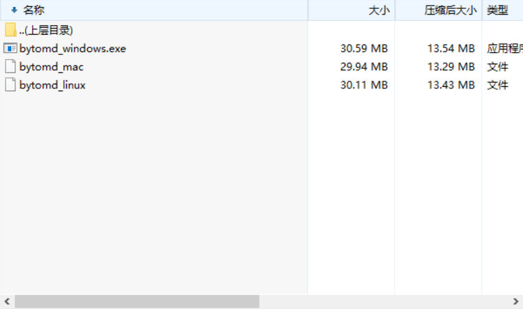

根据不同的系统，选择不同的安装包

以下以windows为例，其他系统大同小异

## 2、初始化节点

通过命令行启动 Bytomd.exe，使用init命令来初始化节点

``` Bytomd.exe init 【--home bytom_home可选，如果你不指定则默认路径】```

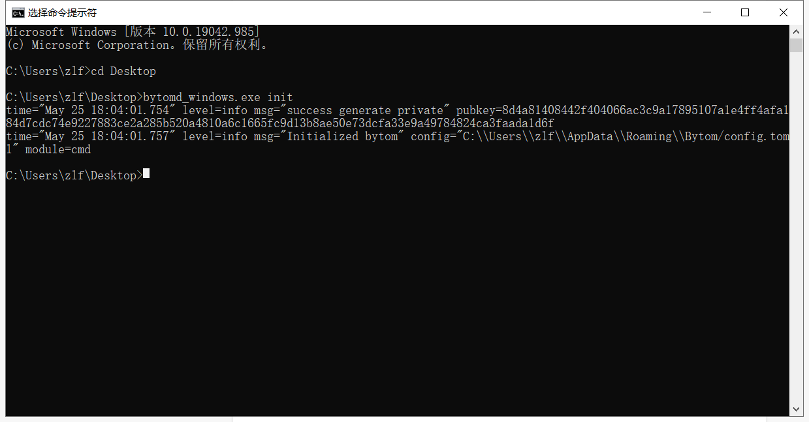

**注意，初始化时，记录一下publickey，后面挖矿需要配置这个参数**

初始化成功，如果你没有指定目录，则相关的区块数据都会存储在默认的路径：

* Windows用户的目标目录如下‘%APPDATA%/Roaming/Bytom’
* Mac用户的目标目录如下‘~/Library/*Application Support/Bytom’
* Linux用户的目标目录如下‘~/.bytom’

## 3、配置挖矿参数

在启动节点之前，需要对参数进行一些配置，进入Bytom的主目录（就是默认或者你自己设置的<bytom_home>目录），打开federation.json

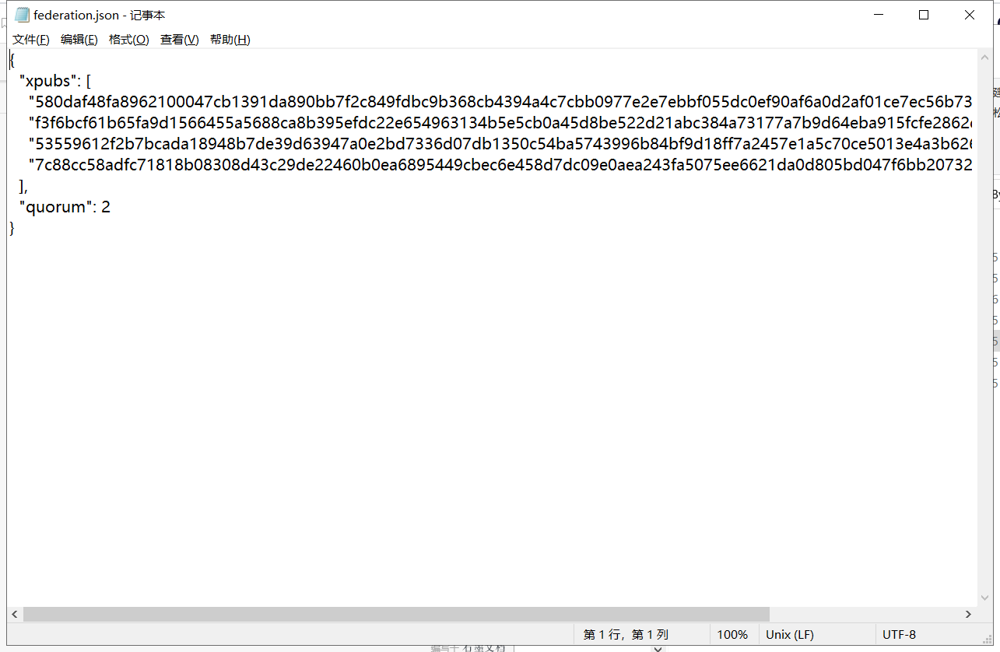

删除其中的“xpubs”的内容，替换自己的xpubs，保存

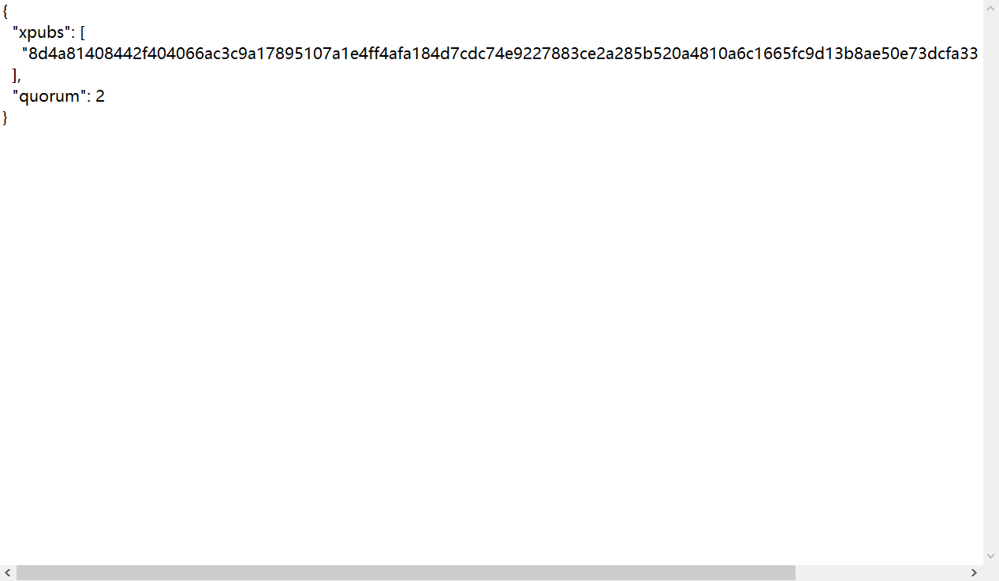

## 4、运行节点

通过命令行启动 Bytomd.exe，使用node命令来启动节点

``` Bytomd.exe node 【--home bytom_home可选，如果你不指定则默认路径】```


启动后，会自动在浏览器弹出钱包页面，则说明启动成功了


默认的dashboard页面为：http://127.0.0.1:9888/

## 5、生成钱包

我们通过dashboard生成Bytom2.0的钱包，选择“新建钱包”

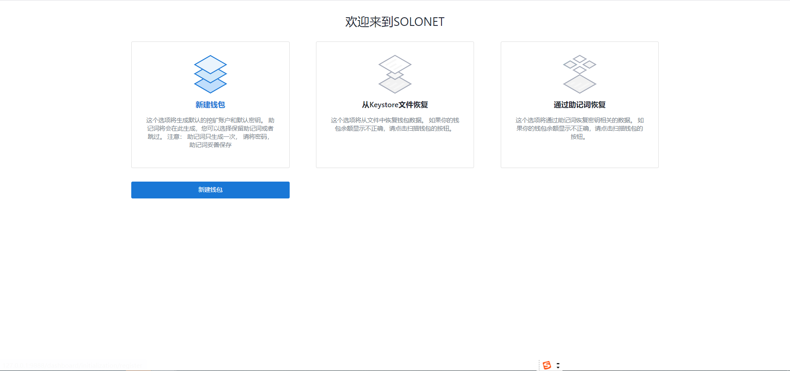

设置初始账户和密钥

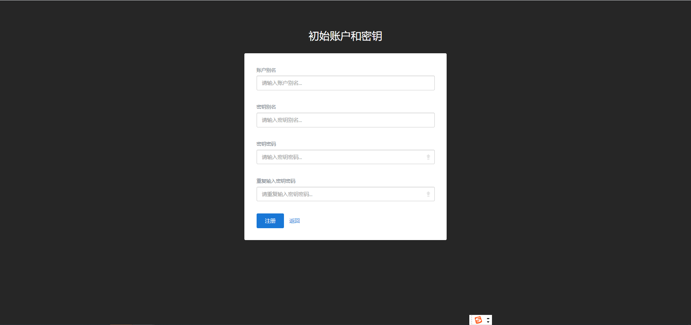

备份助记词，注意保管好的助记词（养成抄写的习惯，防止在主网资产被盗）

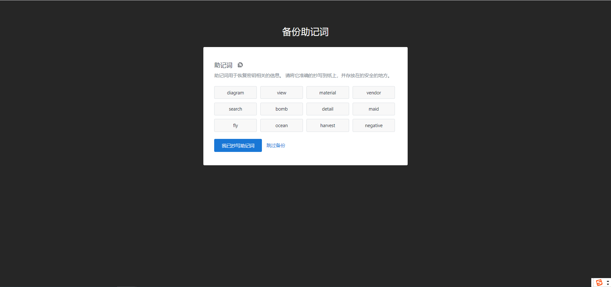

验证助记词，按照顺序填写助记词


生成钱包成功，进入主页面

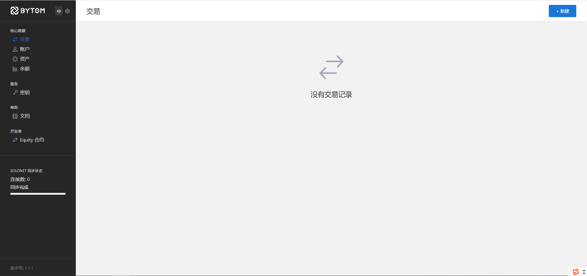

## 6、挖矿

进入dashboard页面：http://127.0.0.1:9888/ ，点击左上角侧边栏的设置按钮，进入核心状态

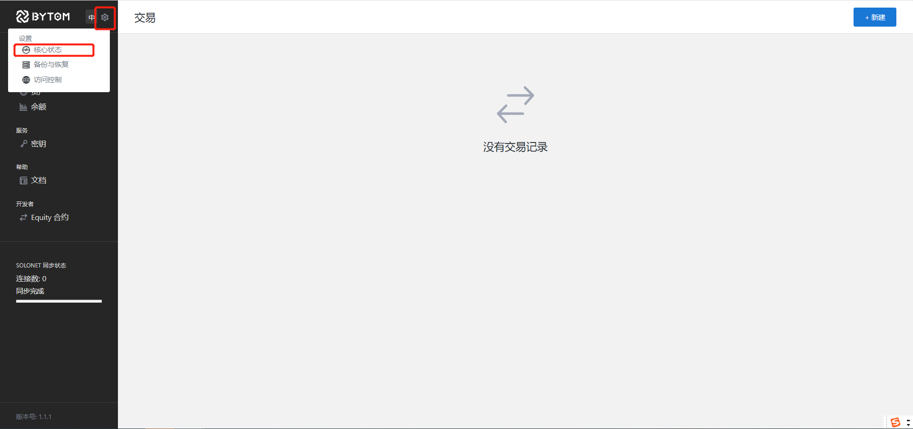

打开挖矿选项，显示蓝色则代表打开状态

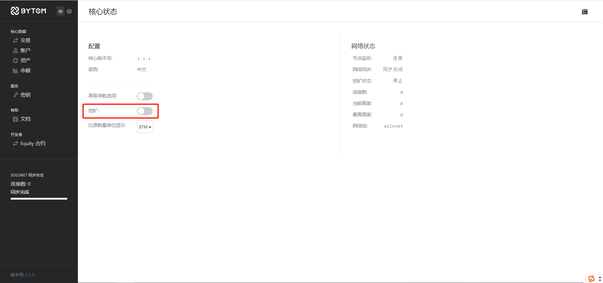

看到左下角侧边栏显示进度，或者核心状态的高度有变化，说明已经开始挖矿


也可以检查交易页面，查看是否有挖矿交易

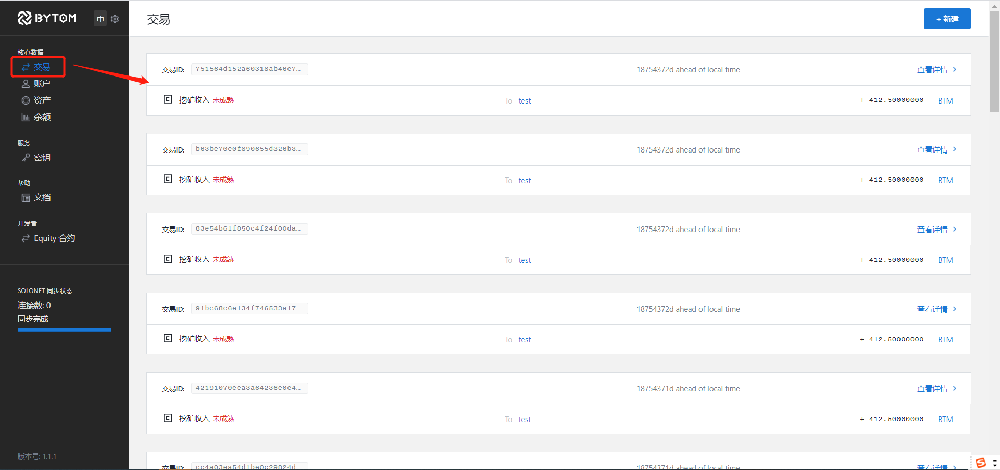

## 7、交易

因为当前处于solonet，无法连接外部的节点，只能发起一笔给自己的交易。

在交易页面新建交易

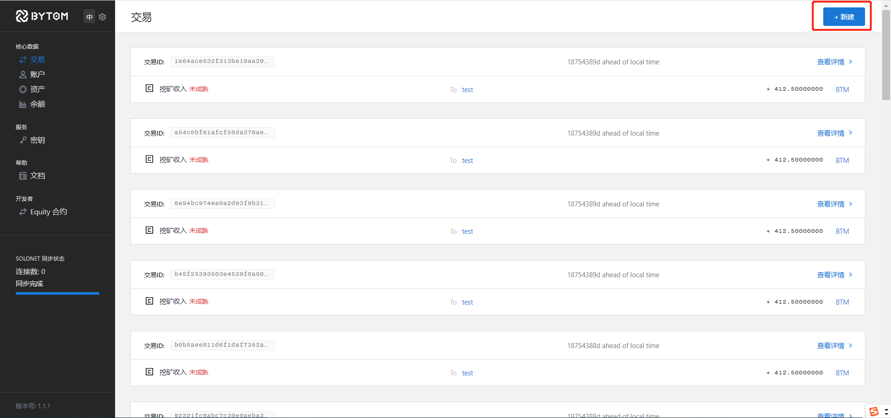

选择简单交易，输入相应的交易信息


提交交易


输入密码


提交交易成功，可以在交易页面查看这笔交易

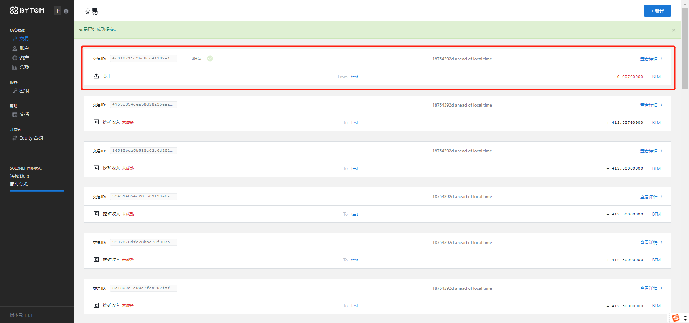

确认交易成功


## 8、查看信息

可以通过Dashboard查看当前的交易，账户，资产和余额信息

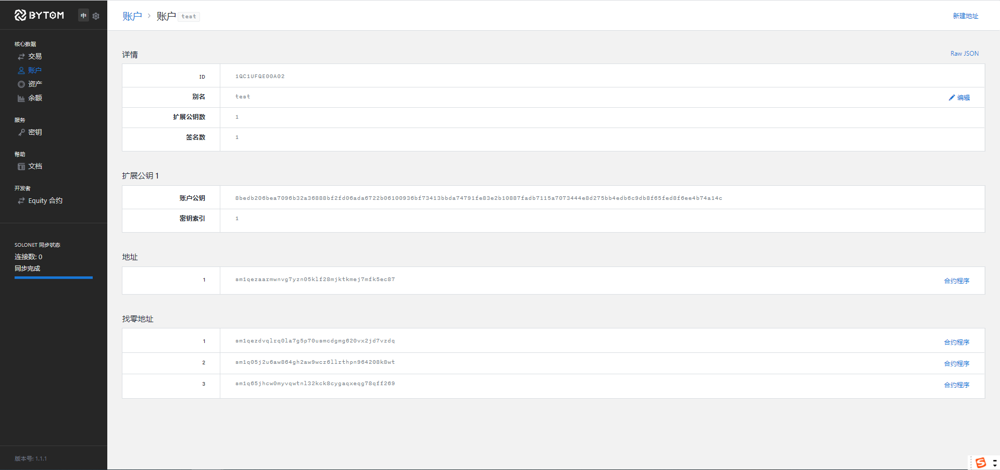

## 9、术语和概念

**Solonet：** 可以理解为发布的一条私链，无法和其他的节点组成一个网络，但可以体验挖矿，交易等基本区块链功能

**挖矿：** 本质是获取区块链的记账权，Bytom2.0采用Pos机制，当质押的BTM数量达到前十时，就可以挖矿，并产生挖矿收益

**密钥：** 密钥由公钥和私钥组成，主要用于数字资产的控制和管理

**账户：** Bytom特有的一个钱包层的抽象概念，方便用户管理自己的地址和密钥


