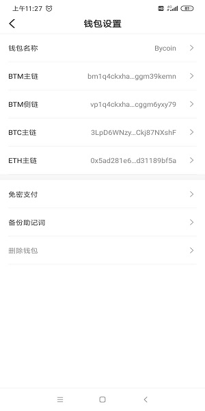
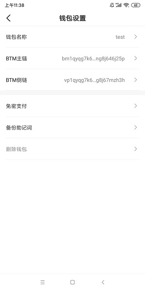
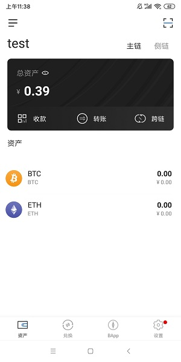
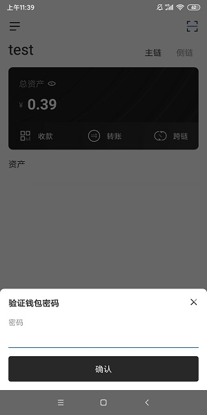
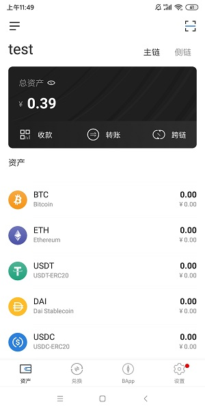

## Bycoin如何创建多链钱包

### 新钱包

创建新钱包默认就会创建ETH和BTC多链钱包，无需操作。在钱包设置中可以BTC和ETH地址，如下图：

### 老钱包创建

首先需升级到v2.1版本，进入主链页面，进入钱包设置，我们看到只有主链和侧链地址

进入主链页面，点击BTC和ETH

会弹出输入密码的页面

输入钱包密码，即可创建BTC和ETH多链钱包，进入钱包设置页面，我们可以看到BTC和ETH地址（创建ETH地址成功后，可以看到新增了USDT，DAI和USDC资产）

