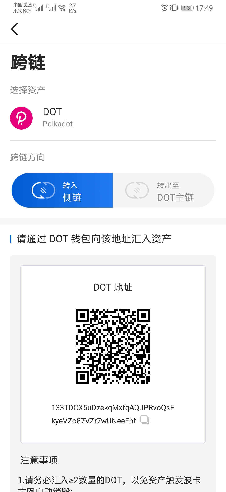

# DOT跨链教程

Bycoin现已支持DOT跨链以及侧链资产管理。

现在您可以将您的DOT资产转入MOV，我们将陆续适配更多MOV生态应用！

**一、如何将DOT转入侧链地址？**

目前Bycoin暂不支持波卡主网钱包，我们将在后续版本中完成主网钱包迭代，并陆续支持波卡投票以及Staking应用。

1、请先将Bycoin升级至最新版本（2.2.5及以上），在侧链资产中选中DOT，并点击‘跨链’，选择‘转入侧链’方向。系统将根据您当前的侧链地址，自动生成映射的波卡主网地址：

2、使用您其他持有DOT的钱包，向该地址汇入您想要转入侧链的DOT即可完成跨链。

请您务必留意：

- **请汇入≥2数量的DOT，避免资产被Polkadot删除**（详见波卡官方技术文档https://wiki.polkadot.network/docs/en/learn-accounts）
- 实际到账金额，以您汇入的DOT数量为准。请勿转入任何非DOT资产，避免资产损失
- 如长时间未到账，请检查转账钱包，确认是否成功发送交易
- 目前仅支持'Transfer Transfer_keep_alive Batch'的方式转入DOT，其他转账方式无法跨链（请咨询您的主网钱包供应商）

3、等待波卡主网以及跨链网关确认后，即可在侧链资产首页看到您的侧链DOT资产余额。

**二、如何将侧链的DOT转出至波卡主网地址？**

1、在侧链资产中选中DOT，并点击‘跨链’，选择‘转出至DOT主链’方向：

2、在收款地址输入框，输入您想要接受DOT的主网地址（请检查输入符合波卡地址规范）；在数量输入框内，根据当前侧链DOT余额输入要转出的DOT数量；确认跨链手续费。

3、等待跨链网关和波卡主网确认后，即可在侧链资产首页看到DOT的跨出记录。

**注意：DOT跨链跨入数量必须大于等于2 DOT，否则不会入账，资产会被Polkadot主网自动销毁，无法找回**