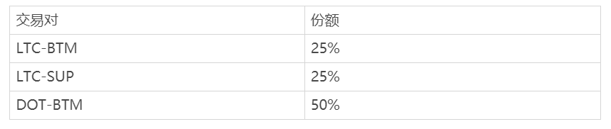

# MOV支持波卡（DOT）跨链及DOT-BTM超导交易对开放公告

尊敬的MOV用户

根据超导社区治理通过提案<十七>——超导协议上线DOT交易对，Bycoin钱包已于2021年1月18日开放DOT主链充提并支持DOT跨链，超导协议开放DOT-BTM交易对交易。这是DOT首次进入已落地应用的DeFi生态，后续BTM还将可能通过平行链进入DOT生态，实现双向跨链。MAG流动性挖矿后续也将新增DOT-BTM交易对，挖矿份额占所有超导挖矿的一半，调整后的超导挖矿分配见下：

**注意：DOT跨链跨入数量必须大于等于2 DOT，否则不会入账，资产会被Polkadot主网自动销毁，无法找回**

感谢您对 MOV 的支持！

MOV团队  
2021 年 1 月 18 日