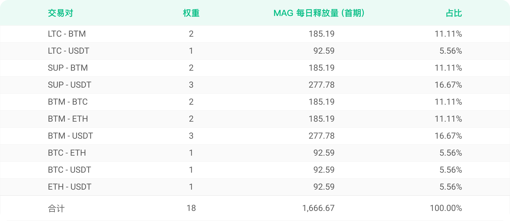
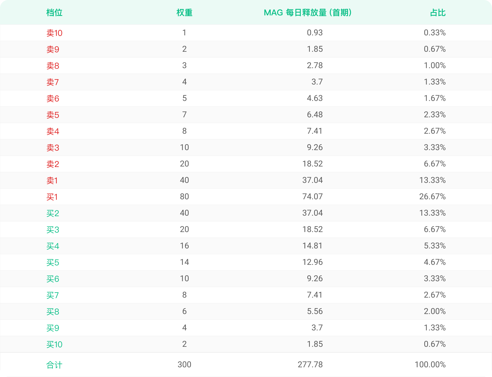
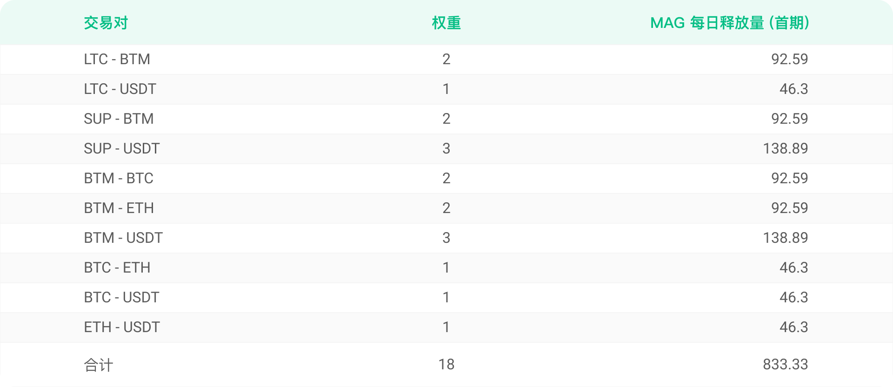
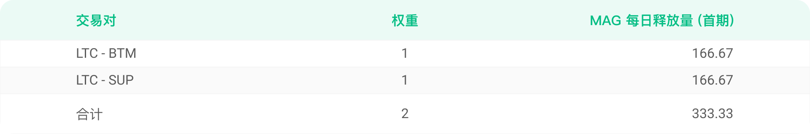

# MAG挖矿规则发布，将对参与过相关交易的用户及 SUP 用户进行空投

为改善磁力合约的用户体验，并进一步推进 MOV的去中心化治理，比原链基金会于11月05日发布《MAG挖矿：一场价值发现和共识凝聚之旅》一文，文中简要介绍MAG发行的初衷及目的，并提出MAG的挖矿活动会遵从“兼顾多方，有所侧重”的原则，通过挂单挖矿、交易挖矿、过往用户空投、交易渠道挖矿以及流动性挖矿五种方式，开启磁力合约治理之路。

以下为活动具体细则：

## **MAG是什么？**

MAG 是用户使用比原链 MOV 磁力兑换交易产生的通证，后续 MAG持有者可对 MOV 磁力兑换产品进行社区治理

## **挖矿总量**

MAG 总量不超过1,000,000枚，其中对磁力过往交易用户及SUP持有者空投MAG的数量占总量的15%。除空投部分外，其它MAG将分期通过挖矿的方式分发。

本文将详细介绍 MAG 的空投方案以及第一期挖矿分配细则，比原链基金会将根据磁力产品业务发展的需要适时推出后续MAG的挖矿方案，敬请持续关注。

## 空投方案

1、于2020年10月1日0时（北京时间）之前参与过磁力兑换中含有BTM交易对交易的地址为有效地址，有效地址及持有SUP的地址将获得MAG空投。

2、空投部分占MAG总量的15%，其中5%部分按有效地址数均分给相关用户；5%部分按照有效地址于2020年10月1日0时（北京时间）之前参与含有BTM交易对的加权后交易量的比例分配给相关用户，购买BTM的交易的权重为2，其余交易的权重为1；剩余5%部分将按照SUP的持币数量的比例分配给相关用户，SUP的持币数以2021年1月1日（北京时间）内对侧链地址随机快照的结果为准。

3、空投的MAG需要用户打开钱包进入活动页面主动领取，领取起始时间为北京时间2021年1月4日10：00（AM）。

## 首期MAG挖矿方案

一、分配方案

首期MAG的挖矿数量为100,000枚，通过挂单挖矿、交易挖矿、交易渠道挖矿和流动性挖矿四种方式分发，具体比例见下表：

## 挖矿时长

一个月，2021年1月4日—2021年2月3日

## 1、挂单挖矿

1.1、参与挂单挖矿的各磁力交易对的权重和每日MAG释放量如下表：

1.2、各个交易对的前买十和前卖十档位参与该交易对的挂单挖矿

1.3、各交易对及各档位按照预设的固定数量分配MAG，包含SUP或BTM的交易对的SUP或BTM的买单的挖矿权重更高，如下表所示：

不包含BTM和SUP的交易对买卖十档权重表（以BTC-USDT交易对为例）

包含BTM或SUP的交易对买卖十档的权重表（以BTM-USDT交易对为例）

**1.4、买入BTM或SUP方向的挂单，将获得双倍的MAG收益，BTM-SUP交易对的买卖权重一致**

1.5、每分钟随机对各交易对的挂单情况快照一次，各档位内部按挂单金额的比例分配MAG

1.6、挂单挖矿于北京时间2021年1月4日10：00（AM）启动，挂单挖矿MAG每十分钟分配一次

## 2、交易挖矿

2.1、各交易对交易挖矿每天释放的MAG数量为固定值，交易者按照交易量的比例分配各交易对挖出的MAG

2.2、不同交易对分配的权重不同，具体见下表

**2.3、买入BTM或者SUP的交易，将获得双倍的MAG收益,BTM-SUP交易对的买卖权重一致**

2.4、交易挖矿于北京时间2021年1月4日10：00（AM）启动，交易挖矿 MAG每十分钟分配一次

## 4、交易渠道挖矿

4.1、交易渠道挖矿面向为磁力合约提供订单的各类渠道，包括Bycoin、Byone等各类接入磁力合约的钱包

4.2、根据不同渠道的磁力交易量比例分配交易渠道挖矿的MAG，拟参与交易渠道挖矿的主体需与比原链官方联系，对接具体接入事宜。

4.3、交易渠道挖矿启动时间为北京时间2021年1月4日10：00（AM）

## 5、流动性挖矿

各交易对每日挖出MAG的数量固定，具体见下表：

各交易对内部按照提供的流动性比例进行分配，每十分钟分配一次。

流动性挖矿启动时间为北京时间2021年1月4日10：00（AM）。

最后，比原链官方团队提醒大家注意风险：

MAG不属于募资范围，无投资价值，所有MAG通证均是通过活动手段获得，人人均可参与；

如果对本细则有更多建议与意见欢迎至 Bycoin-设置-意见反馈中提出您宝贵的意见（Bycoin下载链接：[https://blockmeta.com/wallet/](https://blockmeta.com/wallet/)）

