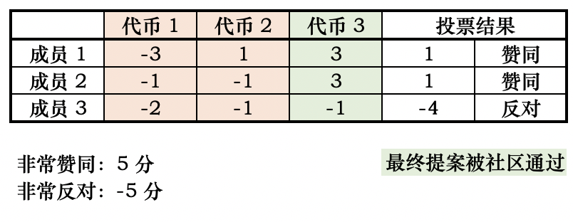

# 关于超导提案规范性的说明

超导治理上线以来，已经有十数个社区提案被提出。感谢社区的热情和贡献，希望我们共同努力，通过提升社区的治理水平促进超导的发展。

提案的质量而非数量影响着社区的治理的质量，在这一点上我们仍有很大进步空间。

为了提升提案的通过率，提案者可以在提案前，更多地通过链节点等途径将自己的提案与社区进行预沟通；同时重视提案的质量，提升治理提案的规范性，对提案内容进行清晰的描述。

可以参考以下提案格式：

**概要**：简单描述提案希望促成的改变，该描述应该让社区成员易于理解。

**动机**：阐述提案想要解决的问题，即为什么提案。

**具体实施**：详细说明提案需要实施的内容，涉及到技术问题，需用非技术的语言加以解释，以提升社区成员的理解程度。

以上线交易对为例：

**概要**：建议超导上线 LTC 交易对

**动机**：增加交易品种有助于多样化用户交易选择和提升交易积极性。 莱特币素有“比特金，莱特银”的称谓，有较为庞大的矿工群体，且市场接受度较高。且 2020 年受到灰度增持，说明价值受到主流认可。虽然在本次 DeFi 浪潮中没有表现，但这也是机会，如果 MOV 超导上线 LTC 交易对，将吸引LTC矿工和持币用户加入（因为没有其他 DeFi产品可以使用 LTC），为 MOV 带来增量用户，增强共识。

**具体实施**：支持 LTC 资产跨链，上线 LTC/SUP 交易对

另外请社区在提案时请注意，**在上线未经社区广泛认可的币种时，一个提案仅能针对一个未上线的币种进行投票。**原因是，不同币种同时提案会让只赞同部分币种上线的社区成员无法通过投票完全表达自己的意见，最终造成次优的结果。

如上面的例子，三个代币同时提案，会使得三个代币都会被社区通过；但实际上，如果分开被提案，代币 1 和 代币 2 都不会被社区通过。社区在这种情况下无法充分表达自己的意见，被绑定的选项裹挟了。

再次感谢社区的积极治理，让我们一起提升治理质量，共同促进超导协议的发展。