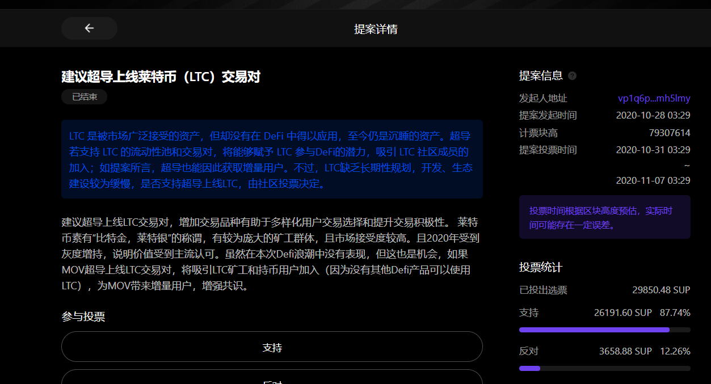
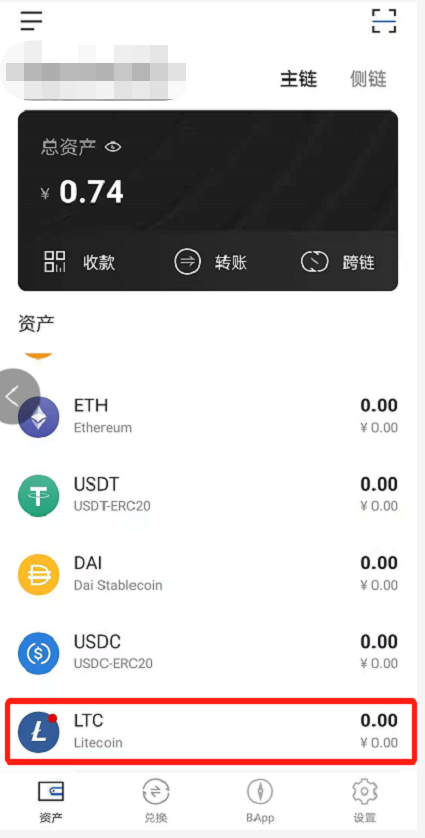
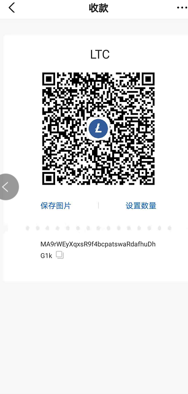
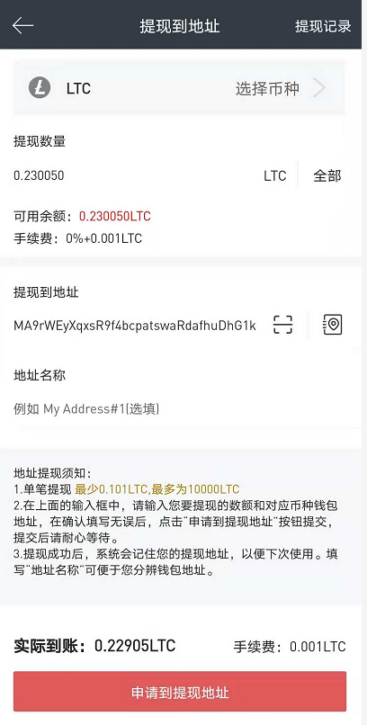
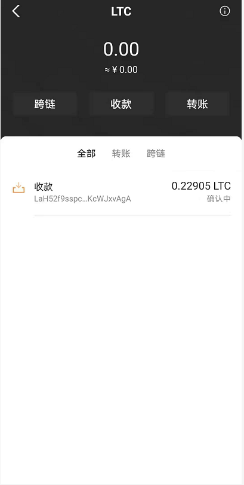

# MOV上新LTC，转账跨链交易全教程

上周，根据超导社区治理提案首个通过的提案——<建议上线超导上线莱特币（LTC）交易对>，MOV超导兑换池已上新LTC。

（一些用户对超导交易对上新速度有疑问，可以看看[《MOV上新需要做什么》]([https://weibo.com/ttarticle/p/show?id=2309404570829185745107#_0](https://weibo.com/ttarticle/p/show?id=2309404570829185745107#_0))MOV作为一个去中心化交易协议，上新除了基本的充提外，在网关开发，跨链等业务上都需要耗费很长的时间）

本文将介绍在Bycoin里使用LTC转账跨链交易的完整教程。

**一、如何将交易所的LTC(莱特币)转入Bycoin？**

1）将Bycoin钱包更新到最新版本（V2.2.1也可以直接[点击链接下载]([https://blockmeta.com/wallet/](https://blockmeta.com/wallet/))）

2）点击主链资产“LTC”

3）初次使用Bycoin钱包收发莱特币，需要输入自己的钱包密码，创建钱包。

4）点击“收款”复制收款地址，或者保存收款二维码，从交易所提现。

5）点击Bycoin的LTC资产详情，可以看到转账的LTC正在确认中

**二、如何将主链上的LTC转入侧链地址？**

1)经过确认后的莱特币已到账， 点击“跨链”，选择要跨链的数额，点击“确认”即可将莱特币从主链跨入侧链，跨链需要收取少量LTC作为手续费。

**三、如何在MOV超导池里面交易LTC(莱特币)？**

1）目前MOV超导池里面目前已有LTC/SUP,LTC/BTM的交易对；点击“兑换”——“超导兑换”，选择交易对，进行兑换即可

**四、如何参与超导兑换中LTC的做市？**

1）由于超导兑换采用的是AMM(自动化做市商)，每个人都可以成为LP(流动性提供者)，获取收益，但也需要承担相应风险。

目前超导兑换中，非稳定币理财不支持单币种理财，如果要参与LTC/SUP，LTC/BTM的理财，需要先将自己的LTC兑换一半成为BTM或者SUP才可以投入池子里面做市。

2）目前SUP/LTC的池子年化收益较高，年化可达8.62%（不过也要注意无常损失的风险哦）

如果对超导治理有任何问题，欢迎微博私信小编或者在Bycoin意见反馈板块提交哦。

自超导治理BAPP上线以来，目前已收到来自社区九个治理提案，如果您也想成为超导治理的提案者、投票人，[欢迎点击]([https://supertx.bymov.io/gov/](https://supertx.bymov.io/gov/))

