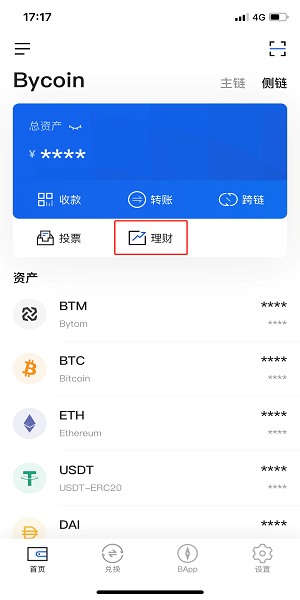
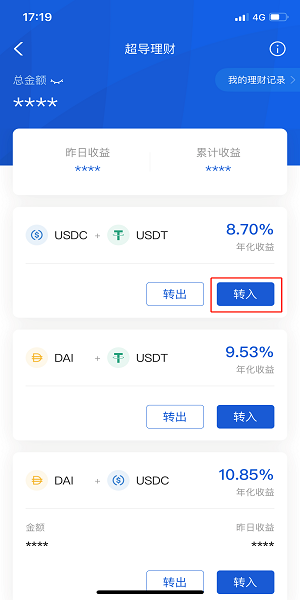

## 超导兑换单币理财指南

自超导兑换和超导理财上线后，受到了广大用户的支持和认可，为降低参与成本，方便用户理财，比原链基金会继续推出单币理财活动，在原有“双资产转入”的基础上，新增“单资产转入”功能。

### 如何进行单币理财

点击进入Bycoin钱包首页，切换到侧链，点击“理财”按钮

进入超导理财界面，根据个人喜好任意选择一个资金池点击“转入”

进入“转入超导池”页面后，默认选择“双资产转入”，点击“单资产转入”按钮选择转入资产类型

完成单资产类型选择后，需在文字框中手动输入转入数量，也可直接点击右侧“全部”按钮选择全部资产转入

最后点击“转入”按钮，输入密码，即可转入成功，完成单币理财

在转入成功页面点击“查看详情”，或者在超导理财主页面右上角点击“我的理财记录”，都能够看到自己的理财详情，快去转一笔试试理财收益吧~

