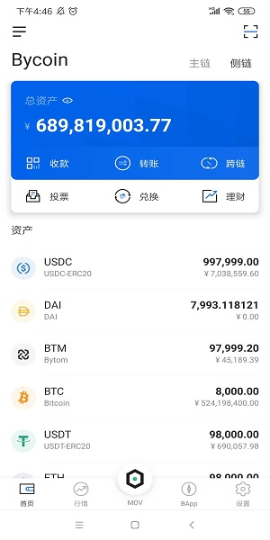
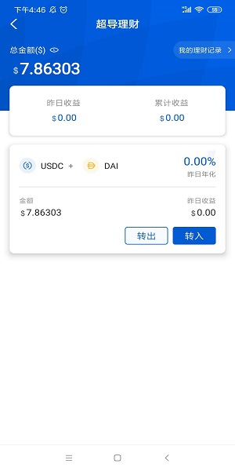
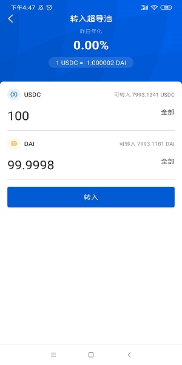
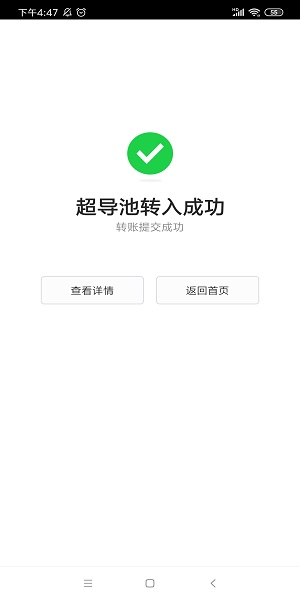
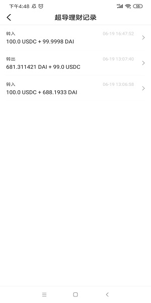

## 超导兑换双币理财指南

超导兑换分为超导兑换和超导理财两部分，理财用户为超导兑换提供流动性，并获取兑换用户的手续费。兑换用户可以满足兑换需求和套利需求。 

### 如何进行双币理财

点击进入Bycoin钱包，切换到侧链，点击理财按钮 

进入超导理财界面，超导理财必须存入一对交易对（比如USDC和DAI）,不能只存入一种

选择转入，输入需要转入的数量，这里转入100个USDC，它会根据比例算出你需要转入的DAI，比例根据超导储备池的数量而定

转入成功

可以在超导理财主界面查看收益，进入我的理财记录查看理财记录

