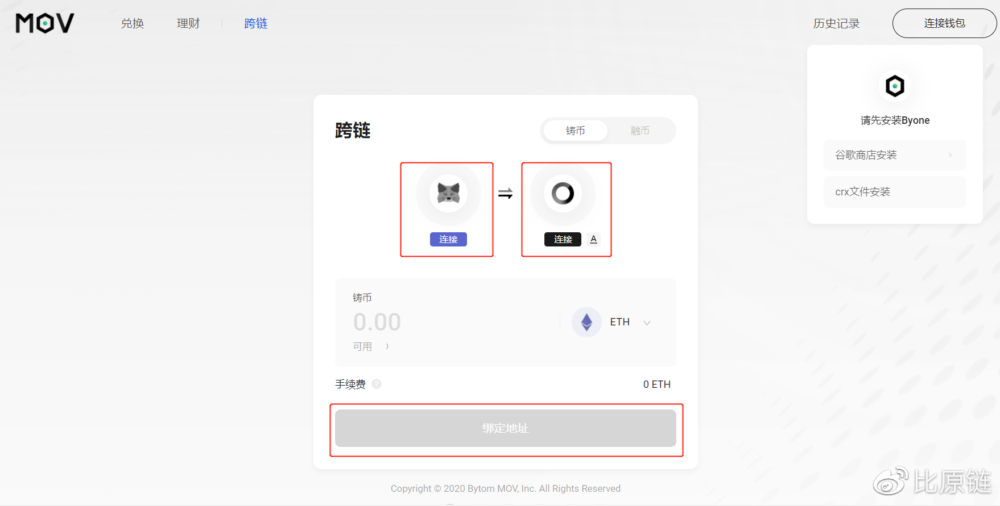

## Web跨链教程

### STEP1:连接钱包

在使用跨链之前，请先安装MetaMask以及Byone的谷歌插件，Byone具体如何操作，可看小编之前的文章——插件钱包Byone使用手册: https://weibo.com/ttarticle/p/show?id=2309404534224190570687#_0 并及时备份。

在跨链页面下，点击钱包icon下的连接按钮，分别唤起授权提示进行连接。

