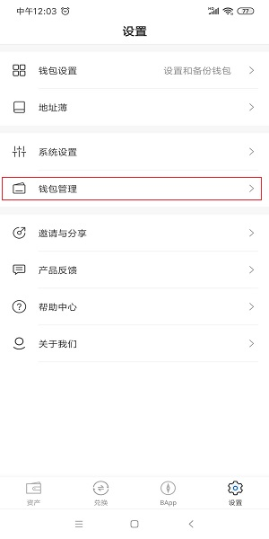
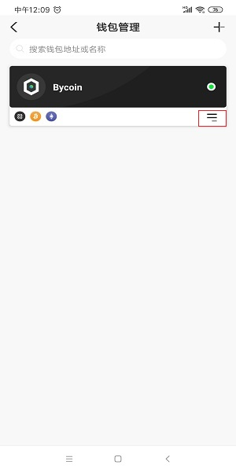
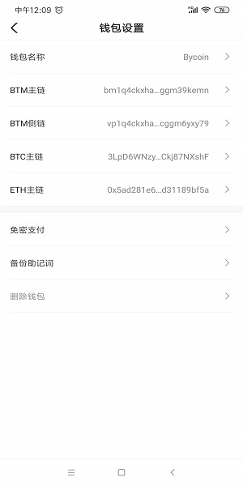
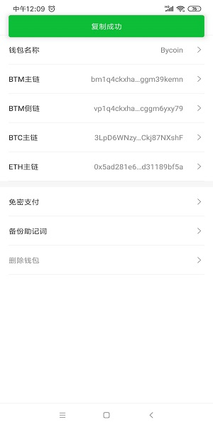

## Bycoin如何跨链充值

跨链BTC需要创建BTC钱包，跨链ETH和其他ERC-20资产需要创建ETH钱包，请参考：Bycoin如何创建多链钱包

点击主链，进入设置页面，点击进行钱包管理

进入钱包管理页面

点击右下角的按钮

点击需要充值的币种地址，充值BTC使用BTC地址，充值ETH，USDT，USDC和DAI使用ETH地址

将该地址复制到你转账（钱包）或者提币（交易所）的地方即可