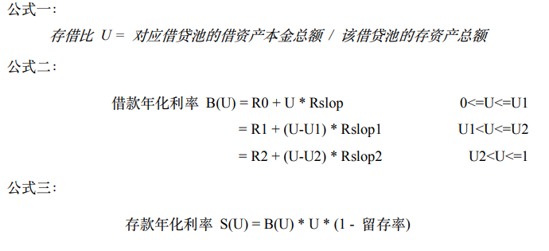

# MOV借贷FAQ

**1、在哪里可以使用到借贷产品？**

最新版Bycoin中内置借贷产品，Bycoin下载地址：https://www.bymov.io/  

**2、目前借贷支持哪些资产？**

目前支持的资产有四种：BTC、ETH、LTC、DOT。

**3、借贷存币理财和超导理财有什么区别？**

二者虽然都是理财产品，但利润的来源不同。超导理财的利润来源于超导兑换的手续费，而借贷中存币理财的利润来源是借贷者支付的利息。

**4、存币理财是否有锁定期？**

借贷存币理财随存随取，没有锁定期。

**5.借贷的利率是怎么计算的？**

利率模型是 MOV 借贷协议重要的功能创新以及市场调控手段，通过分段函数建立不同市场供需状态下的可变利率。公式如下：

其中，留存率为平台从借款利息中收取的费用比例，初始设置为 10% 。实际利率以客户端中呈现的为准。

**6、使用借贷是否需要额外的手续费或服务费？**

使用MOV借贷无需链上手续费和存币服务费，随借随还，随存随取。

**7、借贷利息计算的时间是如何计算的？**

借贷利息以区块数计算，Vapor链目前大约0.5s一个区块，因此与实际时间可能有细微的误差。

**8、若抵押率接近清算线，该怎么办？**

有两种方法避免被清算拍卖。一，可以通过归还部分资产提高当前抵押率；二，可以在对应订单中增添抵押物以提高当前抵押率。

**9、我在存币中存入了资产，为什么有一部分无法取出？**

如果当你分批取出，最后一批的取出数量小于最小取出额时将无法取出，需要先存入一定的数量达到最小取出额后才能取出。  
最小取出额：

|    币种    |  BTC  | ETH  | LTC  | DOT  |
| :--------: | :---: | :--: | :--: | :--: |
| 最小取出额 | 0.003 | 0.1  | 0.8  |  6   |

**风险提示：本产品采用超额抵押，请谨慎参与借贷、清算，控制好风险，选择适合自身风险承受能力的产品进行投资。避免因操作不当或行情波动导致的资产受损。**