# MOV借贷使用指南

MOV 借贷是基于 Bytom 主链生态和 Layer2 侧链 Vapor 设计的⼀个数字资产利率协议，该协议提供基于数字资产的供求变化以智能合约算法模型计算得出利率的资产池，以及全天候的汇率监控和风险管理体系。协议允许资产的供应方（贷款⼈）和借款人直接与协议合约进行交互，从而收益或支付浮动利率，同时也会存在通过参与风险清算拍卖进行套利行为的用户群体帮助协议维护系统安全和资产负债表的平衡。 从业务逻辑的角度划分，MOV 借贷主要包含存资产、借资产以及清算三大模块。

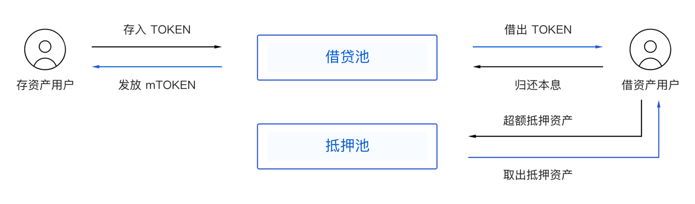

**在使用借贷产品之前，请更新最新版本的Bycoin客户端**

## 借币

进入Bycoin，选择进入借贷产品，点击“我要借币”

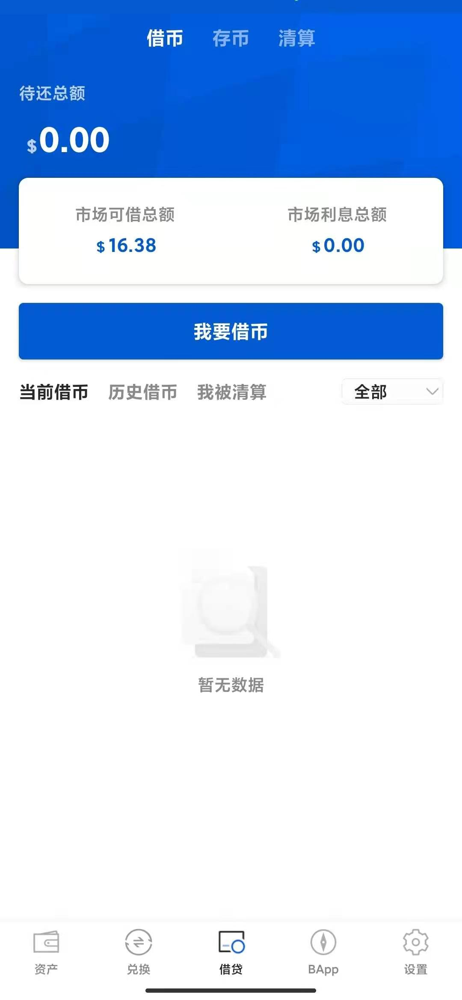

选择希望借的币种、数量并设置抵押率。目前借贷支持的资产有4种（BTC、ETH、LTC、DOT），抵押率有5档可选，抵押率越高，被清算的可能性越小。当抵押率低于抵押清算线的时候，会触发拍卖清算程序。您抵押的资产将会被拍卖！

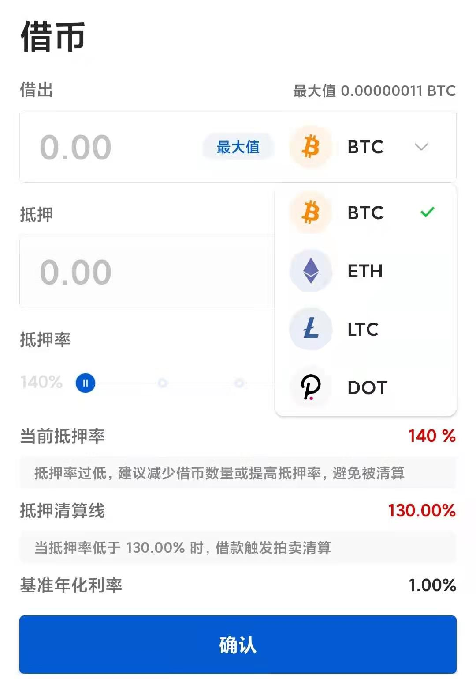

资产借出后，会将订单和数据更新到借贷页面，并会根据当前抵押率显示订单的风险状况

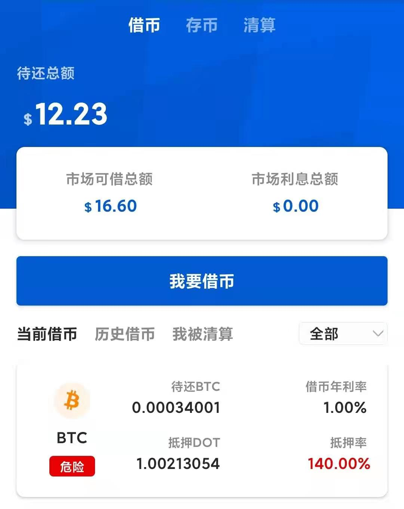

## 还币

点击订单进入详情页面，可以自由输入还币的数量，资产部分归还后，抵押率会上升，当全部还清后，抵押才会返还。

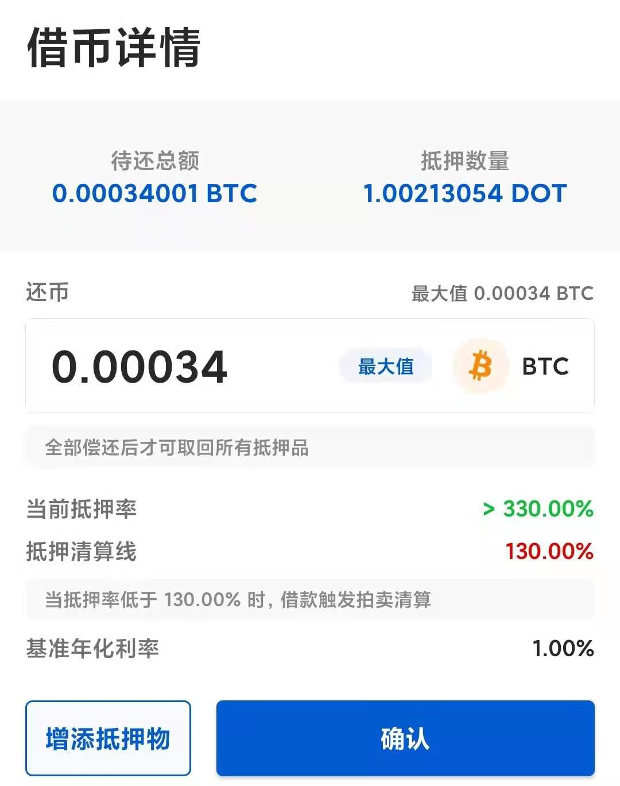

此处显示的**当前抵押率是指还币后的清算线，该内容会根据换币数量而动态改变。**

## 增添抵押物

为了防止被执行拍卖清算，当抵押率较低时，想要提高当前抵押率可以有2种方法，除了归还部分借出的资产外，还可以通过增添抵押物的方式。在订单详情页面点击增添抵押物，抵押物的增加有上限，最大抵押率为330%

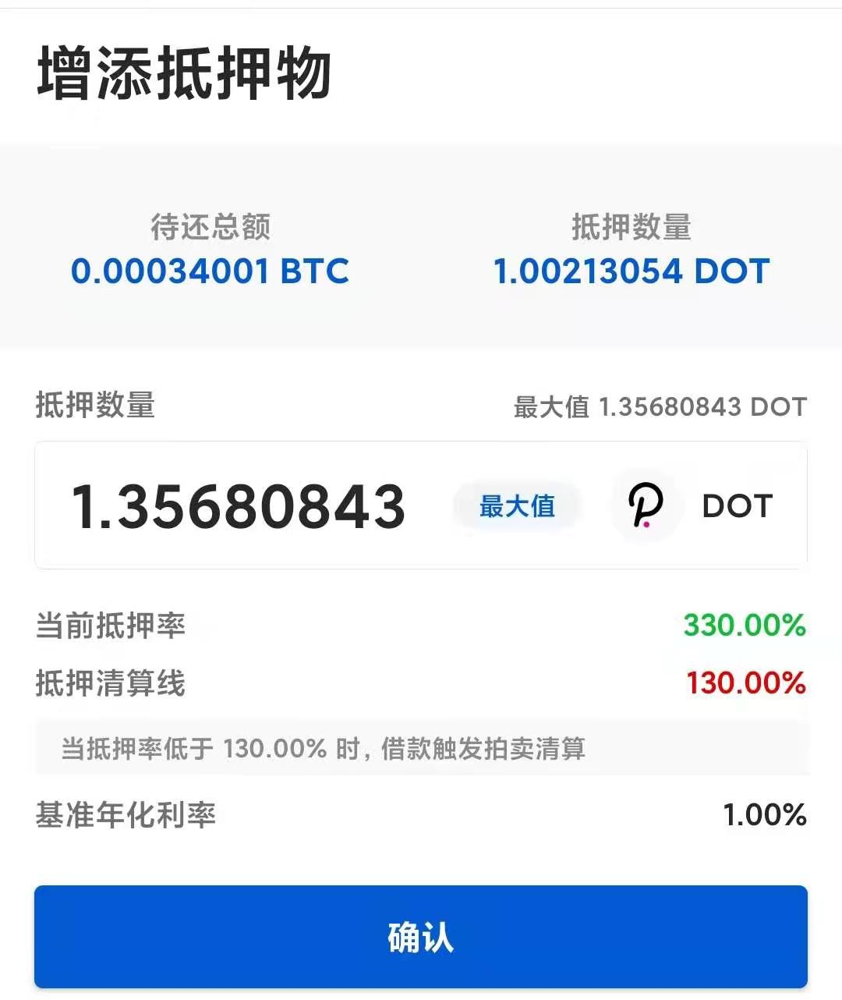

## 存币理财

在借贷产品的顶部选择存币可以进入该界面，点击存币按钮

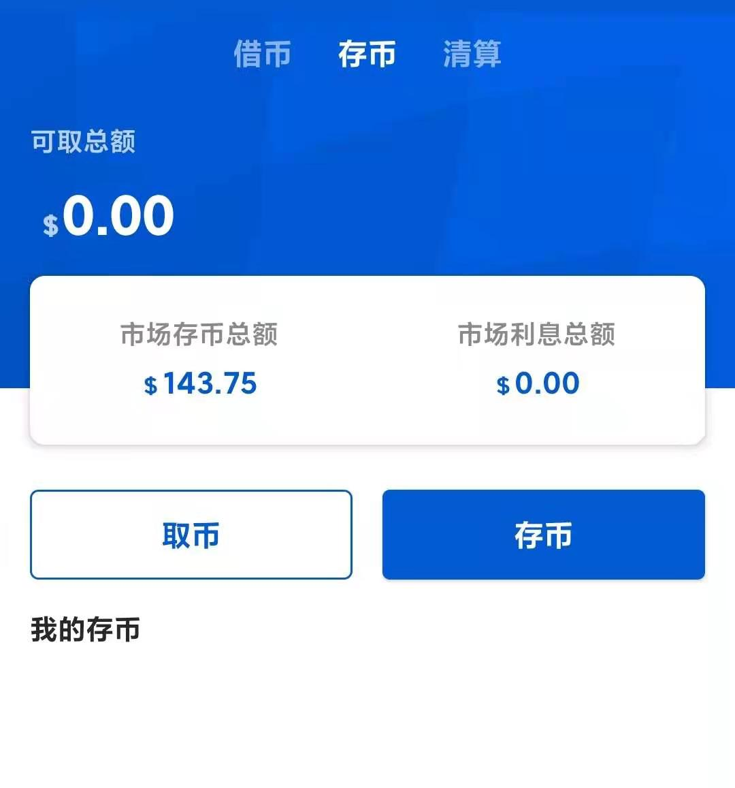

目前的资产有四种：BTC、ETH、LTC、，存储资产到借贷池可以享受收益，借贷池理财相比超导池来说，收益稳定并且不存在无偿损失。具体收益率以实际情况为准，下图仅供参考

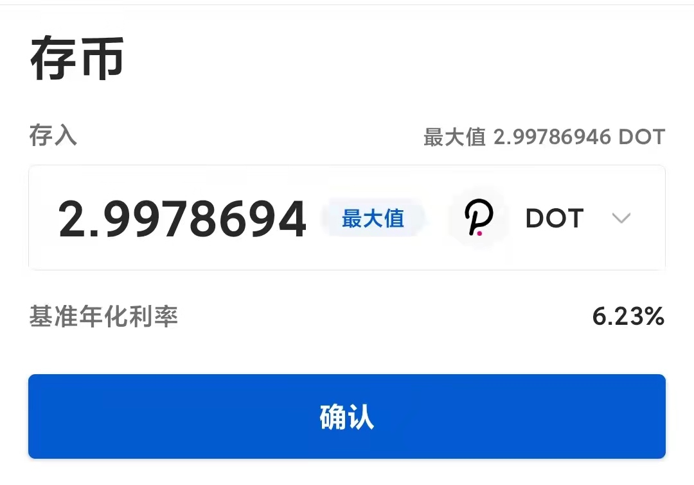

## 取币

如果用户有在借贷池中存币，存币信息会在“我的存币”中显示

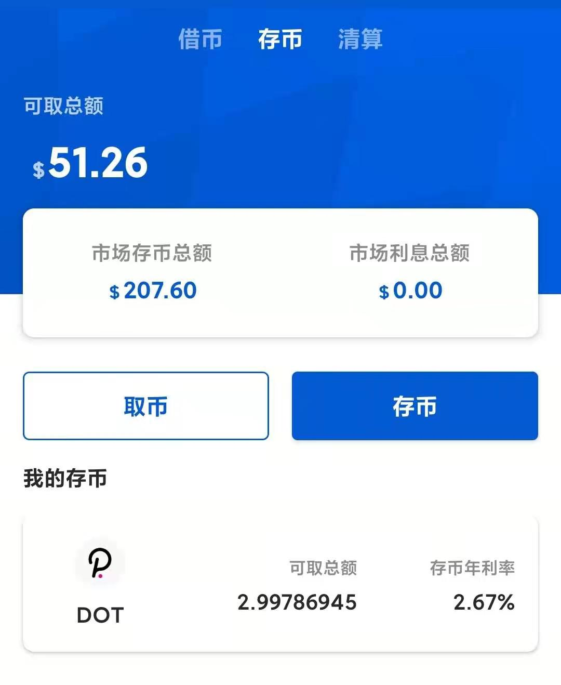

点击订单可以进入详情页面，在页面中可以选择继续存币或是取出。

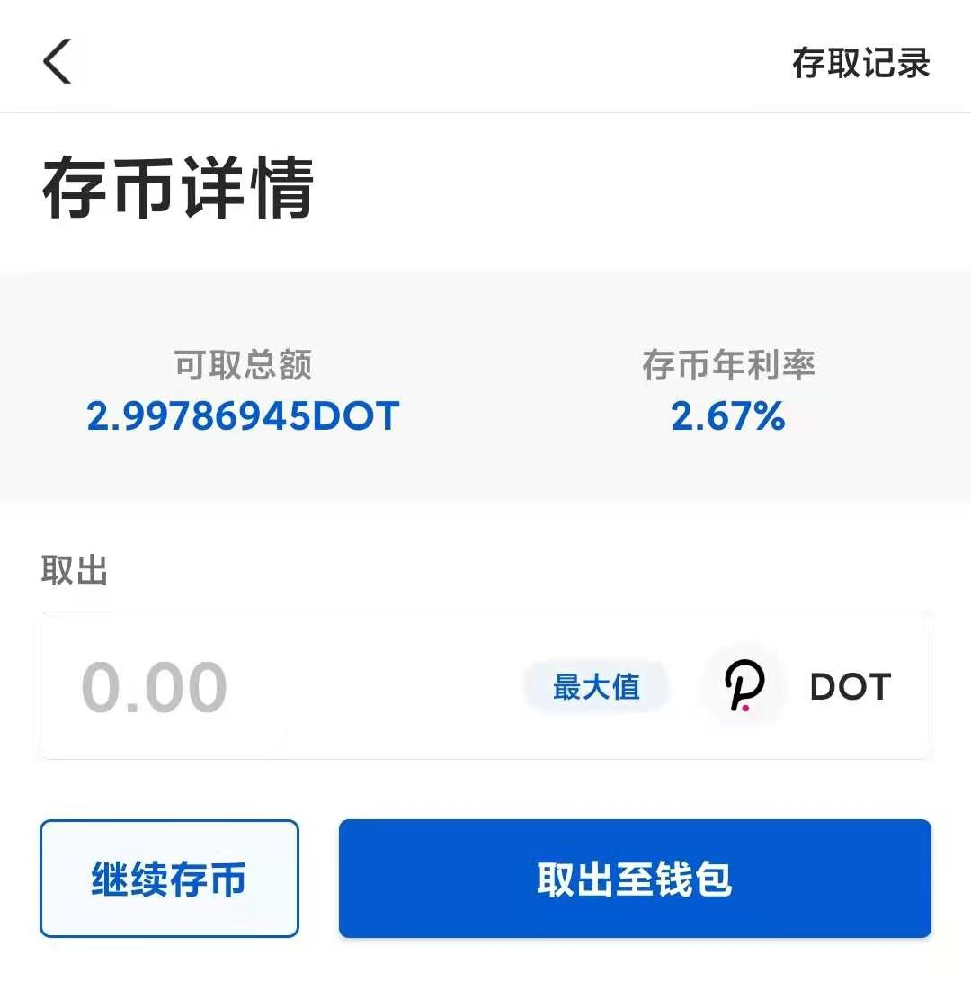

## 清算竞拍

当某笔借资产业务的抵押率低于清算线时立即启动清算拍卖，即将该笔借资产业务的抵押品通过拍卖的方式出售给竞拍者以回收债务本息。值得注意的是，产品层面已经拦截用户以接近清算的抵押率申请借资产，所以已经预留了足够的窗口来避免清算，因此一旦越过清算线就立马清算。

**清算拍卖流程：**  
拍卖启动后竞拍者可以在每个拍卖周期内报名参与该笔竞拍，竞拍者需冻结相应金额（即拍卖价格）的保证金，拍卖结束后可以取回保证金余额或参与其它竞拍。在拍卖截止时，清算协议随机选择某位竞拍者作为竞拍的胜者，竞拍者被选中的概率均等。

注意事项：

- 待回收的债务资产为参拍资产，待出售的抵押资产为拍卖资产。
- 保证金：竞拍者参与拍卖前需将一定金额的资产作为保证金（统一锁定当前竞价轮次价格的保证金）存入保证金池，拍卖款项从竞得者的保证金中扣除，剩余保证金可用于其它同类资产的竞拍，也可取回。
- 抵押品每笔拍卖额度上限为 10,000 USD，抵押品市值超过该上限则按上限值进行拆分。
- 抵押品拍卖价格：拍卖时抵押品市值的 95%，特定情况下可进行调整。
- 抵押品每笔拍卖周期：10 分钟，如无竞拍者参与则顺延或由平台采取措施进行处置，比如调整拍卖价格等。
- 清算罚金：抵押品拍卖所得的 5％，清算罚金作为系统的风险储备金。
- 拍卖所得优先用于归还借资产人所欠的借资产及利息，如拍卖所得仍有剩余则扣除清算罚金作为风险储备金，如仍有剩余则归还给借资产人；如出现资金缺口，则用风险储备金补足，如风险储备金无法全额补足，则缺口由该借贷池的全体存资产人进行承担。

参与教程：

点击借贷中的清算界面。**（折扣率以实际情况为准）**

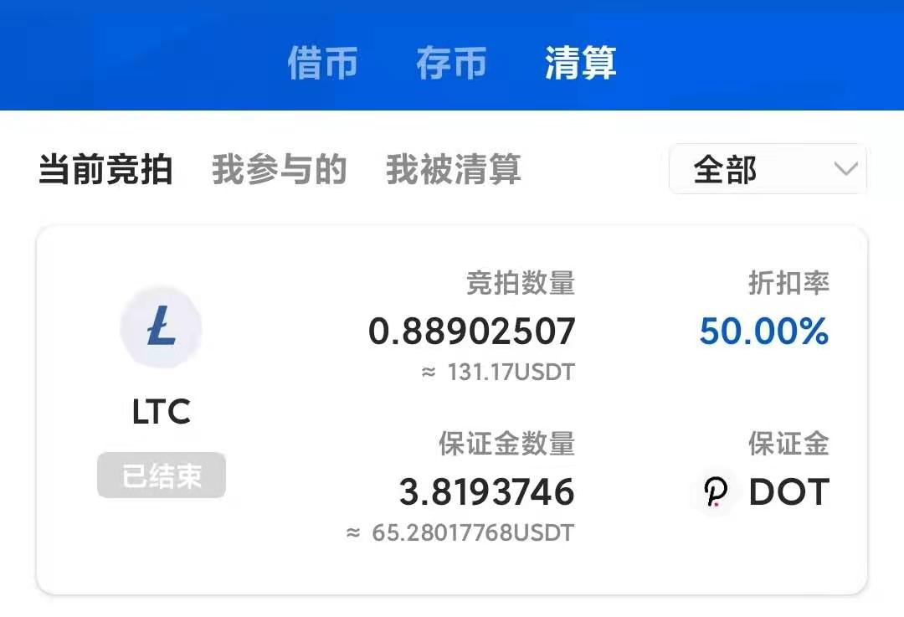

选择你想参与的拍卖

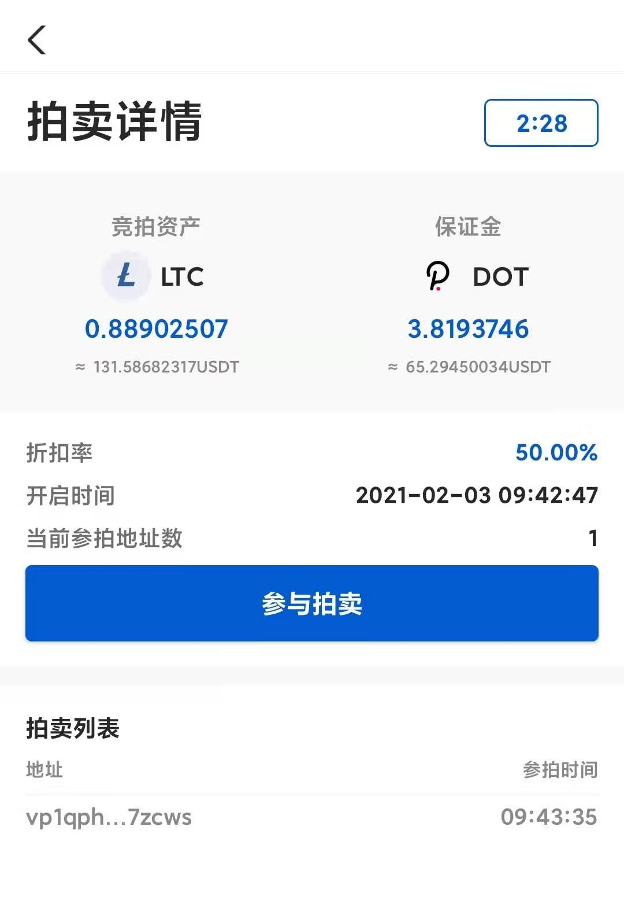

在保证金充足的情况下，可以点击“参与拍卖”。参与成功后，会在中**拍卖列表**中显示你的地址，系统会在所有参拍的地址中随机选择中标者。

**风险提示：本产品采用超额抵押，请谨慎参与借贷、清算，控制好风险，选择适合自身风险承受能力的产品进行投资。避免因操作不当或行情波动导致的资产受损。**