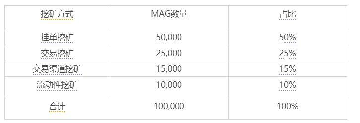
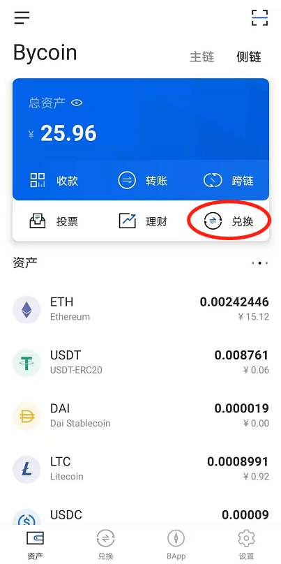
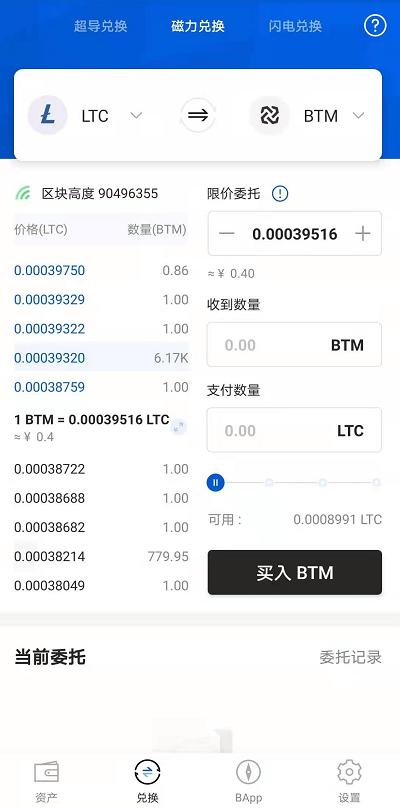
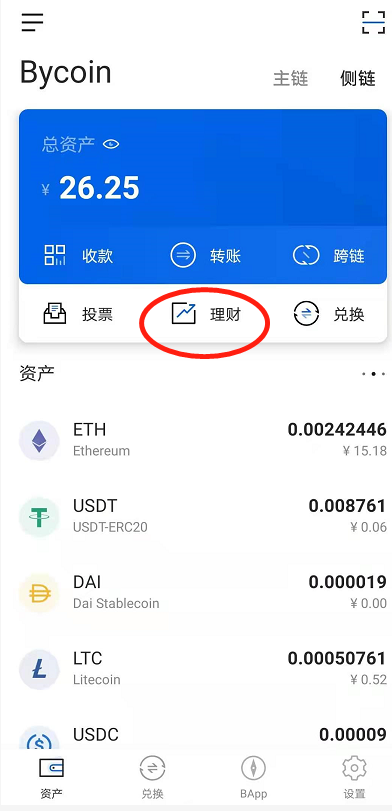
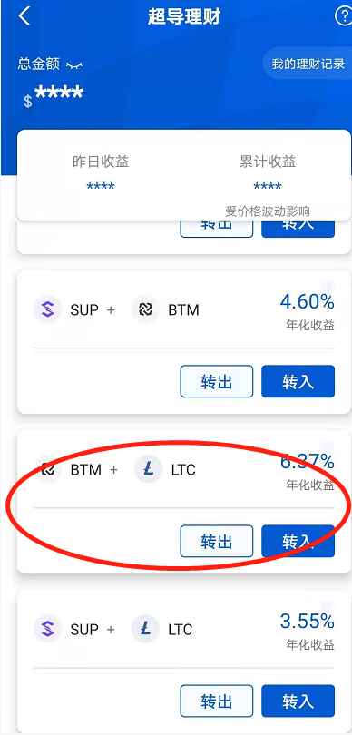

# MOV磁力挖矿教程

MOV磁力挖矿第一阶段已经于2021年1月4日上午10：00正式开启，第一阶段挖矿共计释放100,000枚。

通过挂单挖矿、交易挖矿、交易渠道挖矿和流动性挖矿四种方式分发，具体比例见下表：

## 挖矿时长

一个月，2021年1月4日—2021年2月3日

**一、如何通过磁力挂单挖矿？**

1）打开Bycoin钱包（https://blockmeta.com/wallet/）

2)点击“兑换”

3）点击“磁力兑换”以LTC-BTM为例

各个交易对的买十和卖十档位参与该交易对的挂单都可获得MAG的激励；

各交易对及各档位按照预设的固定数量分配MAG（详情点击：[MAG挖矿规则](../notify/MAG挖矿规则发布，将对参与过相关交易的用户及SUP用户进行空投.md)），包含SUP或BTM的交易对的SUP或BTM的买单的挖矿权重更高，

**二、如何通过磁力交易挖矿？**

各交易对交易挖矿每天释放的MAG数量为固定值，交易者按照交易量的比例分配各交易对挖出的MAG，买入BTM或者SUP的交易，将获得双倍的MAG收益,BTM-SUP交易对的买卖权重一致。使用方式类似于挂单挖矿，成交即可。

**三、如何通过超导流动性挖矿MAG？**

第一阶段MAG挖矿还开启了LTC/BTM、LTC/SUP两个交易对超导流动性挖矿，各交易对内部按照提供的流动性比例进行分配，每十分钟分配一次。

1）打开Bycoin钱包（https://blockmeta.com/wallet/）

2）点击“理财”

3）选择超导流动池——BTM/LTC或者SUP/LTC，存入流动池，除了可以获得年化 还可以获得MAG的收益。

MAG余额查看点击链接http://t.rainoy.com/mag 查看，如何领取点击：[MAG领取教程](https://support.bymov.io/mag/MAG空投领取教程.html)

最后，比原链官方团队提醒大家注意风险：

1、MAG从未募资，人人均可参与无成本挖矿；

2、MAG没有投资价值，是MOV磁力兑换治理通证。

如果对本细则有更多建议与意见欢迎至 Bycoin-设置-意见反馈中提出您宝贵的意见（Bycoin下载链接：https://blockmeta.com/wallet/）