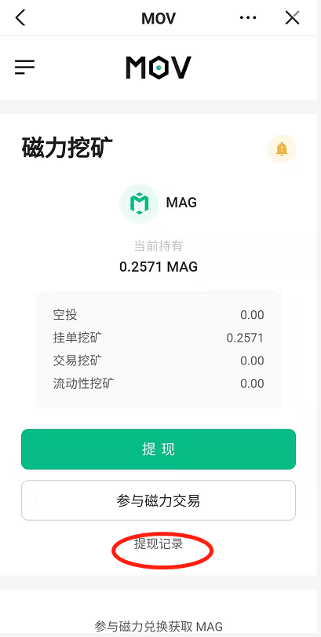

# MAG空投领取教程

1、打开Bycoin钱包（https://blockmeta.com/wallet/）

2、复制https://magnex.bymov.io/mag BAPP链接（或者直接点击BAPP banner进入空投领取页面）

3、确认BAPP请求获取你的钱包地址

4、点击“提现”

5、点击“确认签名”

6、点击“提现记录”确认自己的提现记录，如果未达到0.001MAG的提现标准，会不能提现，可以通过参与磁力挖矿等方法攒够0.001MAG再提现哦~

7、查看自己的侧链地址，发现MAG已经成功提现到侧链地址上了

