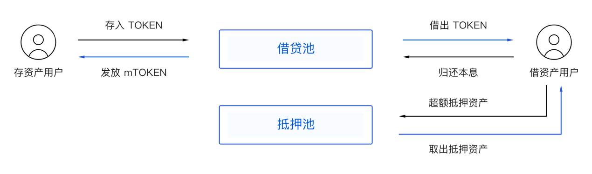

# MOV 借贷：基于算法模型的链上利率协议

# 摘要

​        基于流动性合约的利率协议是建立 MOV 综合性 DeFi 金融协议集团十分关键的一环，也是最为根本的利率基础设施，将直接提升 Layer2 资本利用效率，具有非常显著的双边网络效应。MOV 借贷的创新性体现在四个模型——利率模型、风控模型、清算模型以及衍生资产模型，并与现有 MOV 协议群和 Bytom 公链生态形成积极的互相促进作用，全面增强底层资产价值捕获效用。本白皮书主要讲述 MOV 借贷的技术实现细节。

**关键词：借贷利率协议、算法模型、风险清算、可组合性**

# 1．背景介绍

​        在去中心化金融浪潮下，已经屹立百年并稳健发展的传统金融仿佛在一个镜像的世界找到了一种新的运作模式，从货币发行到资产交易，从证券化到指数映射，从借贷市场到规模庞大的衍生品，这些基本的金融形态正在以一种去中心化的方式重新思考风险、对冲、传导、鉴别、定价、普惠、信用、流动性等等亟待改进的特征，也因此诞生了诸多发展迅猛的 DeFi 协议和产品，涵盖了稳定资产、借贷、交易、基金理财、衍生品等强需求场景。其中又以借贷协议最为庞大和契合，严格上讲，区块链上的借贷协议虽然来自传统金融的映射，但却高于传统金融借贷，更像是一种 DeFi 利率市场，乃至号称“DeFi 皇冠上明珠”的去中心化稳定资产协议也隶属于借贷协议（或利率协议）范畴，共同构成服务于数字资产的去中心化 Money Market（货币市场）。

​        DeFi 借贷协议也经历了从完全模仿传统借贷的中心化平台借贷到去中心化的点对点撮合借贷、再到如今高资本效率的点对池自动化借贷协议的迭代路程，如今基于流动性池的借贷协议占据了整个 DeFi 总锁仓价值的绝大部分，其产生的多层次的利率市场也证明了数字资产供需关系的存在，很大程度上扩展了资产敞口市场，并逐步在向更多金融形态乃至现实世界拓展自己的资产负债表。借贷协议是 DeFi 高资本利用效率最为依赖的基础设施，也是当前新出现的热点结合最紧密的协议。

​        正如前面所提到的，借贷协议是一种利率协议，当前的借贷形态依然还是一种初步的利率市场，会在现代金融经验和去中心化金融本质的共同指引下向更为专业和庞大的链上金融利率市场迭代自己的下一个形态。在这种紧迫的发展趋势驱动下，MOV 借贷协议的诞生对于 MOV 生态乃至比原链生态都是十分重要的基础设施，也得益于 MOV 跨链基础设施和交易基础设施的完善，开展 MOV 借贷协议的基础设施支撑已经全部就位。

# 2．MOV 借贷协议细节

​        MOV 借贷是基于 Bytom 主链生态和 Layer2 侧链 Vapor 设计的一个数字资产利率协议，该协议提供基于数字资产的供求变化以智能合约算法模型计算得出利率的资产池，以及全天候的汇率监控和风险管理体系。协议允许资产的供应方（贷款人）和借款人直接与协议合约进行交互，从而收益或支付浮动利率，同时也会存在通过参与风险清算拍卖进行套利行为的用户群体帮助协议维护系统安全和资产负债表的平衡。

​        从业务逻辑的角度划分，MOV 借贷主要包含存资产、借资产以及清算三大模块，以下将逐一介绍这三大模块的设计机制（需要说明的是，具体产品在实现过程中可能会根据实际需要对一些细节进行调整，但整体设计思路是一致的）。

## 2.1 存资产

### 2.1.1 存资产凭证

​        借贷协议将为每个准入的资产设置独立的流动性合约池，用户可以在任意时刻将其持有的资产存入相应的借贷池以获得浮动的收益，相应的，协议将为存资产用户发行一定数量的存资产凭证（mTOKEN）以证明用户在借贷池内的资产权益以及更好地计算其资产价值。如下图所示：

以 BTC 借贷池为例，mTOKEN 的汇率计算方式如下：

其中，A：BTC 借贷池的总资产，Q：mBTC 的发行量，并且有：

A = BTC借贷池的可借余额 + 待归还BTC的本息和

举例：

- T0 时刻（借贷池创建初始，用户开始存入资产，且暂无用户借资产） —— 用户甲存入 10 个 BTC，按照初始汇率 1 mBTC = 1 BTC 计算，甲获得 10 个 mBTC。

- T1 时刻（存资产用户存入资产，并有借资产用户借出资产） —— 假定该时刻 BTC 借贷池内的可借余额为 50 个 BTC，待归还的本息和为 60 个 BTC，mBTC 的发行量为 100 个，则此时汇率为 1 mBTC = (50 + 60)/100 = 1.1 BTC，而此时用户乙欲存入 10 个 BTC 将获得 10/1.1 = 9.09 个 mBTC；

 

​        在借贷池中有尚未借出的余额时，存资产用户可以通过 mTOKEN 按照实时汇率取回相应数量的 TOKEN，回到系统的 mTOKEN 将自动由协议合约销毁。

*注：借贷池中的资产可能全部被借出，此时存资产用户无法随时取回**TOKEN**。在有新增存入资产或归还的借出资产时，借贷池才能重新提取流动性。因此，自动化的借贷池也并非支持任意时刻的提取流动性。然而，MOV* *借贷协议将通过利率公式的巧妙设定，尽量保持在存借用户自由对接情况下借贷池的流动性，详见利率模型部分。*

### 2.1.2 mTOKEN 价值扩张

需要特别指出的是对 mTOKEN 价值扩张的设计，也是 MOV 在塑造比原链 DeFi 生态所遵循的核心原则 —— 统一性。

MOV 借贷协议以及 mTOKEN 载体将会成为 MOV 稳定金融系统诞生前最为重要的前序工程。借贷协议的生息凭证，即 mTOKEN，与 AMM 协议 LP token 一样，都是优质的链上稳定金融协议 T 字表左端抵押品，是对借贷协议债权的进一步价值扩张，极大拓展了 MOV 金融生态的资产负债表以及流动性。

mTOKEN 可以使借贷协议的存款人通过债权凭证化释放存款资产的流动性价值，而 MOV 稳定金融协议在设计原则上将原生支持此类债权凭证的价值担保以及联动清算。存款人将从单一的储蓄用户角色向 MOV 生态稳定资产信用创造角色递进，也对 MOV 高度整合借贷协议和稳定金融协议建立起关键桥梁作用。

## 2.2 借资产

### 2.2.1 抵押模式

​		不同于专业中心化衍生品（杠杆合约）交易所（如 BitMEX）高倍的贷款价值比（杠杆率），借贷协议追求较低的贷款价值比（LTV），虽然限制了流动性，但却带来了更好的安全性。因此为防范资产市场价格剧烈下行波动以及借资产人无意/无法归还债务等风险，协议将采取超额抵押的模式开展借资产业务，即借资产用户需超额抵押一定的 A 资产方可借出相应额度内的 B 资产。

​		另外，目前已有的借贷产品大多采取了将抵押品直接存入对应借贷池的模式，即借资产人同时也是放贷者，该模式一定程度上提高了资本利用效率，但存在抵押品无法及时取回或者清算的潜在巨大流动性风险，进而引发连锁的系统性风险和挤兑危机。为了尽可能地保障存借贷协议的安全，在风控模型的指导下，MOV 借贷协议将采取抵押品与借贷池互相隔离的双池模式，即抵押品归集于独立的抵押品池，以便借资产者归还债务后随时取出，或者触发清算时及时进行清算。利率模型是 MOV 借贷协议重要的功能创新以及市场调控手段，通过分段函数建立不同市场供需状态下的可变利率，可以灵活应对极端行情的发生。

### 2.2.2 利率模型

​		利率模型是 MOV 借贷协议重要的功能创新以及市场调控手段，通过分段函数建立不同市场供需状态下的可变利率，可以灵活应对极端行情的发生。

​		各借贷池的借资产年利率是基于相应借贷池的存借比 U 的函数 B(U) ——

公式一：

*存借比 U =* *对应借贷池的借资产本金总额 /* *该借贷池的存资产总额*

公式二：

​						借款年化利率 B(U) = R0 + U * Rslop         0<=U<=U1

​														 = R1 + (U-U1) * Rslop1      U1<U<=U2

​								 						= R2 + (U-U2) * Rslop2      U2<U<=1

公式三：

​								存款年化利率 S(U) = B(U) * U * (1 - 留存率)

​		其中，留存率为平台从借款利息中收取的费用比例，初始设置为 10%。

​		MOV 借贷协议将根据不同资产的特点制订针对性的利率模型，具体体现为 R0（基准利率）、Rslop（斜率） 等参数存在差异，同时，随着产品的持续运行，协议将根据使用数据不断调整优化利率模型，通过提高借贷池的资产利用率来保证存借双方的利益。

###  2.2.3 抵押率

MOV 借贷协议的抵押率指借资产的超额抵押覆盖率，抵押率越高，业务风险越低，抵押品被清算的风险也越低，抵押率计算公式如下：

由于各资产的风险不同，因此协议针对每种抵押品设置了相应的最低清算抵押率，当借资产业务的抵押率低于最低清算抵押率时触发清算，抵押品将进行清算处置以回收待还本息。举例如下：

| 资产 | 最低清算抵押率 | 红色预警线 | 橙色预警线 |
| ---- | -------------- | ---------- | ---------- |
| BTC  | 130%           | 140%       | 150%       |

- 当抵押率高于橙色预警线时，不做特别提示，借资产状态变为“正常”。
- 当抵押率介于橙色预警线与红色预警线之间时，相应借资产记录变为橙色高亮提醒，借资产状态变为“关注”。
- 当抵押率介于红色预警线与最低抵押率（清算线）之间时，相应借资产记录变为红色高亮，借资产状态变为“危险”，首次进入该状态时协议通过客户端推送等方式提醒用户。
- 当抵押率低于对应资产的最低抵押率时启动清算，借资产状态变为“清算”，具体清算机制见下文。

##  2.3 清算

上面所述的超额抵押再加上清算机制构成了借贷协议本身的偿付能力，也是消除信用和信任成本的关键所在。当某笔借资产业务的抵押率低于清算线时立即启动清算拍卖，即将该笔借资产业务的抵押品通过拍卖的方式出售给竞拍者以回收债务本息。值得注意的是，产品层面已经拦截用户以接近清算的抵押率申请借资产，所以已经预留了足够的窗口来避免清算，因此一旦越过清算线就立马清算。

**清算拍卖流程：**

拍卖启动后竞拍者可以在每个拍卖周期内报名参与该笔竞拍，竞拍者需冻结相应金额（即拍卖价格）的保证金，拍卖结束后可以取回保证金余额或参与其它竞拍。在拍卖截止时，清算协议随机选择某位竞拍者作为竞拍的胜者，竞拍者被选中的概率均等。具体注意事项如下：

- 待回收的债务资产为参拍资产，待出售的抵押资产为拍卖资产。
- 保证金：竞拍者参与拍卖前需将一定金额的资产作为保证金（统一锁定当前竞价轮次价格的保证金）存入保证金池，拍卖款项从竞得者的保证金中扣除，剩余保证金可用于其它同类资产的竞拍，也可取回。
- 抵押品每笔拍卖额度上限为 10,000 USD，抵押品市值超过该上限则按上限值进行拆分。
- 抵押品拍卖价格：拍卖时抵押品市值的 95%，特定情况下可进行调整。
- 抵押品每笔拍卖周期：10 分钟，如无竞拍者参与则顺延或由平台采取措施进行处置，比如调整拍卖价格等。
- 清算罚金：抵押品拍卖所得的 5％，清算罚金作为系统的风险储备金。
- 拍卖所得优先用于归还借资产人所欠的借资产及利息，如拍卖所得仍有剩余则扣除清算罚金作为风险储备金，如仍有剩余则归还给借资产人；如出现资金缺口，则用风险储备金补足，如风险储备金无法全额补足，则缺口由该借贷池的全体存资产人进行承担。

# 3．借贷协议的第一性原理与创新

*“我们运用第一性原理，而不是比较思维去思考问题是非常重要的。我们在生活中总是倾向于比较，对别人已经做过或者正在做的事情我们也都去做，这样发展的结果只能产生细小的迭代发展。第一性原理的思想方式是用物理学的角度看待世界，也就是说一层层拨开事物表象，看到里面的本质，再从本质一层层往上走。”*

—— Elon Musk

​		回溯 TradFi 借贷和 DeFi 的本质，重新思考 DeFi 借贷怎么做。借助 MOV 生态的其他基础设施，以及对 MOV DeFi 协议簇 balance sheet 的统一管理，MOV 借贷协议能够实现以下创新衍生功能及特征，极大地拓宽了借贷协议本身在区块链世界的边界和交互组合性，链上的借贷协议也将超越传统借贷的范畴，建立起无限延展的高度一统的去中心化利率市场和资产协议。

**抵押资产和存款的置换、抵押品还款功能**

借助 MOV 超导兑换协议的流动性，MOV 借贷协议可以帮助用户直接置换底层抵押资产和存款，也可实现通过抵押品进行还款。

用例：

1. 抵押资产置换：Alice 抵押了 1 ETH 借出 300 MOV（生态稳定资产），但她判断近期 ETH 下行风险较高，可以将全部或部分抵押品置换成 BTC 或其他稳定性较高的资产；
2. 存款置换：Bob 通过 MOV 借贷协议存入了 10000 DAI 进行理财，但后续看到 MOV 的理财收益更高，在系统 DAI 储备允许的情况下，可将全部或部分 DAI 置换为 MOV，以提升收益；
3. 抵押品还款：Carol 抵押 1 BTC 借出了 10000 USDT，但在平仓时，Carol 并不持有 USDT，她无需购买 USDT，可通过底层抵押资产 BTC 偿还债务，然后取出剩余的 BTC。

​        区块链之于金融机制最核心的优势之一便是金融风险的 Token 可量化以及风险的链上交易可转移，极大缩短了风险清算链条。

**抵押资产和存款的转换**

​		用户可将多余的抵押资产转换为存款，赚取存款收益；也可将存款切换为抵押资产，以借出其他资产。

用例：

1. 抵押资产->存款：Alice 抵押了 5 ETH 借出 500 MOV，抵押资产有较多富余，在满足抵押率的情况下，她可将其中的 3 ETH 切换为存款，以赚取存款收益；
2. 存款->抵押资产：Bob 通过 MOV 借贷协议存入了 100000 BTM 进行理财，但他临时需要 1000 USDC，又不想卖出 BTM，他可将存款转换为抵押品，借出所需的 USDC。

**LP Token** **的拆分与合成，以及抵押资产的单边做市**

​		基于区块链的第一性原理，另外一个大的创新范畴便是交易与借贷的可组合性，本质便是二者最底层资产间的自由互通。MOV 借贷协议支持超导协议的 LP Token 作为抵押品，同时通过对 MOV 生态总 **Balance Sheet（资产负债表）**的统一管理，可以实现 LP Token 作为抵押资产的拆分与合成，以及 MOV 借贷协议的单边做市。

用例：

1. 拆分：Alice 抵押了 5 个 BTC-ETH LP Token，价值 42000 USD，借出了 20000 USDC。她可以直接将 BTC-ETH LP Token 按超导池汇率拆分为 1 BTC + 30 ETH 继续作为抵押资产，而不影响他的债务头寸；
2. 合成：Bob 抵押了 1 BTC 和 35 ETH 借出了 20000 USDC，他可以将其中的 1 BTC + 30 ETH 按超导池汇率合成 5 个 BTC-ETH LP Token ，和剩余的 5 ETH 继续作为抵押资产，而不影响他的债务头寸，同时他将获得超导的做市手续费收入；
3. 单边做市：Carol 抵押了价值 20 ETH，并借出 5000 MOV。Carol 可选择将抵押品进行单边做市，并设置单边做市的额度。单边做市将与 MOV 借贷协议的治理资产配对，存入超导协议进行做市。通过单边做市，Carol 可获取交易手续费以及 MOV 借贷协议的治理资产的无常损失补偿。

​        单边做市是 DeFi 借贷协议与 AMM 兑换协议互相成就的典范，既解决了借贷平台治理资产市场流通规模难题（背后则是支撑着社区共识与对抗系统风险的重担），也帮助借贷参与者提高了收益和降低了借贷成本，更为借贷协议与 AMM 协议之间的流量与用户互通建立起桥梁。从本质上讲，借贷是远期的交易，交易是即期的借贷。

**固定利率协议或分级衍生协议**

​		固定/浮动收益协议（包括分级衍生/CDO Tranches）是任何完备金融协议最终具备的功能，MOV 借贷协议的设计预留对复杂掉期协议支持，促进生态 DeFi 堆栈的完善。

用例：

1. 1. 固定利率：借方 Alice 可以选择使用 BTM/SUP 来生成一定数量的 yMOV，而此时 yMOV 价格一般低于 MOV（生态稳定资产）本身，例如设定 【1 yMOV = 0.9 MOV | 1 year expiring】，贷方 Bob 可以选择以该价格用 MOV 来买入 yMOV；如此，Alice 通过抵押借到稳定资产 MOV，而 Bob 在一年到期后根据 1 yMOV = 1 MOV 的汇率换回出借的稳定资产，并获得年化 11% 的固定收益。

   

2. 分级衍生：MOV 借贷协议的 mTOKEN 会进一步包装成两种资产化的 tranches，分别指向高风险高收益和低风险固定收益。假定借贷协议中的稳定资产 MOV 借贷池规模为 1000 MOV，其中 700 MOV 划为优先级 tranche（低风险固定收益），另外 300 MOV 划为劣后级 tranche（高风险高收益）；对于喜欢稳健型固定投资收益的 Alice，将存入 MOV 收到的 mMOV 凭证全部交易转换为优先级 tranche token（许诺 5% APR），而喜欢冒险的 Bob 则全部转为劣后级 tranche token，有如下情况 ——

   1. 如果借贷协议的 MOV 借贷池整体收益乐观，年化达到 10%，即整体利润 100 MOV；首先优先保障优先级 tranche 的收益，即 35 MOV，Alice 由于全部转为优先级 tranche token，也会收到 5% 的年化收益；剩余的 65 MOV 利润划为劣后级 tranche，整体年化利率高达 21.6%，Bob 也为自己的冒险精神换来了 21.6% 的高额年化收益。
   2. 如果借贷协议的 MOV 借贷池遭遇冷行情，年化只有 3%，即整体利润收入 30 MOV；首先依然优先保障优先级 tranche 的收益，即 35 MOV，而整体利润收入只有 30 MOV，其余 5 MOV 的缺口将从劣后级 tranche 的本金中划取，由劣后级 tranche 的持有人共同承担损失，最后 Alice 在冷淡行情中依然稳定获得 5% 的年化收益；而劣后级 tranche 不仅没有利润收入，还为此而承担损失，出现负利率 -1.6% APR，Bob 也因此损失本金。

​        固定利率协议和分级衍生协议的完善和引入需要 MOV 生态的 AMM 兑换协议、稳定资产协议以及借贷协议三方共同无缝链接合作来完成，是利率市场的最复杂延伸，满足不同风险偏好的 C 端用户群体的投资需求，有助于建立 DeFi 利率市场的三层定价过程和模型：基准利率、即期利率、远期利率，创设不同风险溢价的收益率曲线，对日后远期、期货、互换等衍生品的定价提供重要指引。

**流动性杠杆**

MOV 借贷协议支持与 MOV 生态杠杆产品的结合，探索杠杆加杠杆的商业模式。

用例：

1. Alice 从 MOV 借贷协议原生借出 ETH，然后贷给某 MOV 生态杠杆产品上的用户 Bob，后者可以借助高倍杠杆进行流动性挖矿的参与，在保障两平台风险清算的同时，Bob 在高杠杆的帮助下获得更多倍的流动性挖矿收益，而杠杆产品平台回馈给 Alice 的利率收益也将超越稳健型借贷平台的借贷利率，实现共赢。

​        杠杆加杠杆的模式极大拓展了借贷协议的衍生市场，也是对借贷利率市场的进一步丰富和需求创造，满足高风险高收益产品和用户群的需求，同时给自身利率市场的健全和稳健提供市场支撑。通过杠杆的叠加效应，可以让借贷产品触达更多新兴的 DeFi 热点和创新，促成生态内更多协议间的合作与统一，增强了 DeFi 利率市场的传导效应，也为 MOV 生态带来了更多需求场景的创造，进而完成捕获最底层公链价值的使命。

# 4．总结

​        虽然 DeFi 借贷消除了传统金融借贷的（信任）违约风险，但却引入了新的链上流动性风险，风险的转移也给予了 DeFi 借贷风险控制体系新的使命，是不容忽视的一环。借贷协议从资产的供需本质出发，定义了利率和杠杆，而不同的风险和收益分级也基于借贷平台催生了更为庞大和复杂的衍生品、杠杆等市场，借贷协议的边界正逐步模糊，同时兼具了储蓄、交易乃至资产发行等综合性的协议簇，向一种超级平台协议迈进，而这种超级平台或者集团也必定是利率市场的大一统，利率是金融最为本质的特征，借贷协议是完成利率设定最基本的基础设施，是利率市场利率定价的锚。MOV 借贷会立足于比原链底层价值捕获和 MOV DeFi 生态统一的出发点，给用户带来更多的理财场景和投资需求。