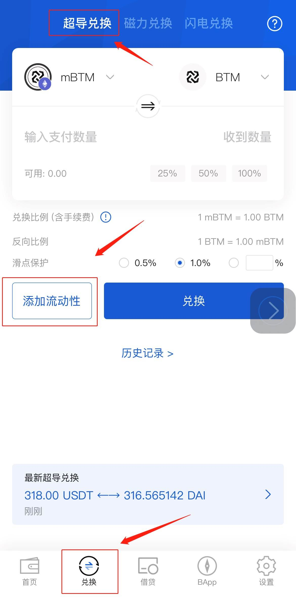
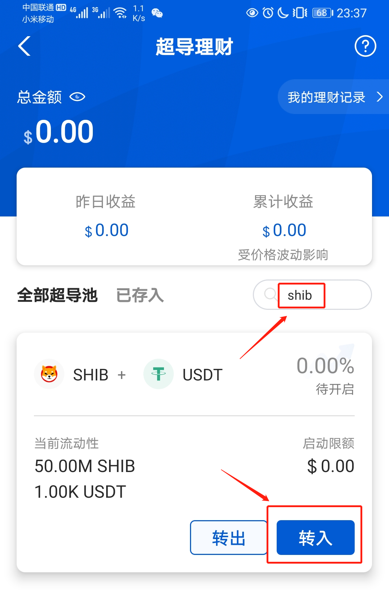
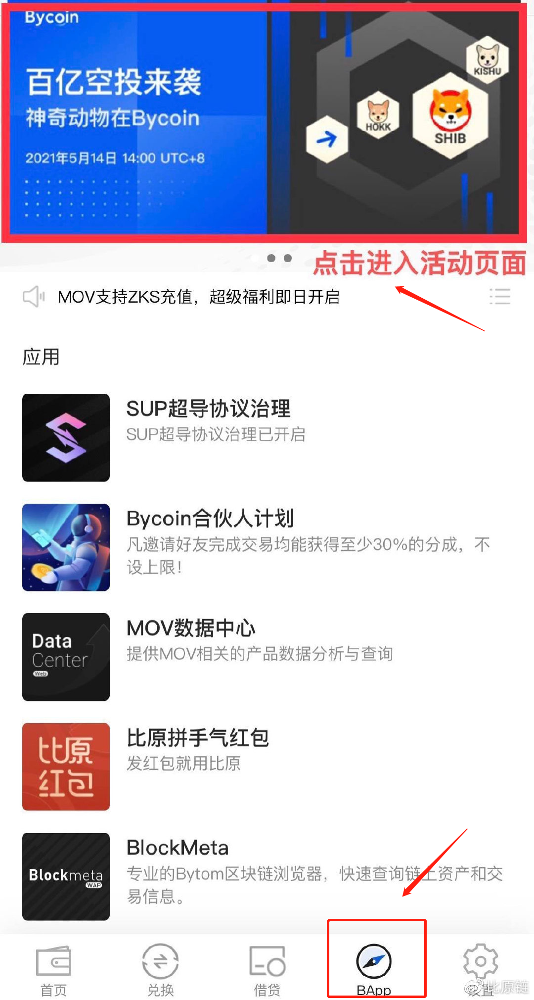
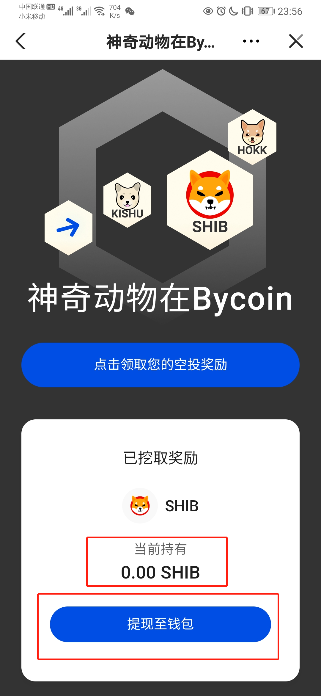
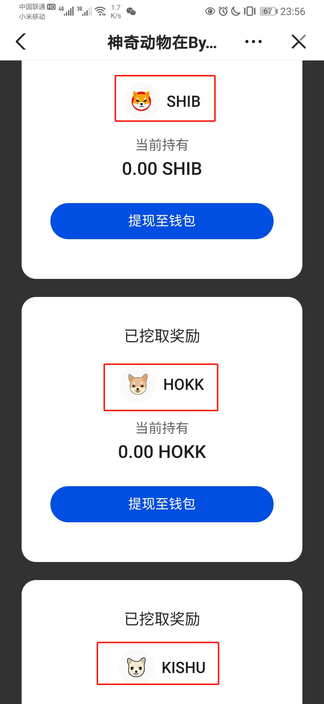
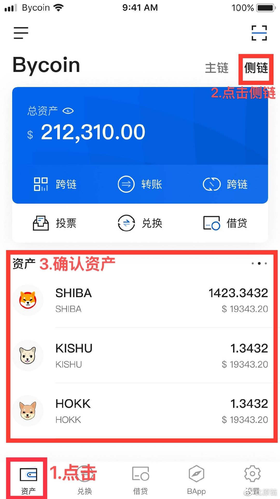

超导流动性挖矿将于2021年5月16日10:00开启，为期一周，届时Bycoin新老用户凡在SHIB-USDT、 HOKK-USDT、 KISHU-USDT三个超导池提供流动性，均可分别获取对应池的挖矿奖励。

1、全体用户挖矿奖励总额如下：

SHIB-USDT池 350,000,000个SHIB

HOKK-USDT池 3,500,000,000,000个HOKK

KISHU-USDT池 3,500,000,000,000个KISHU

2、挖矿奖励依据每个侧链地址，在对应超导池中所提供的流动性份额进行等比例分配。奖励每1小时更新一次，用户需在Bycoin内切换至流动性提供地址，访问活动页面领取收益。

## 一、如何参与挖矿

#### 第1步.进入超导池列表

访问Bycoin底部兑换功能下的“超导兑换”，并点击“添加流动性”。

#### 第2步.添加流动性

通过滑动列表或搜索资产名称，定位到参与活动的超导池。

点击“转入”按钮，将您的对应资产存入超导池。

流动性成功添加后，即开始计算收益，一定时间后即可访问活动页面领取您的收益。

当您想取出您的资金，通过“已存入——指定池——转出”的操作，即可取出您的流动性资金至侧链钱包。

## 二、领取挖矿收益

#### 第1步.访问活动页面

挖矿奖励依据地址发放，访问活动页面前，请先将钱包切换至提供流动性的地址。

访问Bycoin底部“BApp”功能，并通过顶部进入活动页面。

#### 第2步.领取挖矿收益

页面下方的面板，会显示当前地址已产出的挖矿余额。点击下方的“提现至钱包”按钮，授权签名后即可将奖励体现至侧链钱包。

挖矿奖励每约1小时计算一次，若您提供流动性后立即访问页面可能无法看到收益，请耐心等待一段时间。

三个活动超导池的挖矿活动，分别独立计算，因此收益也分别独立领取。请根据您所提供的流动性，在对应面板提取您的挖矿收益。

### 第3步.查看收益到账

奖励会发放至Bycoin钱包侧链，点击【首页】，进入到【侧链】，点击对应的资产，查看奖励是否到账。

