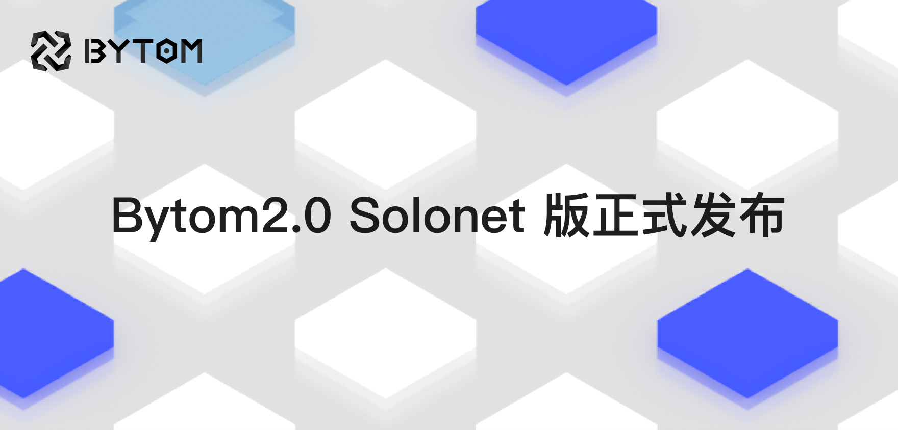
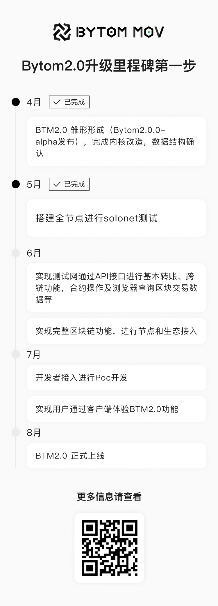

## Bytom2.0  Solonet版正式发布

5月25日16：30，Bytom2.0 Solonet版正式发布。自Bytom官方发布升级计划以来最关键的一步。

从该版本起，Bytom共识机制将由PoW转移至PoS。且更新后的版本区块确认时间也随之调整至 6 秒 / 块，有利于降低分叉的可行性，保证链再⽆回滚的状态发⽣。

### 比原链2.0到底是什么？
比原链1.0是PoW公链，其架构为主链Bytom，以及侧链Vapor，主链为PoW共识，负责资产发行，侧链采用PoS，负责交易效率。

比原链2.0的革新在于，将一主一侧的架构合并为统一平台，即以Vapor技术为根基，合并为一条全新的、统一的、PoS共识的新比原链。

比原链2.0路线图

### 此次Solonet版两大亮点

#### 1.共识机制由POW→POS

BTM2.0将完全从PoW过渡到PoS阶段，BTM2.0 不需要运行昂贵且专业的设备来创建和验证交易区块，新交易区块的验证和确认将由验证器来完成，根据抵押的BTM轮流出块。考虑到POS机制本身存在的无利害攻击问题，会采用创新的经济惩罚措施来避免相关的情况产生。

注意事项：由于还处于Solonet版，目前尚不支持通过抵押Token成为共识节点。

#### 2.调整出块速度

在之前比原侧链Vapor的实践过程中，吸取了很多的实战经验，Vapor每0.5s一个块，同时每个节点连续产出10个块，可能带来了分叉的情况，在新的BTM2.0中，将调整为6s一个块，同时每个节点每次只产出1个块，尽可能的将分叉的概率降低，保证链再⽆回滚的状态发⽣。

### 版本升级的益处

#### 1.更强的性能和稳定性

通过全新的POS共识算法，将大大降低了链的分叉概率和占用体积，能够更好的发挥出PoS链的性能优势，更好的保证其稳定性和安全性。

#### 2.赋能DeFi生态发展

从目前 DeFi 的热度发展和以太坊的瓶颈来看，用户对于DeFi市场的需求正在不断增强。但如何保证主流资产链上资产转移的安全、可靠、高效，并且真正提高 DeFi 生态的活力和效率是亟待考虑的重点。比原链将通过对主流资产的支持，完善DeFi 生态中主流资产流通路径，增加了资产利用率，推动DeFi生态的繁荣与发展。
