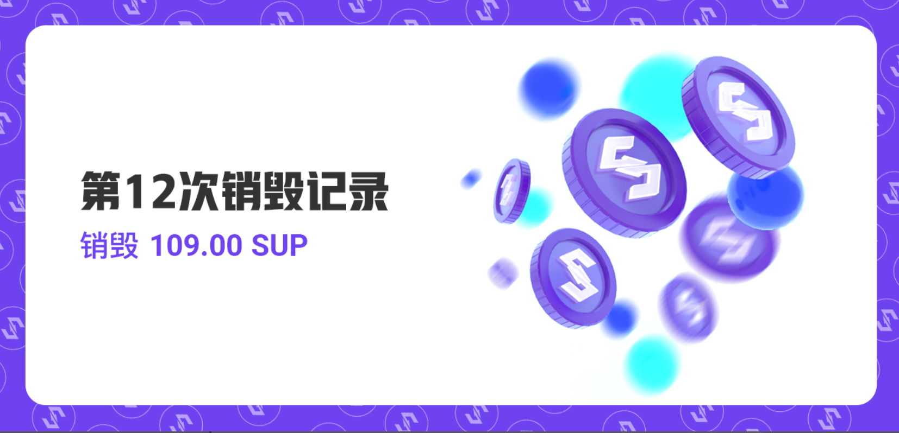

尊敬的用户，您好：
2021年7月2日至2021年8月1日，比原链基金会已按计划完成七月MOV超导交易手续费回购SUP并销毁，本次共计销毁109.00 SUP。
单月超导协议各币种交易手续费分别为： 0.05 BTC、1.88 ETH 、58,423.13 BTM、 3,321.78 USDT、 3,075.26 DAI、2,755.08 USDC、7.31 SUP、0.94 LTC、21.49 DOT、85.92 ZKS、228,705.41 SHIB、9,941,742.51 HOKK、130,620,587.6 KISHU。
 
SUP销毁哈希：
8bf6ed9c1a961f583df827160be44c4072cb1c67e6bfa62f252a66992321a6a6
SUP销毁链接：
https://blockmeta.com/tx/8bf6ed9c1a961f583df827160be44c4072cb1c67e6bfa62f252a66992321a6a6
自2020年9月25日开始，比原链基金会按照SUP回购销毁规则——流动性挖矿结束后，每月将超导协议20%的手续费用于回购SUP并销毁。目前已累计销毁1332.98 SUP。