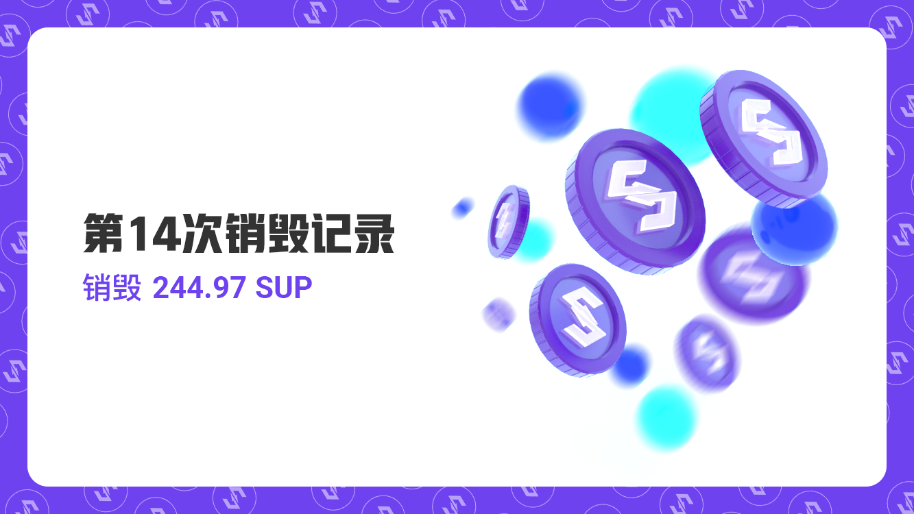

尊敬的用户，您好：
2021年9月1日至2021年9月30日，比原链基金会已按计划完成九月MOV超导交易手续费回购SUP并销毁，本次共计销毁 244.97 SUP。
单月超导协议各币种交易手续费分别为： 0.097 BTC、2.606 ETH 、106,759.087 BTM、 3,155.190 USDT、 2,910.886 DAI、2,651.149USDC、10.930 SUP、1.657 LTC、20.423DOT、110.803 ZKS

本月实际销毁：0.0195 BTC, 0.521 ETH, 21,351.817 BTM, 631.038 USDT, 582.177 DAI, 530.230 USDC, 2.186 SUP, 0.331 LTC, 4.085 DOT, 22.161 ZKS

SUP销毁哈希：
159d8600dd9793ef4573356b4f9de0f21e036668bcf80358e76647bc507ad44e

SUP销毁链接：
https://blockmeta.com/tx/159d8600dd9793ef4573356b4f9de0f21e036668bcf80358e76647bc507ad44e

自2020年9月25日开始，比原链基金会按照SUP回购销毁规则——流动性挖矿结束后，每月将超导协议20%的手续费用于回购SUP并销毁。目前已累计销毁1750.87 SUP。
