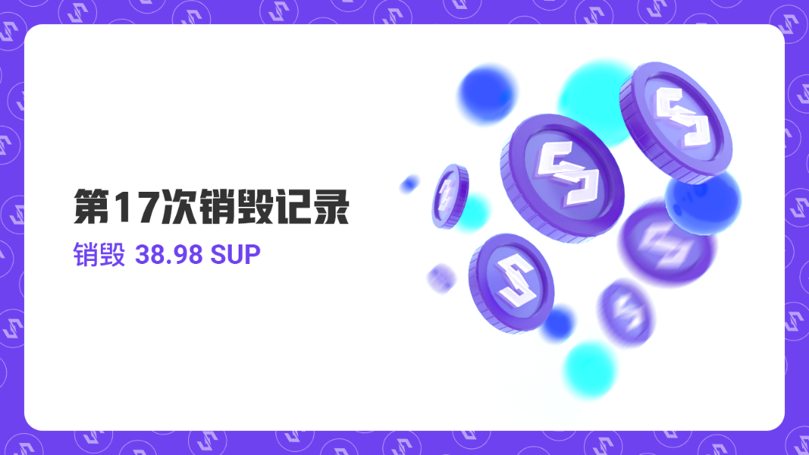

尊敬的用户，您好：
2021年12月1日至2021年12月31日，比原链基金会已按计划完成十二月MOV超导交易手续费回购SUP并销毁，本次共计销毁 38.98 SUP。
单月超导协议各币种交易手续费分别为： 0.037 BTC、0.552 ETH、49021.133 BTM 、 0.147 USDT 、13776.630 SHIB 、9.878 SUP、0.009 DOT、2.816 LTC、157.168 ZKS

本月实际销毁： 0.006 BTC、0.093 ETH、9804.227 BTM、0.029 USDT、2755.326 SHIB、1.976 SUP、0.001 DOT、0.563 LTC、31.434 ZKS
SUP销毁哈希：
d3a4c5210ce0afdb6e84ff19b0f7ee9ac704d745eb8c9197a9406daab7be4c2f
SUP销毁链接：
https://blockmeta.com/tx/d3a4c5210ce0afdb6e84ff19b0f7ee9ac704d745eb8c9197a9406daab7be4c2f
自2020年9月25日开始，比原链基金会按照SUP回购销毁规则——流动性挖矿结束后，每月将超导协议20%的手续费用于回购SUP并销毁。目前已累计销毁 2016.69 SUP。

另，由于技术升级，后续SUP的销毁将由每月一次调整为每季度一次，MOV的磁力兑换和闪电兑换功能已关停，故后续将不再产生销毁。