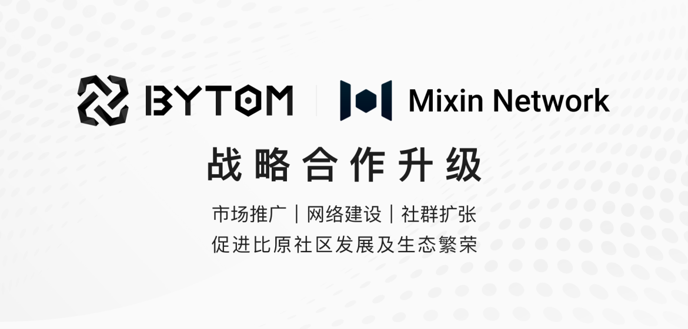

Mixin Network 与 Bytom（比原链）将进行战略合作升级。比原链是一种多样性资产的交互协议，运行在比原链区块链上的不同形态的、异构的比特资产（原生的数字货币、数字资产）和原子资产可以通过该协议进行登记、交换和基于合约的更具复杂性的交互操作 。目前，Bytom 2.0 即将上线，比原链将建立PoS 新比原链，从一主一侧合并为“统一平台”。
Mixin Network 已于 2019 年集成并支持 BTM 至其跨链生态中。通过本次战略合作升级，双方将在全球范围内的市场推广、网络建设及社群扩张等方面进行进一步深入合作。
Mixin Network 将全面助力比原社区发展及生态繁荣。同时，通过 Mixin 生态中丰富的去中心化应用，也将为更多的比原社区用户提供更多的实际应用场景。
Mixin Network 与 Bytom 欢迎大家加入社区。在社区中，您可以遇到更多加密世界的好友，更便捷的了解最新资讯，更有超多社区福利等您领取！

## 关于 Bytom

Bytom Blockchain Protocol（简称比原链：Bytom）是一种多样性资产的交互协议，运行在比原链区块链上的不同形态的、异构的比特资产（原生的数字货币、数字资产）和原子资产可以通过该协议进行登记、交换、对赌、和基于合约的更具复杂性的交互操作 。
为了实现这一目标，Bytom 建立了一个全面的产品生态系统，涵盖了 Bytom 主链，Bytom 侧链（Vapor），DeFi 协议（MOV），以及跨链网关（OFMF），同时还领导着一个区块链标准的 IEEE 工作组。Bytom很快将推出Bytom2.0协议，将一主一侧合并为“统一平台”。

## 关于 Mixin Network

Mixin Network 是一个免费、快速的点对点数字资产网络，可帮助其他区块链分布式账本获得百万级 TPS、亚秒级确认、零手续费、加强隐私、无限扩展的能力。
Mixin Network 是一条目前拥有 37 个节点的 PoS 公链，已作为 Layer 2 解决方案支持 Bitcoin、Ethereum、Monero、Polkadot、Solana 等 36 条公链，网络总资产超过 20 亿美金。AMM、聚合交易、挂单、铸币等金融基础设施完善。
Mixin 始终致力于为全球用户提供安全、隐私、去中心化的区块链基础设施。

