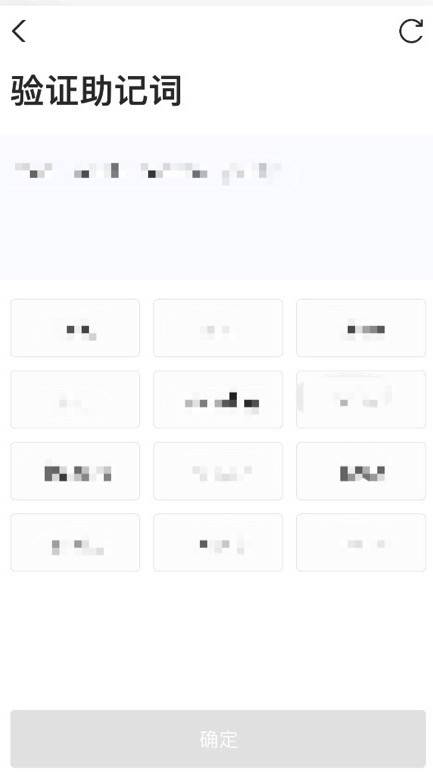

## 一、Bycoin的下载

1、点击网址：https://blockmeta.com/wallet/ ,请选择对应的版本进行下载。安卓用户点击【Android】直接下载。

iOS用户目前有两种途径可供下载Bycoin。

注意：两种途径均需要使用海外APPLE ID，点击页面链接可以查看海外APPLE ID教程。

途径1:下载【TestFlight】，再安装【Bycoin】。

途径2:直接下载【Bycoin】国际版。

### 【途径1】

1、打开【APP Store】

2、点击右下角【搜索】，在搜索栏输入【TestFlight】

3、点击下载，【TestFlight】安装完成

4、安装【Bycoin】

退出【TesyFlight】，点击进入：https://blockmeta.com/wallet/ ，点击【立即下载】，点击弹窗中的【打开】，即可跳转至【TestFlight】页面。

在【TestFlight】页面点击【接受】、【安装】，即可完成【Bycoin】的安装。

### 【途径2】

1、打开【APP Store】

2、点击右下角【Search】，在搜索栏输入【Bycoin】，即可安装完成。

## 二、Bycoin的注册

1、打开【Bycoin】，点击【创建钱包】

2、输入两次密码

3、备份【助记词】

将助记词记录在纸上。
请务必保存好自己的助记词，一旦丢失，钱包里的资产就无法找回。

4、验证助记词

请按顺序选择助记词。

5、注册成功

成功备份、验证助记词后，即可打开Bycoin首页。

## 三、参与活动

1、进入【Bycoin】，点击下方【BApp】

2、点击进入宣传活动页

3、点击领取空投奖励

4、确认奖励

空投奖励会发放至Bycoin钱包侧链，点击【首页】，进入到【侧链】，查看奖励是否到账。

