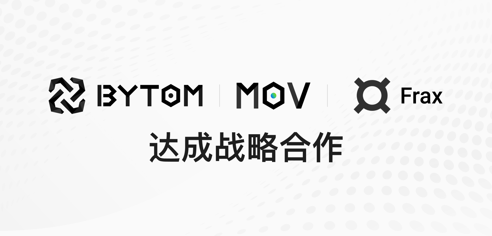

随着去中心化金融（DeFi）的迅速发展，稳定币在这个领域的重要性日益突出。在DeFi生态中， 稳定币承担着交易媒介职能与流通职能，成为了去中心化金融（DeFi）中的关键组成部分。 对于 DeFi 的发展，稳定币无疑将发挥至关重要的作用。
 
为了推进双方生态发展，共同推进Defi 产品的创新，今日比原链官方宣发与算法稳定币Frax达成战略合作，将把Frax引入MOV DeFi生态系统。

## 算法稳定币的先驱者

目前市场上有三种稳定币的发行方式：法币作为抵押、数字资产作为抵押、算法稳定币。

法币作为抵押的代表币种是USDT， 也是目前运用 最广泛的， 由 Tether 公司推出，与美元 1:1 锚；数字资产作为抵押，一般都是超额抵押，运用最广的就是 DAI；算法稳定币：主要分为纯算法稳定币和部分算法稳定币。纯算法稳定币不需要抵押物，主要的机制是 rebase；部分算法稳定币需要部分抵押物，但是并不会要求超额抵押，币价的稳定一般依靠于套利机制。

FRAX （ Fractional-Algorithmic Stablecoin Protocol）是在以太坊网络上推出并与美元挂钩的去中心化，部分抵押的稳定币。FRAX以“分数算法”稳定机制命名，抵押和算法的比率取决于FRAX稳定币的市场价格。 如果FRAX的交易价格高于$ 1，则该协议会降低抵押物比率。 如果FRAX的交易价格低于1美元，则协议会增加抵押物比率。 

FRAX 作为算法稳定币的先驱者，主要解决了 DAI 这类超额抵押资金利用率不高和清算风险，以及 AMPL 等完全没有抵押品的算法稳定币的投机性远远大于实用性问题。通过引入抵押率这个概念，很好的调控了这两种机制的平衡（ESD2.0 会引入类似 Frax 的机制），同时 FXS 也成功转移了投机者对 FRAX 价格的影响。
 

## 比原链助力Frax 跨链

比原链和Frax将在跨链上展开合作，在比原链底层跨链技术的帮助下，Frax将通过比原链的跨链基础设施完成FRAX到比原链的跨链。当跨链实现后，未来将允许用户使用超导协议来交易Frax，并开放相关交易对。

## MOV生态系统中稳定币新选
比原链是一种多样性比特资产的区块链交互协议，在比原链上可以运行不同类型资产，进行复杂的交互操作。2020年3月10日，基于比原链的下一代去中心化跨链Layer2价值交换协议——MOV正式上线。2021年3月18日Bytom 2.0计划启动，比原链将不断完善MOV DeFi 簇，增加更多金融衍生品。在跨链基础设施的基础上，比原链将与更多链达成合作，促进资产流动，扩大DeFi产品的使用场景。

生态的发展不仅需要用户，还需要大量的资产注入，才能形成网络效应，发展应用生态。Frax是MOV继USDT、USDC、DAI上线的第4个稳定币，也是第一个算法稳定币。通过此次合作，将提高用户产品体验，扩展MOV生态的多维度布局，为DeFi生态系统注入流动性和稳定性。

## Bycoin最新活动

Bycoin钱包开启新用户注册，领百亿空投活动，更有挖矿奖励等你来拿。
5月14日下午2点Bycoin钱包开启百亿空投免费领活动，新用户注册可领SHIB、Hokk、KUSHI空投大礼包；5月16日10点，Bycoin开启SHIB-USDT、 HOKK-USDT、 KISHU-USDT三个超导池的流动性挖矿，老用户可通过存入相关币种参与挖矿，新用户可用空投奖励直接参与。本次挖矿活动奖励份额有限，越早参与收益越高哟。

空投领取教程：https://shimo.im/docs/w9xhxg3GXYJcyXkJ/read

空投领取方式：安装Bycoin钱包 > 注册钱包 > 点击“BApp" > 点击活动页领取。  

Bycoin下载地址https://bycoin.im/?invitecode=YYR1PL
