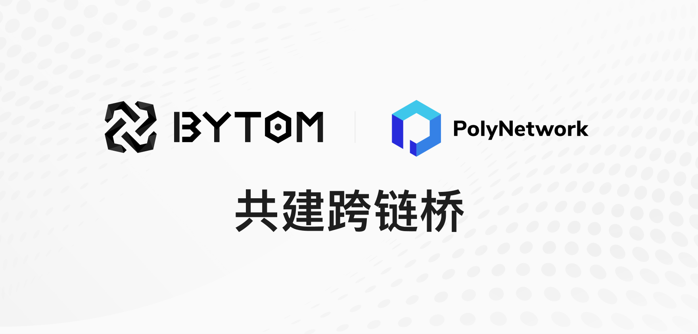

今日，比原链官方宣布与跨链互操作协议 Poly Network 战略合作进一步升级，双方将在资产跨链领域展开深度合作。通过Poly Network的底层跨链技术帮助，将实现比原链上的多链数字加密资产在 ETH、BSC、HECO、Bytom 网络的跨链互通，打通多链资产的互操作性。未来双方将共建比原和其他链之间的跨链桥，实现不同链上主流资产的自由兑换，共同为 DeFi 应用生态系统繁荣助力。

比原链是一种多样性比特资产的区块链交互协议，在比原链上可以运行不同类型资产，进行复杂的交互操作。2020年3月10日，基于比原链的下一代去中心化跨链Layer2价值交换协议——MOV正式上线。2021年3月18日Bytom  2.0计划启动，比原链在不断完善MOV DeFi  应用，新的协议和功能也在不断推出。在跨链基础设施的基础上，比原链计划将同更多的区块链进行交互，增加资产多样性。通过此次合作，将扩展双方之间的跨链交互，全面丰富双方业务生态的多维度布局。

**与Poly Network共建跨链桥**

比原链通过自研的OFMF网关来打通和其他链的互操作性。通过与其合作弥补自身不足，同时拓展比原在跨链的能力，使比原在跨链数量、跨链资产、互操作性上等方面都能得到很大提升。通过Poly Network创建去中心化方式连接多个链的互操作性层，让比原链上的多链数字加密资产在ETH、BSC、HECO之间相互流转，提供多链资产的互操作性。

**建立跨链桥的重要性**

1、比原链具有高吞吐，低延时和低手续费的优势，通过跨链桥，使得其他生态的用户和开发者都可以进入比原链享受高性能带来的便利；
2、通过跨链桥，开发人员可以将跨链逻辑集成到他们的智能合约中，以创建可互操作的Dapp；
3、用户可以通过该桥跨链参与其他的生态，增加BTM的使用场景，加速自身生态与ETH、BSC、HECO等多生态的融合，促进生态发展壮大，为DeFi用户提供更多服务。
