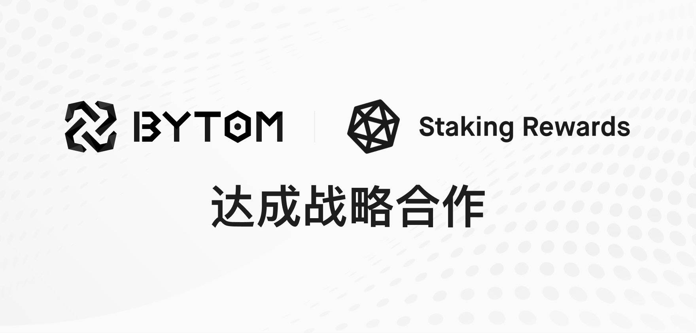

今日，比原链与全球知名质押项目排名网站Staking Rewards达成战略合作，双方将在品牌宣发、Staking等领域展开深度合作。目前Bytom已上线Staking Rewards平台，相关数据接入进行中。海外用户通过该平台，可以更便捷的参与到Bytom 2.0 Staking生态建设中。未来，双方将共同为海外数字资产用户提供更优质便捷的服务。
更多详情:https://www.stakingrewards.com/earn/bytom-2

共同推进Bytom 2.0 Staking

比原链现在正处于从基于PoW共识的Bytom 1.0到基于PoS共识的Bytom 2.0的过渡期间，Staking Rewards将与比原链团队强强合作，一起为用户提供更优质便捷的服务。

（1）目前Staking Rewards已经为比原链开发了相关页面（https://www.stakingrewards.com/earn/bytom-2）；

（2）Staking Rewards正在将比原链资产配置文件中显示最新的年化收益和网络统计信息，用户可以在这个页面可以查看与跟踪当前与staking相关的数据和信息。

（3）Bytom2.0主网启动后，Staking Rewards将集成Bytom 2.0的验证节点信息等文件；

（4）Staking Rewards官网就Bytom 2.0常见问题整理归纳了相关解答文档（https://www.stakingrewards.com/earn/bytom-2/overview）；

（5）Staking Rewards在未来几个月中，将持续关注并报道Bytom2.0相关信息。

关于Staking Rewards
Stakingrewards是全球最大的质押项目排名网站，也是数字资产委托权益收益数据库，被誉为质押项目领域的Coinmarketcap。

Staking Rewards 重点关注质押证明协议，旨在收集知识并建立安全的质押和 defi 生态系统。
团队创建的独特功能包括：交互式计算器，用于预估奖励和奖励频率；以及“质押得分”指标，用于发展被动收入机会的吸引力。Staking Rewards 目前正在追踪214项收益率较高的资产，平均回报率为14.95％，并提供8600名合格的质押节点。

## 关于Bytom

比原链是一种多样性比特资产的区块链交互协议，在比原链上可以运行不同类型资产，进行复杂的交互操作。2020年3月10日，基于比原链的下一代去中心化跨链Layer2价值交换协议——MOV正式上线。2021年3月18日Bytom  2.0计划启动，比原链在不断完善MOV DeFi  应用，新的协议和功能也在不断推出。在跨链基础设施的基础上，比原链计划将同更多的区块链进行交互，增加资产多样性。

## 最新活动：

Bycoin下载地址：https://blockmeta.com/wallet/

### 1.社区合伙人计划

为促进MOV的生态进一步发展和回馈社区粉丝，比原链于2020年5月11日正式启动“创合伙，造未来”社区合伙人计划。为感谢社区用户一直以来的支持，Bycoin团队将合伙人计划从限时启动升级为永久开放。自2020年8月11日起，所有合伙人将获得10%的永久分红，其中一级分红比例为8%，二级分红比例为2%，分红不设期限。

参与方式：「下载Bycoin」→「设置」→「邀请与分享」→「查看我的专属邀请码」→「分享链接/分享海报」→邀请他人注册。

### 2.节点投票
根据年化收益差异选择自己满意的节点，通过BTM投票。投票所需BTM将会锁定约20天（以释放快高为准），投票收益每天释放。

注意：节点年化收益根据节点过往发放的收益统计，仅作为参考，不代表节点实际的收益发放情况。

参与方式：「下载Bycoin」→「首页」→「投票」（收款图标下面）→「投票」。
