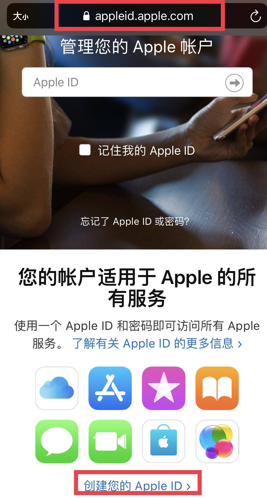
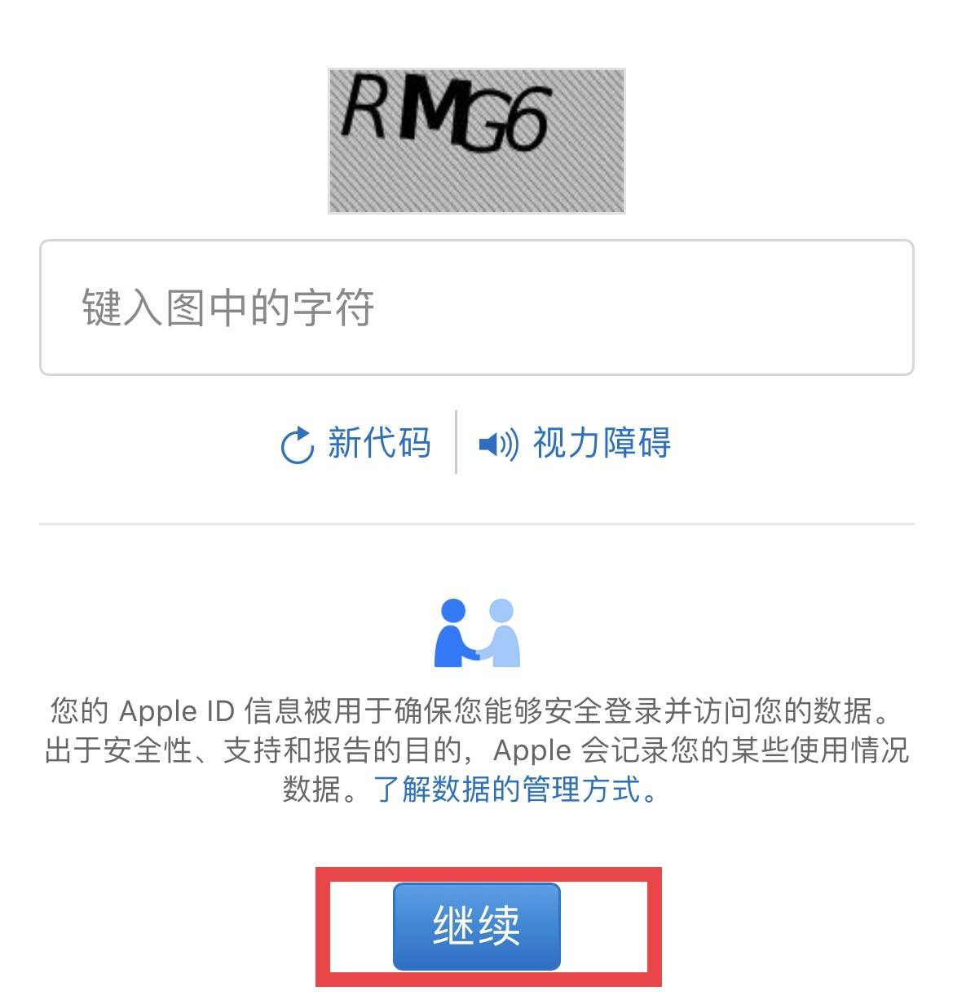
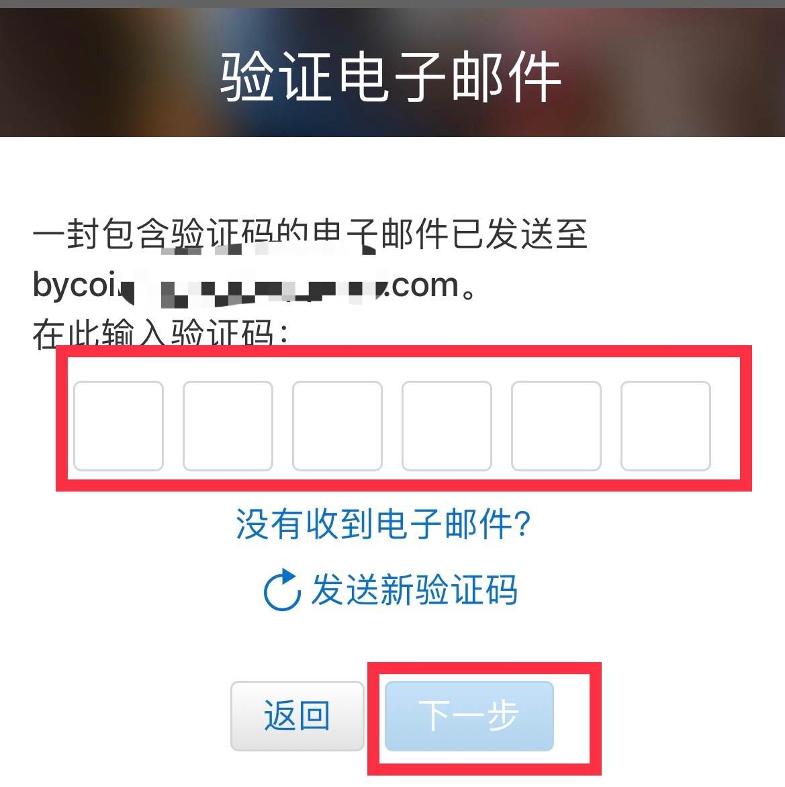
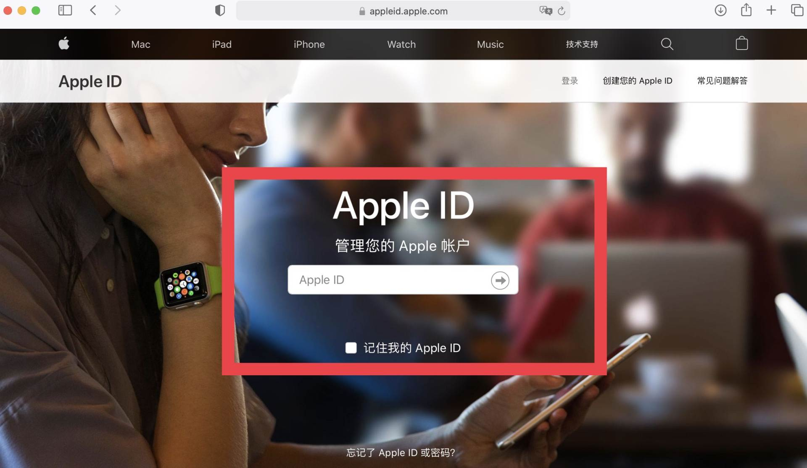
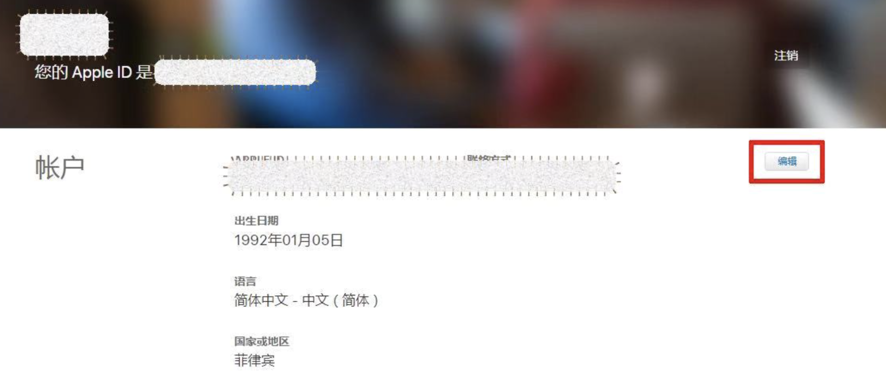
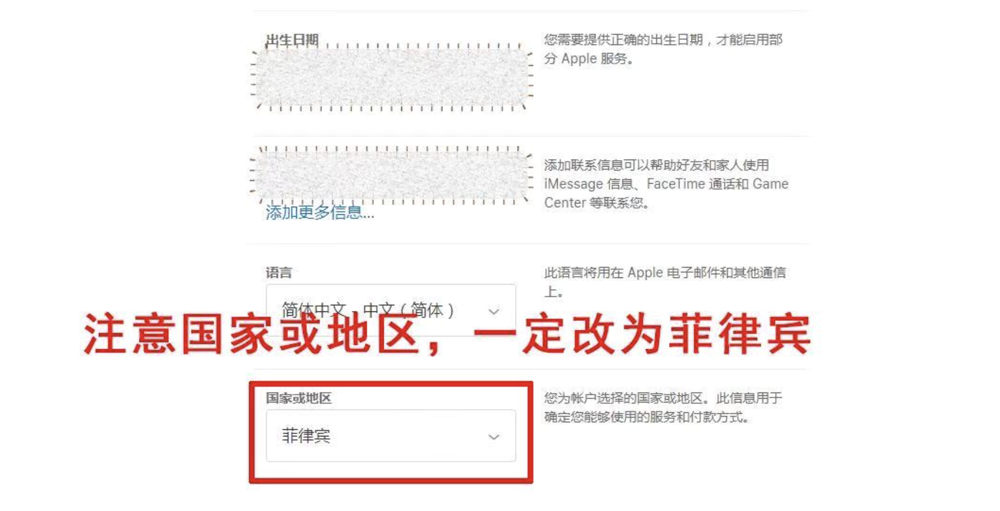
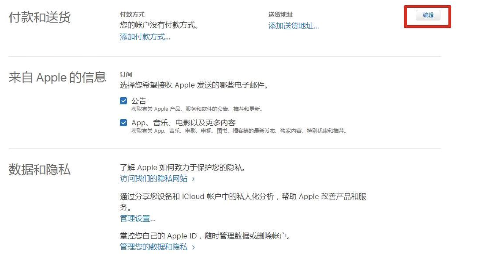
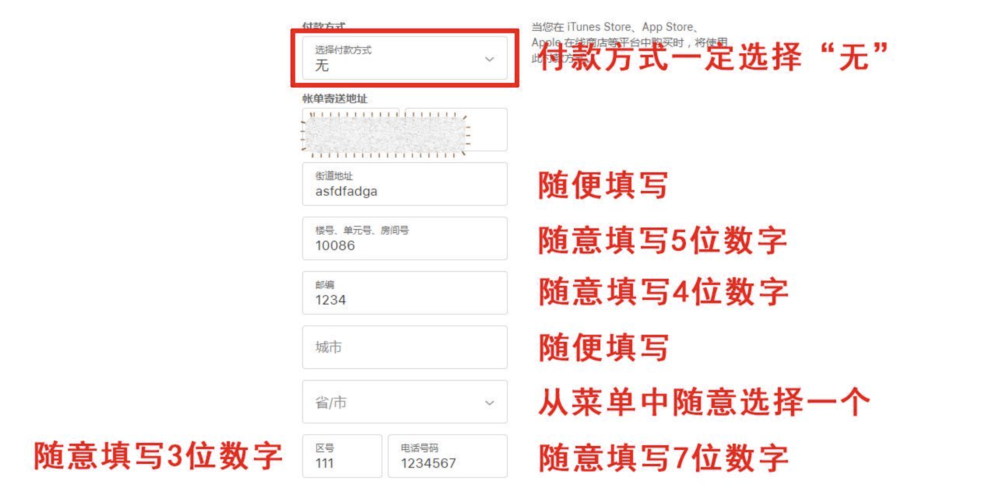

## 1、在手机上注册Apple ID

打开safari，输入网址：http://appleid.apple.com ,下拉至页面底部，点击创建您的Apple ID。

## 2、根据提示填写信息

国家或地区这一栏请填写“菲律宾”。

填写完毕后，在底部点击"继续"

## 3、填写验证码

打开邮箱，获取验证码，输入邮箱收到的验证码

点击下一步，创建完成。

## 4、登录账户，修改信息

在电脑网页修改Apple ID国家和区域，在电脑浏览器中输入网址：http://appleid.apple.com ，并登陆放才用手机完成注册的Apple ID。

点击编辑

检查国家或地区这一项是否显示为“菲律宾”，如果不是，请改为“菲律宾”。

修改付款信息

根据提示填写信息，具体填写规则请参照图示。

修改完成后，在手机APP Store上登录即可使用该Apple ID。
首次登录会提示检查账户，同意条款等信息，点击同意，无需修改任何信息，点击NEXT。
注意事项：如果进入商城后发现底部菜单栏显示的不是英文，表示没有跳转到海外商城，请退出账户并尝试重新登录。
