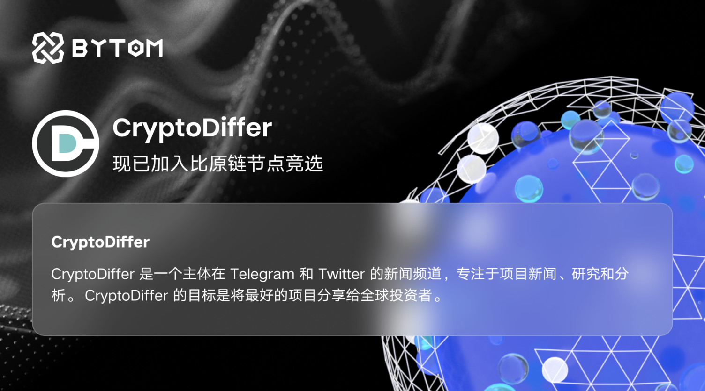

我们很高兴地宣布 CryptoDiffer 已加入 Bytom 的节点活动。 CryptoDiffer 是众所周知的加密货币新闻、研究和市场分析的权威。

作为比原链网络中的节点之一，Cryptodiffer 将通过创建关于比原链staking的教育内容为社区提供定期支持，并将作为比原链基金会顾问为基金会提供有益的建议和资源支持。 Bytom 基金会将与 CryptoDiffer 密切合作，为扩展 CryptoDiffer 和 Bytom 生态提供任何必要的支持。

## 关于 CryptoDiffer

CryptoDiffer 是一个主体在Telegram 和 Twitter 的新闻频道，专注于山寨币新闻、研究和分析。 CryptoDiffer 的目标是将最好的山寨币项目带到全球投资者的视线中。 CryptoDiffer 拥有非常多样化的受众，其追随者甚至遍布欧洲、独联体国家、东南亚和东亚国家。此外，CryptoDiffer 目前正在升级并更新网站，该网站将融合 Messari 和 Coingecko 功能组合。主要想法是创建一个用户友好且清晰的空间，人们可以在其中研究与 CryptoDiffer 持续合作的项目。预计该网站将于 2021 年底推出。

## 关于比原链

比原链（Bytom）是一种多元比特资产的交互协议，运行在比原链区块链上的不同形态的，异构的比特资产（原生的数字货币、数字资产）和原子资产（有传统物理世界对应物的权证、权益、股息、债券、情报资讯、预测信息）可以通过该协议进行登记、交换、对赌和基于合约的更具复杂性的交互操作。连通原子世界与比特世界，促进资产在两个世界间的交互和流转。基于区块链技术创造多样资产与可编程经济。
比原链构建了完善的产品生态系统，涵盖：

1、比原链
2、DeFi协议簇（mov.network）
3、跨链网关（ofmf.io）
4、领导IEEE身份密钥管理标准工作组

通过访问 https://bytom.io 并订阅Newsletter、在 Twitter@Bytom_Official 上关注我们以及加入我们的 Telegram 或 Discord 社区来了解更多信息。