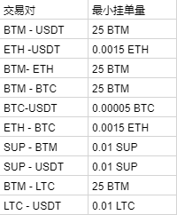

# 磁力兑换挂单手续费浮动通知

​        鉴于频繁小精度的挂单行为，影响磁力挖矿体验，为保证磁力挖矿的公平性，同时避免过多的粉尘交易，MOV团队目前已针对磁力兑换挂单手续费和挂单精度做相应调整。MOV磁力兑换挂单将根据实际情况进行浮动收费，届时请在磁力挂单时在钱包中保留充足的BTM作为手续费。另外，MOV团队已针对MOV磁力交易对的挂单精度做了最小数量限制，各交易对base最小挂单量如下表：  

​	感谢您对 MOV 的支持！  
​	MOV团队  
​	2021 年 01 月 05 日