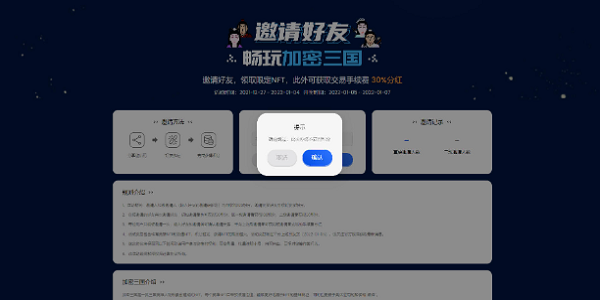

## 邀请好友预注册迷宫协议活动教程

### 移动端用户如何参与活动

1.在活动期间，用户将Bycoin更新至V2.8.2版本，在Bytom主网下点击【Maze】进入活动页面。

**初始邀请码：MYTYYYYR**

Bycoin下载地址：bycoin.im

2.初次进入页面的用户，需要点击【获取/绑定邀请码】按钮。输入好友的邀请码点击确认钱包签名绑定后会获得100积分，点击跳过确认钱包签名后将不会获得积分。注意：每个用户地址只拥有一次绑定好友邀请码的机会，点击确认绑定或跳过绑定确认钱包签名后，将无法更改或再次进行绑定。

3.确认输入邀请码/跳过输入邀请码后，页面中将显示用户自己的专属邀请码，用户可以通过分享，好友输入该邀请码进行绑定来获取积分。邀请绑定成功后，该邀请码归属者与被直接邀请的好友，都会获得100积分，直接邀请的好友再次邀请好友，初始邀请者也可获得50积分。

4.用户的直接邀请人数与二级邀请人数将会在页面最下方显示记录，供用户自行查看。

5.用户可以通过其他用户分享的消息中的网址，直接前往活动页面

### Web端用户如何参加活动

1.Web端用户需要提前安装插件钱包Byone确认为Bytom网络下，点击应用中的【Maze】访问活动页面。 

**初始邀请码：MYTYYYYR** 

迷宫协议官网：https://maz.network

2.初次进入页面的用户，需要点击【获取/绑定邀请码】按钮。输入好友的邀请码点击确认钱包签名绑定后会获得100积分，点击跳过确认钱包签名后将不会获得积分。注意：每个用户地址只拥有一次绑定好友邀请码的机会，点击确认绑定或跳过绑定确认钱包签名后，将无法更改或再次进行绑定。

3.确认输入邀请码/跳过输入邀请码后，页面中将显示用户自己的专属邀请码，用户可以通过分享，好友输入该邀请码进行绑定来获取积分。邀请绑定成功后，该邀请码归属者与被直接邀请的好友，都会获得100积分，直接邀请的好友再次邀请好友，初始邀请者也可获得50积分。

4.用户的直接邀请人数与二级邀请人数将会在页面右侧显示记录，供用户自行查看。

5.用户可以通过其他用户分享的消息中的网址，输入至浏览器中直接前往活动页面。

