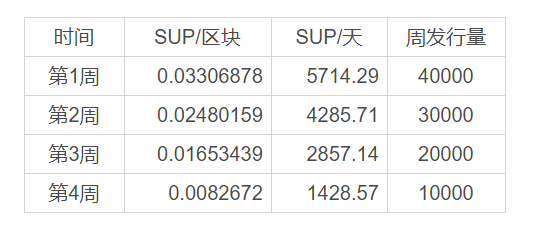

## SUP：一场MOV超导价值捕获的社会实验

SUP是MOV超导的价值捕获Token，是MOV的重要组成部分，SUP 将拥有MOV超导的治理权，在未来可以决定超导协议交易手续费率，决定超导协议流动性池（即交易对）的上线/下线，
决定超导协议的发展方向（通过对协议升级方案的提案和投票）等等。

SUP是一场有意义的社会实验，它的未来由社区决定，由众多拥有SUP的用户决定。依托于MOV超导产品的持续迭代和升级，SUP也将体现其巨大的价值。

### 无预挖，无预留，无私募

SUP完全通过去中心化的分发方式，自比原侧链 Vapor 72,600,001 区块高度起，为在超导中提供流动性提供者提供 SUP 奖励。团队无预挖，无预留，无私募。对任何人都绝对公平，大家处于一个起跑线上！

### 分发方式

SUP总量为100,000 枚，自比原侧链 Vapor 72576000  区块高度起，为在超导中提供流动性提供者提供 SUP 奖励，各流动性池的权重如下：

流动性挖矿开 1 天后，超导将上线 SUP/BTM 流动性池，开启 SUP 交易。
并为SUP提供流动性提供最高的权重奖励.

### 即刻获得or延迟满足

用户通过流动性挖矿获得的SUP将会有两种选择：即刻获得or延迟满足。

- 即刻获得即马上获得SUP，并可进行交易
- 延迟满足需要使用延迟满足合约锁定一定周期再获得，但可获得高于当前数量数倍的奖励：
  - 将即将获得的 SUP 锁定 3 个月，3 个月后收获 1.5 倍的 SUP
  - 将即将获得的 SUP 锁定 6 个月，6 个月后收获 2.1 倍的 SUP
  - 将即将获得的 SUP 锁定 12 个月，12 个月后收获 3.3 倍的 SUP

注意：只在获得时可以有选择，当获得后将无法再进行延迟满足

### SUP 的回购销毁

流动性挖矿开始 1 周后，超导协议 20% 的手续费将用来回购销毁 SUP
SUP 将每周回购销毁一次。

### 路线图

#### 第一阶段：初始分发

初始在BTC/BTM等6个池中进行挖矿，BTC/BTM ，ETH/BTM ，BTC/ETH ，USDT/USDC ，USDT/DAI ，USDC/DAI

#### 第二阶段：上线 SUP/BTM 流动性池

超导将上线 SUP/BTM 流动性池，开启 SUP 交易，并开启SUP/BTM池挖矿

#### 第三阶段：开启 SUP 的回购销毁

流动性挖矿开始 1 周后，超导协议 20% 的手续费将用来回购销毁 SUP。SUP 将每周回购销毁一次。

#### 第四阶段：后流动性挖矿阶段

流动性挖矿结束后，SUP 的回购销毁将持续进行，SUP 进入通缩状态。超导协议将会搭建相应的治理面板，将治理权交给 SUP 持有者，SUP 持有者可以：
- 决定超导协议交易手续费率
- 决定超导协议的手续费分配方案（如 LP 与 SUP 回购的分配比例）
- 决定超导协议流动性池（即交易对）的上线/下线
- 决定超导协议的发展方向（通过对协议升级方案的提案和投票）

MOV团队将持续进行 DeFi 生态的建设，将 SUP 引入更多的应用场景。