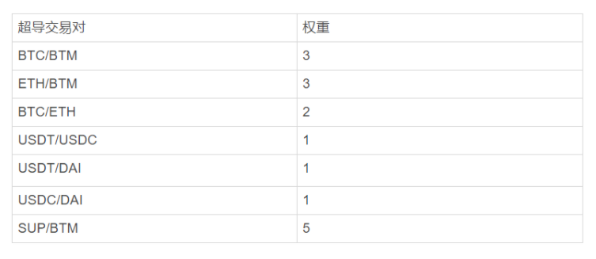
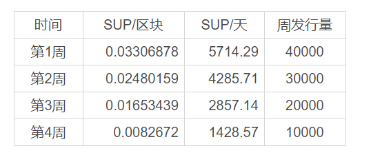

## SUP流动性挖矿细节

### 1. 产品规划

**a. 启动时间**

SUP将在比原侧链 Vapor 达到72,576,000 区块高度时，开启流动性挖矿。
时间约为：2020/09/17
目前点击页面http://bapp.blockmeta.com/sup 可以查看当下距离挖矿还有多少时间以及池子里面还有多少剩余SUP。

**b. 分发方式**
SUP总量为100,000 枚，自比原侧链 Vapor 72576000 区块高度起，为在超导中提供流动性提供者提供 SUP 奖励，各流动性池的权重如下：            

流动性挖矿开 1 天后，超导将上线 SUP/BTM 流动性池，开启 SUP 交易。并为SUP提供流动性提供最高的权重奖励。
常规情况下，SUP 发行为期一个月，每周呈线性递减，具体发行情况见下表：

该发行会受到延迟满足的影响，将推动流动性挖矿和 SUP 发行的提前结束。

**c. 即刻获得or延迟满足**

- 即刻获得即马上获得SUP，并可进行交易
- 延迟满足需要使用延迟满足合约锁定一定周期再获得，但可获得高于当前数量数倍的奖励：
  - 将即将获得的 SUP 锁定 3 个月，3 个月后收获 1.5 倍的 SUP
  - 将即将获得的 SUP 锁定 6 个月，6 个月后收获 2.1 倍的 SUP
  - 将即将获得的 SUP 锁定 12 个月，12 个月后收获 3.3 倍的 SUP

注意：只在获得时可以有选择，当获得后将无法再进行延迟满足

**d. SUP 的回购销毁**

流动性挖矿开始 1 周后，超导协议 20% 的手续费将用来回购销毁 SUP，SUP 将每周回购销毁一次。

**e. SUP流通**

开启挖矿后的24h后，将上线SUP/BTM超导池，用户即可在超导交易中进行兑换。

**f. SUP收益计算**

用户单位时间收益=用户流动性提供量/用户所存池子规模*该流动性池单位时间释放 SUP 数量+LP收益
其中 该流动性池单位时间释放 SUP 数量=该池权重/总权重*单位时间内 SUP 总释放量

例如，用户提供 USDT+USDC 为 2000，该池规模为 2000000，该池权重为 1，所有池总权重为 16，SUP 单位时间释放量为 40000，则该用户单位时间可获得的 SUP 数量为 2000/2000000*1/16*40000 = 2.5 
(举例忽略滑点，交易损耗，币价涨跌等因素，仅供参考)

### 2.MOV SUP的优势

- 无门槛，无限制

  无需获取LPtoken，无需高昂GAS费，轻松上手。质押资金无大小限制，质押越多，回报越大。

- 收益快速，不拖延

  SUP奖励按区块计算，每一个新区块诞生都有收益。收益每十分钟发放一次，用户无等待。

- 公平，公正，公开

  SUP流动性挖矿，官方团队无预挖、无预留、无私募、公平分发。

- 一次挖矿，双份收益

  流动性挖矿获得SUP的同时，享受超导理财给流动性提供者的收益

- 官方回购，全面通缩

  SUP流动性挖矿开始一周后，超导协议 20% 的手续费将用来回购销毁 SUP。SUP 将每周回购销毁一次。流动性挖矿结束后，SUP 的回购销毁将持续进行，SUP 进入通缩状态。SUP全面通缩，价值保证。

- 去中心化社区治理，公平公开

  超导协议将会搭建相应的治理面板，将治理权交给 SUP 持有者，SUP 持有者可以：

  - 决定超导协议交易手续费率
  - 决定超导协议的手续费分配方案（如 LP 与 SUP 回购的分配比例）
  - 决定超导协议流动性池（即交易对）的上线/下线
  - 决定超导协议的发展方向（通过对协议升级方案的提案和投票）

  比原团队将持续进行 DeFi 生态的建设，将 SUP 引入更多的应用场景。