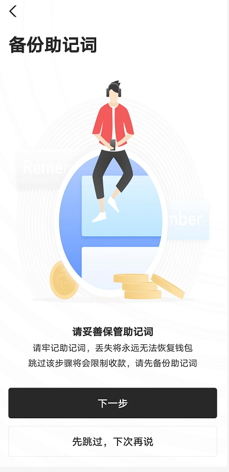

# 保姆级教程——如何获取SUP？

SUP是MOV超导的价值捕获Token，SUP 将拥有MOV超导的治理权，总量10万个，正式挖矿会在9月17日正式开启，目前点击页面http://bapp.blockmeta.com/sup 可以查看当下距离挖矿还有多少时间以及池子里面还有多少剩余SUP。

预计挖矿周期为四周，由于有延迟满足会增加SUP的锁定，大概率会提前发放完成（关于延迟满足增加SUP的锁定详情会在接下来的文章详细介绍）下面就开启获取SUP的保姆级教程吧，由于考虑一些新人小白，本教程写的非常细致甚至包括如何创建使用钱包，老用户可忽略直接跳到最后一部分查看。

**注意：SUP挖矿现在虽然还未正式开启，但超导池质押已经开启！现在可以将币种先跨入MOV，并存入超导池，等到比原侧链 Vapor 72576000 区块高度时，即默认参与SUP挖矿，无需其他操作！！！**

## 如何注册使用Bycoin钱包？

Bycoin钱包是一款基于比原链的钱包app，安全可靠，目前已上线闪兑，磁兑，超导等多项功能，使用Bycoin能更好的管理资产。

**下载链接：bycoin.im**

### 一、如果你从未使用过Bycoin钱包

点击“创建钱包”，如果您之前使用过Bycoin钱包，点击“恢复钱包”

### 二、输入密码，重复密码

### 三、备份助记词

一定一定要保存好自己的助记词，否则助记词丢了，该钱包里面的资产就无法找回了。

### 四、转入资产

成功备份、验证好助记词以后，就可以看到Bycoin首页，目前Bycoin已支持BTC/ETH/USDC/USDT/DAI的主链，可由交易所/钱包主链地址直接转入资产。

此刻你就拥有了第一个你的Bycoin钱包啦。

**如何成功将BTM/BTC/ETH/USDT/USDC/DAI成功跨入Bycoin钱包？**

目前由于Bycoin钱包已经成功实现BTC/ETH的多链，所以可以直接先从其他地址将BTC/ETH/DAI/USDT/USDC等币转入Bycoin的主链地址，再从Bycoin里面跨入侧链，无需经过其他钱包，方便便捷省钱。

#### 一、以BTM为例

1）点击“主链”，点击“BTM”，

2）点击“收款”

3）点击复制地址

4）去交易所复制地址提现，BTM需要经过六个区块确认，差不多需要三四十分钟到账

5）到帐前你的BTM余额显示为0,不过地址处有红点显示，表示资产正在确认中，你可以看到转账的进程。

#### 二、ETH/USDT/USDC/DAI跨链教程

1）ETH资产跨入和BTM类似。只是复制的跨入地址是ETH的地址，以及ETH首次跨链需要进行地址绑定，需要额外的手续费，这边要注意

#### 三，BTC跨链教程

同上

如果你的币在比特派/imToken/麦子钱包，可以在钱包内实现跨链，具体教程点击这里查看：https://www.chainnode.com/post/418958

**如何在MOV购买或兑换BTC/ETH/USDT/USDC/DAI？**

如果我在MOV里面只有一种币种能参与此次的SUP挖矿嘛？如果你拥有的是USDT/USDC/DAI这三种稳定币，那你是可以单币理财的，具体可以点击这篇文章查看：https://weibo.com/ttarticle/p/show?id=2309404526289007804523#_0，不过稳定币超导池挖矿收获权重较低，不过稳定币参与受市场波动影响小，较为稳妥。

**如果只拥有BTM，如何参与挖矿？**

用BTM兑换BTC，目前在超导交易对中所占权重为3,

**1)BTM兑换BTC，点击“侧链”——“兑换”**

**2）点击“超导兑换”，填入你想兑换的BTM和兑换的BTC，如遇“滑点过大”的问题，可以自定义滑点大约10%就不会再出现这样的问题了。**

BTM兑换ETH，ETH兑换BTC步骤如上，目前超导兑换的手续费大约为千分之一。

**如何投入理财池收割SUP？**

当你拥有一定量的ETH/BTC/BTM/USDT/USDC/DAI即可参与超导理财参与SUP挖矿。

以小编目前有的ETH/BTM为例，

**1）在Bycoin里面点击“BApp”,点击banner，进入挖矿页面**

**2）找到BTM+ETH交易对，点击“去存入”**

**3）进入“超导理财”页面，在BTM+ETH交易对点击“转入”**

**4）按照池子里的比例来投入两种币种，点击“转入”**

**5）超导池转入成功，如果币一直在交易池里，等到区块高度达到72576000，默认参与SUP挖矿，无需其他多余操作。另外现在参与超导理财还可获得高达10+%的年化LP收益哦**

非稳定币理财交易对的配比在池子里面，点击“转入”即可查看两个币种所需比例。

**提示：以上理财会有无常损失风险，需要警惕，当市场出现较大波动，会出现损失！！！**

拓展阅读：什么是跨链？https://weibo.com/ttarticle/p/show?id=2309404509616158408903#_0

最近太多人提问Bycoin怎么跨链了，统一回复 https://weibo.com/ttarticle/p/show?id=2309404527009748615244#_0

无常损失是什么？https://weibo.com/ttarticle/p/show?id=2309404521926180864027#_0

如何在MOV Web端体验跨链，超导理财和超导兑换？https://weibo.com/ttarticle/p/show?id=2309404546918062620793#_0

SUP挖矿群正在热烈讨论，进群请加+bytom666