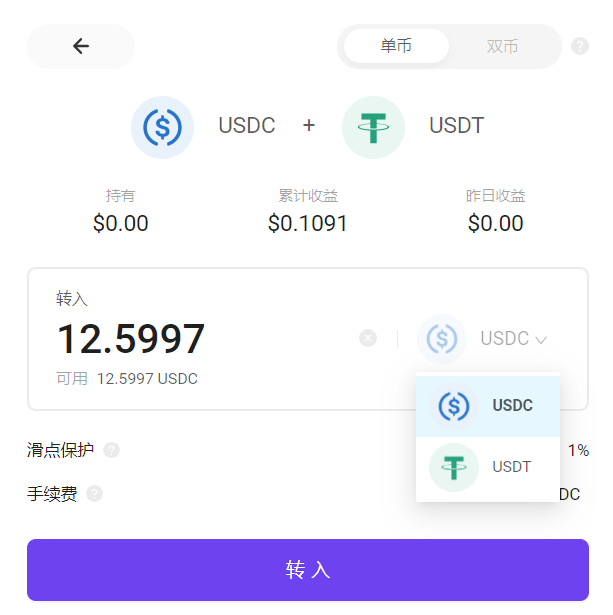
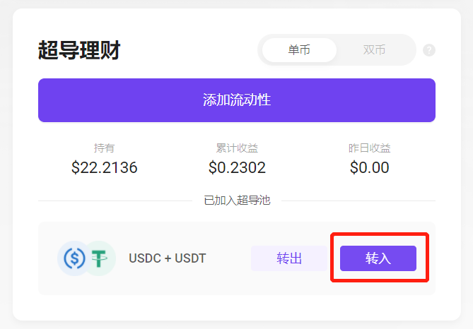
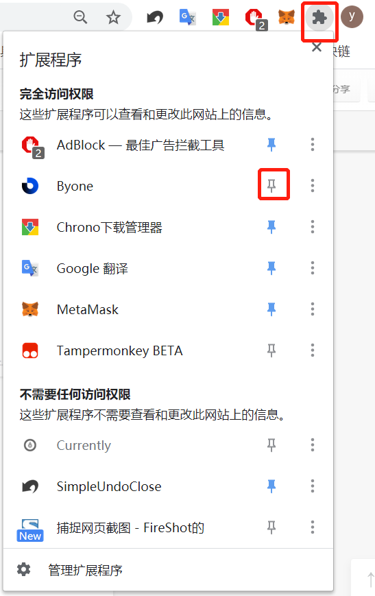
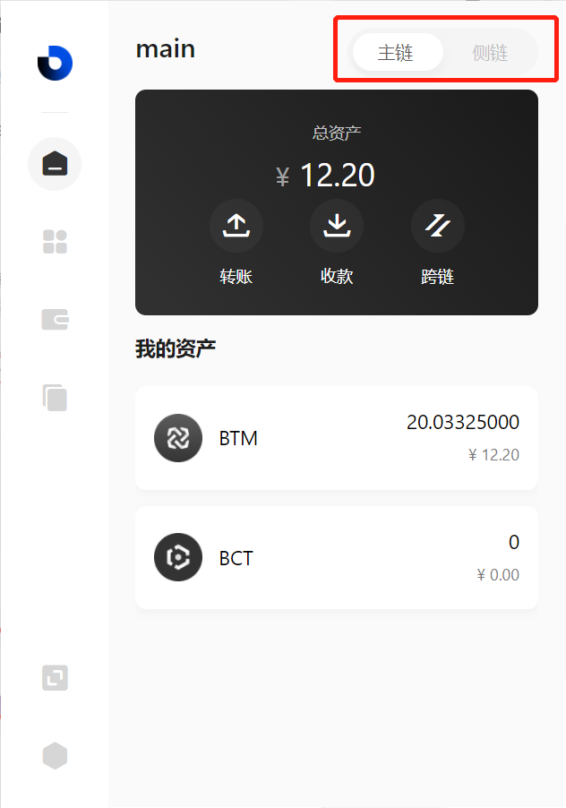
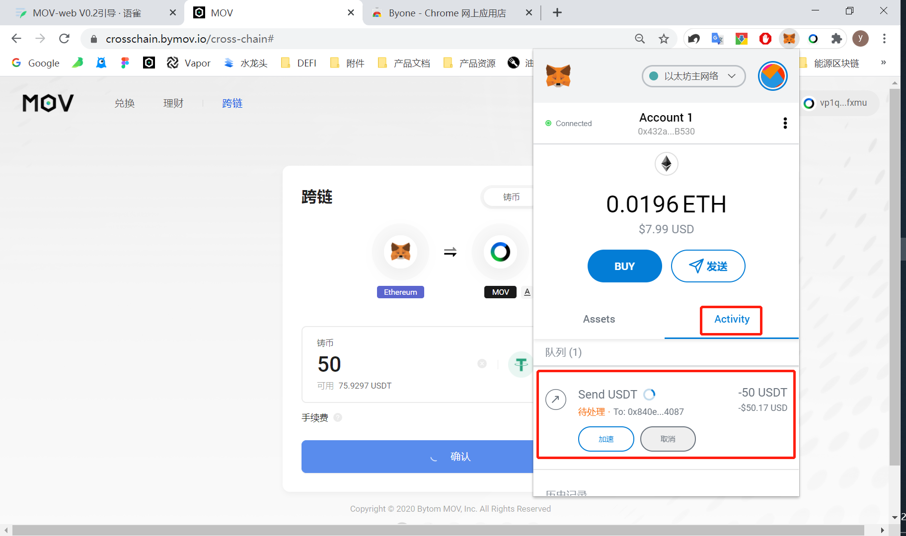
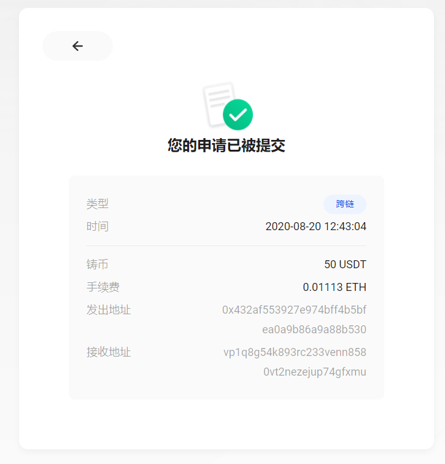

## 保姆级教程二：如何通过网页端来挖SUP？

**一、打开MOV Web版**（链接：https://supertx.bymov.io/swap）

点击“横banner”的“成为超导LP获取您的SUP”

**二、即可看到距离正式挖矿正式开始的倒计时和各个池子目前总流动性**

**三、点击“去存入” ——“连接钱包”——连接Byone**

**四、如果已经连接Byone钱包的，点击“添加流动性”按钮，在超导池列表选择想要存入的池子，**

注意：SUP挖矿现在虽然还未正式开启，但超导池质押已经开启！现在可以将币种先跨入MOV，并存入超导池，等到比原侧链 Vapor 72576000 区块高度时，即默认参与SUP挖矿，无需其他操作！！！选择理财池，存入，默认开启挖头矿。

**系统会自动读取您Byone中相关资产的可用余额，从输入框中键入您想要存入的资产数量。**

**单币模式下通过下拉可以选择存入币种，单币存取将会产生一定手续费和交易滑点。**

**请输入您的Byone管理密码并确认，兑换将自动执行。**

**转入成功后，将展示相关快照信息。您也可以在网页右上角的历史记录中查看您的历史交易。**

在超导理财首页您可以查看到您已存入的超导池，并可以继续向其中添加资产，或选择新的超导池添加。

**Byone是MOV的网页插件钱包，仅限网页版可用，手机端不可使用！！！**

## 1、安装Byone

### 从谷歌商店安装（推荐方式）：

选择“谷歌商店安装”，访问页面

点击“添加至Chome”，并从弹窗页面选择添加扩展程序

安装将会自动进行，安装完成后您可以在插件栏找到您的Byone，并通过锁定按钮将其锁定在工具栏

## 2、创建新钱包

点击Byone插件，首次访问将会弹出页面提示您创建新钱包，或恢复您已有的钱包

请按流程创建钱包。（设置钱包名称、密码——备份助记词——验证助记词）

务必请您保存好生成的助记词，这是您恢复钱包的唯一途径。一旦助记词丢失您钱包内的数字资产将无法找回。

创建成功后，即可使用您的Byone

## 3、导入钱包

选择导入钱包，您可通过助记词、keystore、keystore纯文本三种方式导入

请依次按顺序输入您的助记词，注意空格

助记词识别正确后，请您设置钱包名称和密码

导入成功

## 4、访问MOV-web并连接Byone

当您安装完成后，首次访问MOV-web需要先连接Byone，才可正常使用相关功能

若提示切换侧链网络，请在钱包面板右上角切换至Vapor

连接成功后，页面已显示您的钱包连接状态信息

接下来您已经可以使用MOV-web的相关功能了！

## 跨链

目前MOV-web可以通过MetaMask，以支持以太坊网络上ETH、USDT、USDC、DAI四个币种的跨链功能。您可通过顶部TAB访问跨链功能。

后期将陆续开放BTC等其他主流资产的跨链，敬请期待。

### 1、连接钱包

在使用跨链之前，请先安装MetaMask以及Byone的谷歌插件，并及时备份。

在跨链页面下，点击钱包icon下的连接按钮，分别唤起授权提示进行连接。

Byone授权连接：

MetaMask授权连接：

### 2、地址绑定

当您初次使用跨链功能时，需要先将您的ETH地址与MOV地址相关联，这将需要一定的时间，并消耗一定Gas费用运行只能合约。

绑定完成后，按钮变更为“确认”，跨链功能可以使用。

### 3、铸币/融币

您可以通过右上角的TAB，切换操作模式，决定用MetaMask里面的以太坊资产“铸币”至Byone。

或从Byone将MOV资产“融币”至MetaMask。

系统将自动读取您钱包内的可用资产余额，并预估手续费。

如果您有其他接收资产的地址，您也可以通过地址切换按钮，将您的资产“铸币/融币”至您手动填写的地址。

确认币种和数量后，点击确认，对应的钱包将弹窗提示您授权交易。

请留意结算页面的最终金额，实际成交金额以钱包结算为准。

确认后可以看到交易已经被提交，等待主网确认。

### 4、完成

当您提交请求之后，会反馈快照页面显示您申请的跨链信息。

返回主页后，您可以通过右上角历史记录，浏览您提交的跨链申请进度，以及您之前的跨链记录。

## 超导兑换

超导兑换是基于超导协议的自动做市函数，提供的去中心化兑换服务。

在您成功连接Byone插件钱包后，可以使用超导兑换功能

通过币种下拉，选择您想支付兑换的币种，已经您想要获得的币种

支付框内会标识您当前Byone内对应币种的可用余额，超过额度的兑换请求将被拒绝。

收到框内会标识当前兑换的兑换比例，兑换手续费已经包含并计算在兑换比例之中。

采用自动做市函数的兑换池，可能产生交易滑点。您可以自定义滑点保护范围，如果兑换申请时的比例变化，超过滑点保护，则兑换请求会被中止。

当您确认了兑换币种以及数量后，点击确认，将会自动唤起Byone进行签名。

请输入您的Byone管理密码并确认，兑换将自动执行。

兑换成功后，将展示相关快照信息。您也可以在网页右上角的历史记录中查看您的历史交易。

