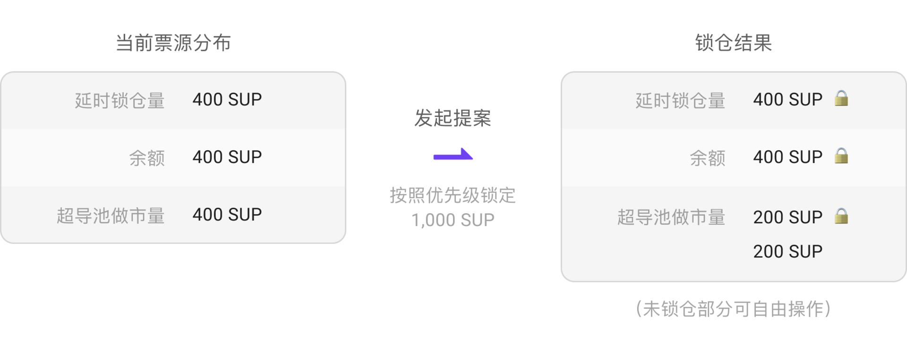
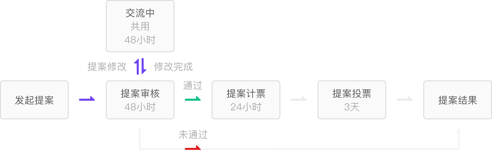

## 1、票源统计

为了让提供流动性和锁仓的用户能够进行提案和投票，超导治理将从三个方面来统计用户的票数。

**1、SUP余额**

**2、SUP-BTM超导池中做市的SUP，根据计票时刻超导池中SUP数量计算票数。**

*举例：用户初始存入10 SUP，**因价格波动，产生无常损失**，在计票时刻变成了11个SUP，则按照11票计算*

**3、SUP延迟锁仓，按最终解锁获得的SUP计票。**

*举例：用户锁仓10个SUP一年，最终可以获得33个SUP，则可计得33票*

## 2、提案

1、**单一地址**上必须至少有1000票才可以进行提案（参考票源统计）

2、发起提案时，**立即锁定该地址上1000个SUP**，包括

* SUP余额锁仓，无法交易和转账
* 锁定部分的SUP流动性无法进行操作
* 不会延长延迟满足的锁仓SUP，锁仓到期仍然可以照常提取

锁定优先级 ：SUP延迟锁仓量—SUP余额—SUP-BTM超导池做市量

3、锁定期按照10天计算的区块高度，到该高度自动解锁，具体以实际的出块情况为准。

4、提案未通过，SUP锁定不会提前解除，请珍惜您的提案权利

5、为尽量保持投票客观性，提案发起人无法对自己发起的提案投票，但其锁仓SUP仍然可以作为票数统计，继续给其他提案进行投票

6、提案提交后，经过48小时审核期，48小时后给出通过或未通过结果。

提案审核通过后，会进入24小时计票期，投票用户可以在此期间内筹备SUP选票。

提案计票期结束后，会有7天的投票期，投票期内用户根据计票数量进行投票

提案流程如下所示：

完整周期如下所示：

7、提案中不得出现谩骂，色情，反动，有损国家形象和法律法规相违背等内容，否则直接撤销提案并不予公示

8、内容不存在合规性问题，但最终未通过的提案，将给予公示，官方会说明未通过理由

## 3、投票

1、用户可以给处于“投票阶段”的提案进行投票

2、用户可投票数在议案计票期结束时刻对用户地址进行快照，快照所统计的票数为用户针对该提案地可投票数。

快照一旦生成，票数已经被固定并不可更改，之后用户地址SUP变化不再影响该议案的可投票数。

快照结束后，用户的SUP可以任意处置，不影响投票。

*举例：用户在计票期内，延时锁仓1年期1个sup，提供流动性10个SUP，余额10个SUP，但在计票时刻到来之前转出5个SUP，则计票期结束时刻，可以获得的票数为3.3+10+（10-5）= 18.3票。快照之后，用户的SUP可以任意交易，票数已被定格为18.3不变*

3、针对每个议案，用户地址可用票必须大于0.1才能投票

4、发起投票时，一次性消耗全部的SUP票

*说明：假设用户有20票，当有A，B两个选项，用户只可以选择其中一个选项投出20票，不能对A投10票，B投10票*

5、用户相同的SUP票源，可以在不同提案中分别计票

*举例1：用户余额一直持有10个SUP，则在A提案快照时可以获得10票，在B提案快照时也可以获得10票*

*举例2：用户余额开始持有10个SUP，则在A提案快照时可以获得10票；一个月后，用户将全部SUP转账给其他地址，此时新增了B提案，则B提案快照时，用户地址无法获得票数*

## 4、提案通过条件

1、每个提案的投票票数必须达到总流通量的5%才能算有效提案，在投票期结束后，如果少于5%，则该提案失败。

总流通量 = 实际流通量 + 延迟锁仓量 - 已销毁的数量

2、对于提案，其中一个选项的得票数必须大于2/3才算有效，否则提案失败

## 5、冲突提案的处理

如果批准的提案相互冲突，优先考虑最近批准的提案，必要时重新发起对冲突提案进行表决的新提案。

