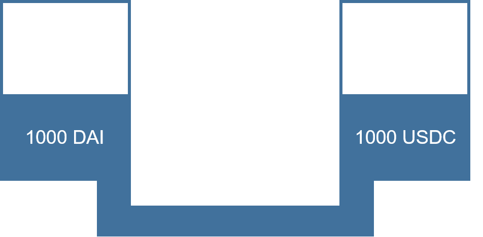
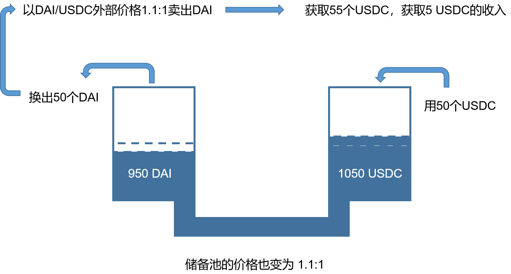
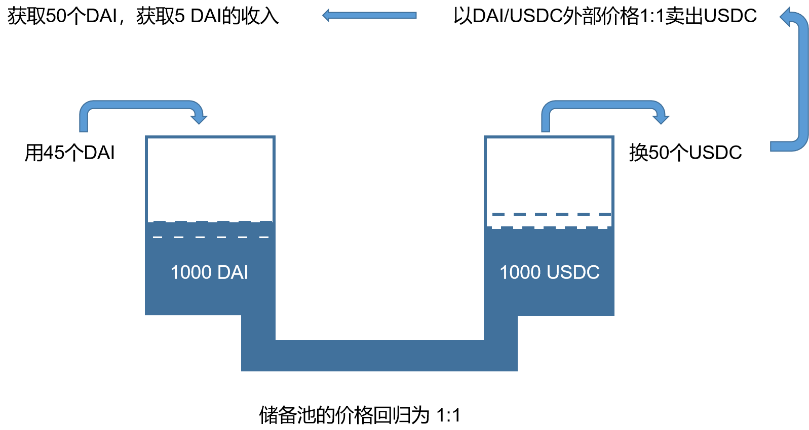

## 什么是无常损失

### 无常损失（虚损失）

我们知道超导是由三个流动性储备池组成，兑换的价格也是根据池中的资产的数量根据一定的算法进行定价，所以当币价波动时，就会产生一定的套利空间。

假设初始时，假设有人存入1000 DAI 和 1000 USDC，价格锚定为1：1。假如此时外部DAI的价格波动，涨为1.1时，如果此时储备池价格不变，那么就会产生套利空间，套利者可以在外部购买USDC并在超导兑换中兑换成DAI，然后在外部换成USDC，就会产生10%的收益。

如果存入的用户此时提出所有资产，那么获得的是950 DAI和1050个USDC（不考虑手续费的情况），又因为此时DAI的价格已经变为1.1了，所以不考虑手续费的情况下，用户略有亏损，亏损即套利者所获取的利润。而从另外一个角度看，当前用户虽然DAI的数量减少，但USDC的数量增多，其总数量保持不变。

当外部DAI/USDC价格重回1：1时，套利者又可反向套利，从而让池子回归平衡

