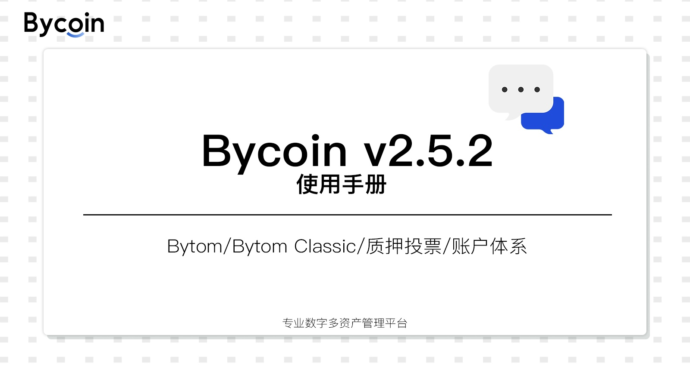
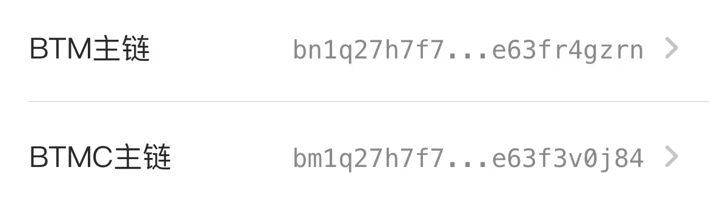
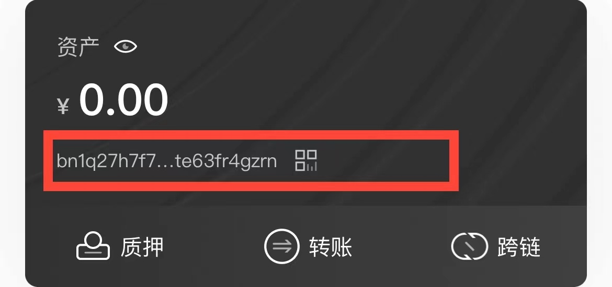
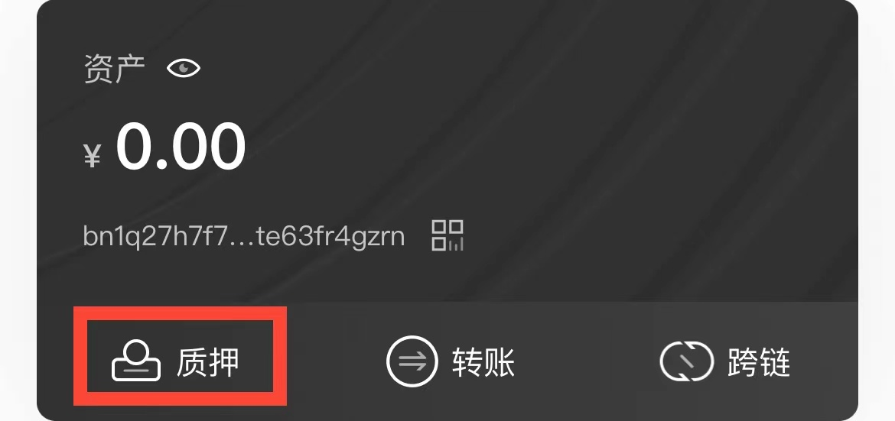
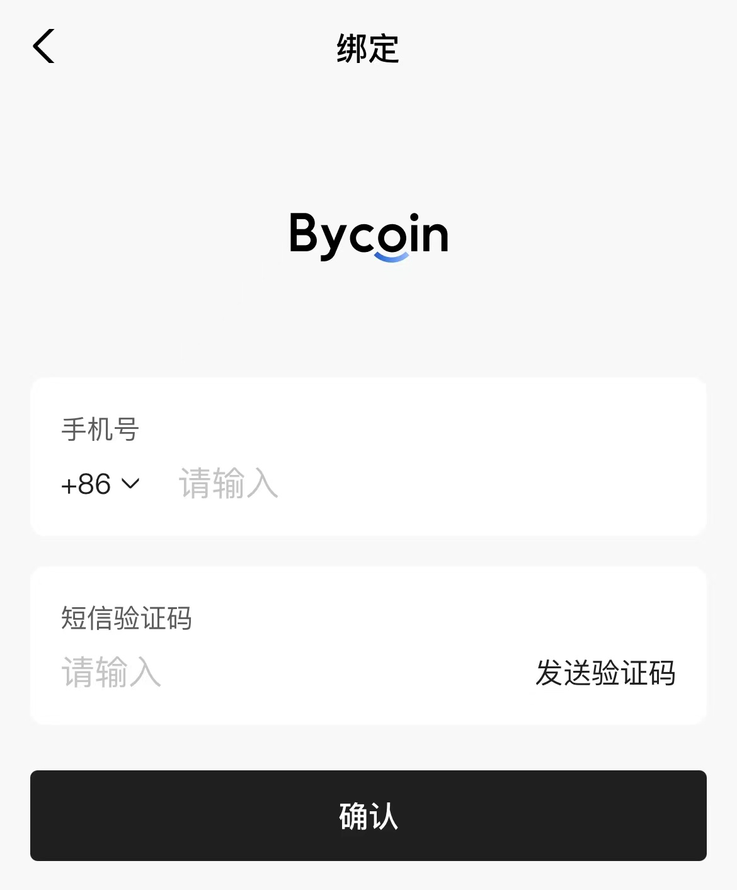

## Bycoin使用手册

### Bycoin功能更新

新链支持：支持Bytom 2.0，2.0显示名称为Bytom。地址以"bn"开头
旧链名称更改：Bytom改为Bytom Classic。地址以"bm"开头

地址查看方式：
1、[首页]界面：选择网络 - 查看对应地址
2、[设置]界面：点击「钱包设置」-查看对应地址

### 节点投票

在[主链]界面：点击「质押」-选择「节点」- 点击「质押」-输入「数量」-点击「确定」。即可参与节点投票

注意：

1、现节点质押投票的锁定期为1天（具体以区块高度为准）

2、仍在[侧链]上参与节点投票的用户请及时撤出投票，转移至主链参与Bytom 2.0质押投票

### 账户体系

在[设置]界面：选择「绑定」-输入「手机号」-输入「验证码」-点击「确定」- 绑定成功

