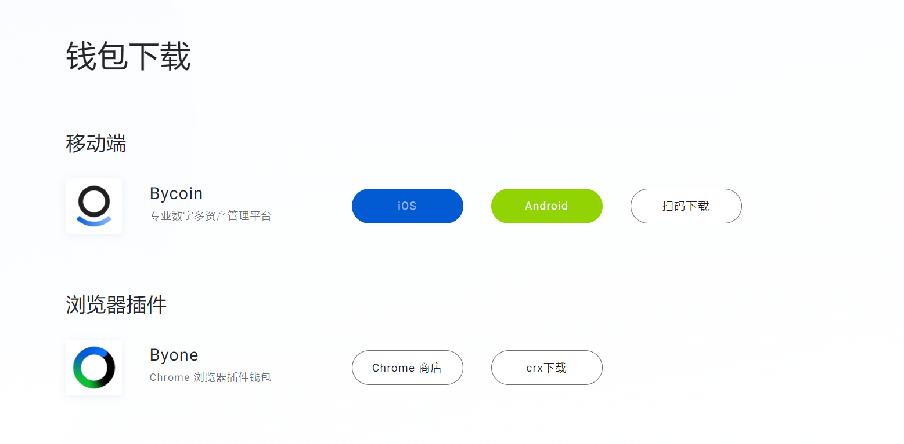
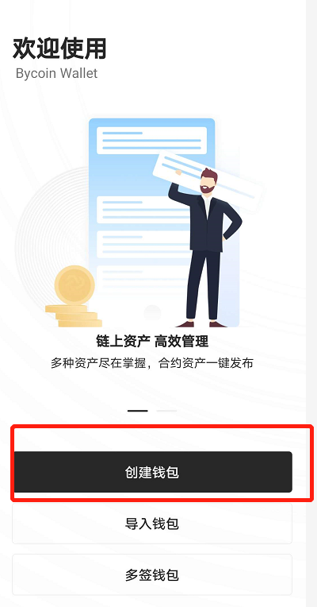
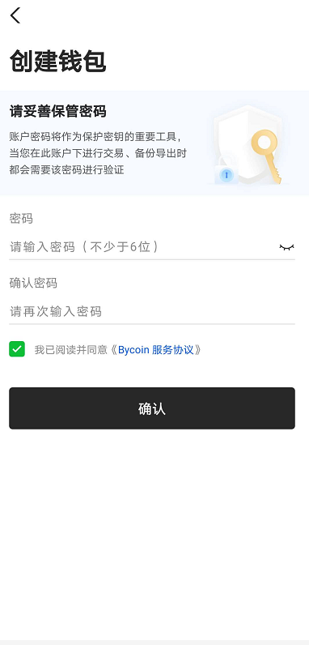
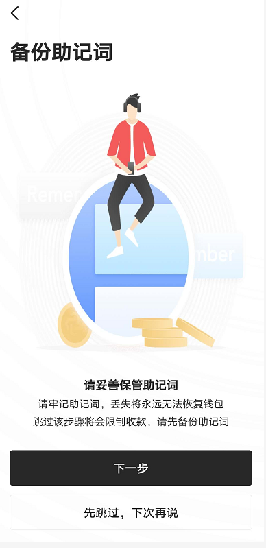
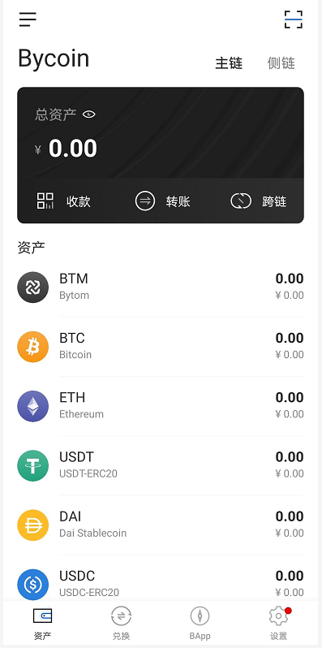

## 如何注册Bycoin钱包

Bycoin钱包是一款基于比原链的钱包app，安全可靠，目前已上线闪兑，磁兑，超导等多项功能，使用Bycoin能更好的管理资产。

**下载链接：bycoin.im**

### 一、如果你从未使用过Bycoin钱包

点击“创建钱包”，如果您之前使用过Bycoin钱包，点击“恢复钱包”

### 二、输入密码，重复密码

### 三、备份助记词

一定一定要保存好自己的助记词，否则助记词丢了，该钱包里面的资产就无法找回了。

### 四、转入资产

成功备份、验证好助记词以后，就可以看到Bycoin首页，目前Bycoin已支持BTC/ETH/USDC/USDT/DAI的主链，可由交易所/钱包主链地址直接转入资产。

此刻你就拥有了第一个你的Bycoin钱包啦。
