## 常见问题

### 1、MOV是什么？
MOV是去中心化价值交换协议
通俗来说，实现了一套链上交易机制，你可以在区块链上完成交易功能，而不需要第三方中心化机构。
当然MOV不止于交易，后续将推出借贷、稳定币等Defi相关的功能。

### 2、什么是MOV跨链
MOV的跨链你可以认为是充提，跨入就是将你的ETH或者USDT充值进入MOV，跨出就是将你的ETH或者USDT从MOV提出，具体的教程见：https://www.chainnode.com/post/418958

### 3、MOV的手续费到哪里去了？
MOV的整个交易过程是由共识节点进行撮合的，同时跨链需要依赖于各个联邦节点的签名，所以MOV的所有的手续费都分给了共识节点和联邦节点，两者各分总量的一半。再平均分给各个节点。比如10btm的手续费，联邦节点分到5个，共识节点分到5个，一共10个共识节点，每个共识节点分到0.5个。

### 4、MOV和比原钱包是什么关系？
比原钱包时MOV功能的载体之一，但不是唯一的载体，可以粗略把两者比作供货商和商铺，所以只要有MOV这个供货商，任何的商铺都可以在此之上开店。

所以任何第三方都可以开发出一套基于MOV的交易和闪兑应用，让交易无所不在

### 5、为什么比原钱包里面有一个闪兑功能和磁力兑换？
这两个功能是为了满足不同的场景，磁力兑换是买卖挂单的形式，主要是满足套利的交易者所需，而闪兑功能满足的是想要进行快速交易的用户而能够容忍一定的价差损失的用户，这是两种不同的需求和场景

磁力兑换：

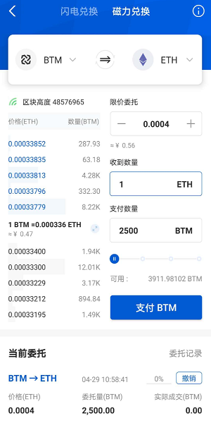

链上撮合：

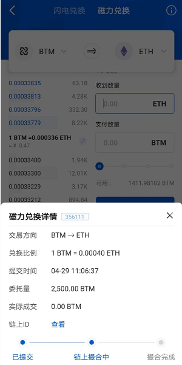

闪电兑换：

两者所运行的机制不同，所以并没有太多的关联

### 6、MOV和交易所有什么关系？
MOV不是交易所，MOV是一种去中心化的交易协议，任何人都可以基于MOV搭建去中心化的交易所，比原链官方首先在Bycoin钱包上开辟了这样的交易功能供大家使用。

### 7、为什么转侧链时间要24小时不定性？这个过程会不会吃了我的币？
跨链在后台是一个复杂的过程，需要两条链之间的交易进行确认，至少需等待两条链多个块的确认才能成功，所以确实需要一定时间。

MOV的一大特点就是安全透明，所有的转账和交易都在链上，你可以在区块链浏览器上查到所有的交易情况，不存在中心化机构侵吞和挪用资产的情况发生

### 8、为什么beta版会过期

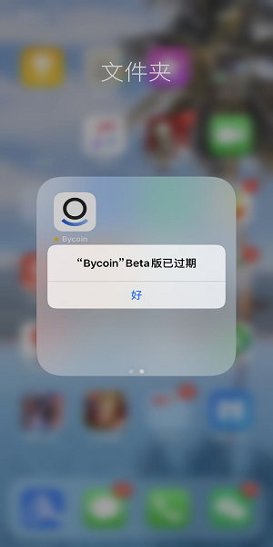

testflight的版本都有90天有效期，如果超过有效期，需要重新下载，注意备份助记词防止资产丢失

### 9、为什么挂单显示验签失败？

UTXO过多，建议去磁力兑换挂单再撤销，多挂几次，合并UTXO。

### 10、理财收益每天什么时候打到链上？

理财收益不是额外打到账户的，而是以每个区块计息，时刻计算账户再总池子里占的权重，用户取出的时候会自动把利息分配给用户。

### 11、为什么挂单显示验签失败？

UTXO过多，建议去磁力兑换挂单再撤销，多挂几次，合并UTXO。

### 12、为什么会超过市场限额

做市深度不够了，一般是行情来了单边兑换请求过多。等待做市商补充资金

### 13、iOS用户下载不了Bycoin的beta版

iOS用户在下载及更新Bycoin时均需要登陆海外Apple ID，海外Apple ID及Bycoin的下载教程已更新至首页置顶，您可以点击进入帮助中心的置顶位查看教程。

### 14、Bycoin钱包的资产如何转入交易所

1、进入Bycoin，点击首页，点击转帐。

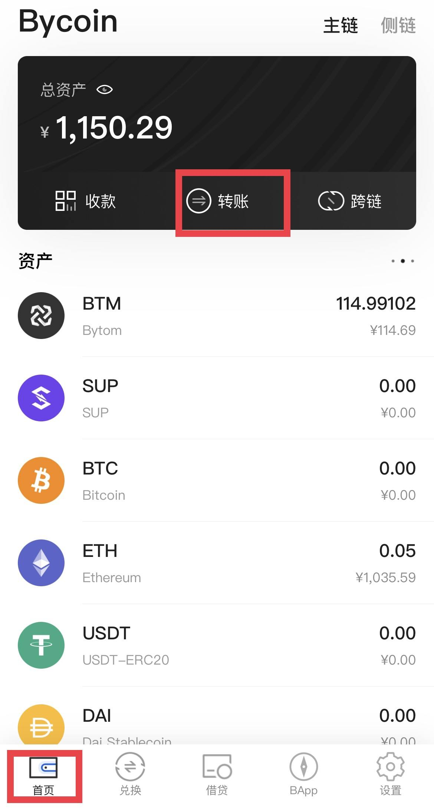

2、选择需要转账的资产

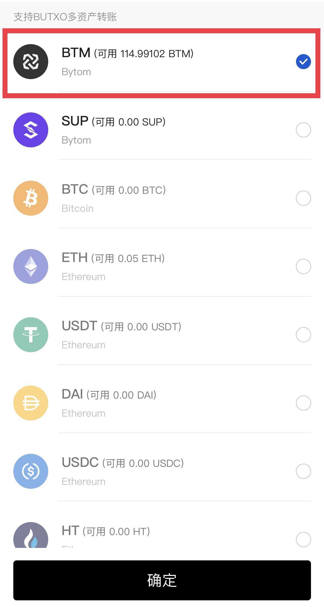

3、输入地址，数量，确认手续费，点击确定。

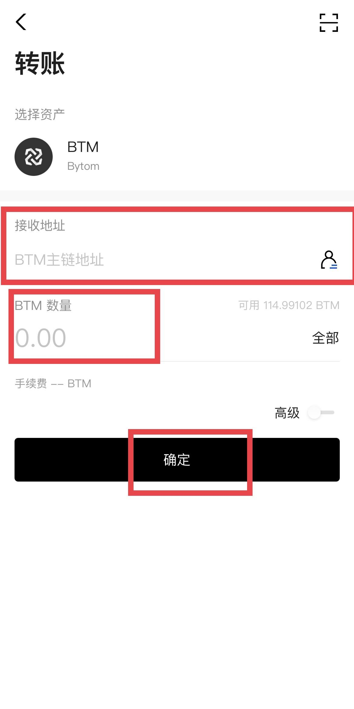

4、等待操作完成，确认到账。

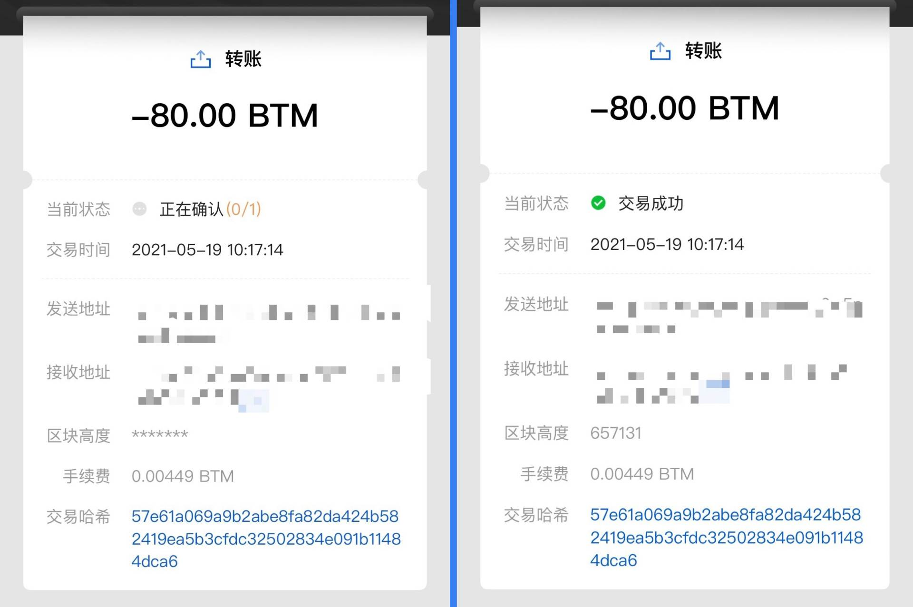

### 15、SHIB如何超导成USDT

1、打开Bycoin，点击兑换

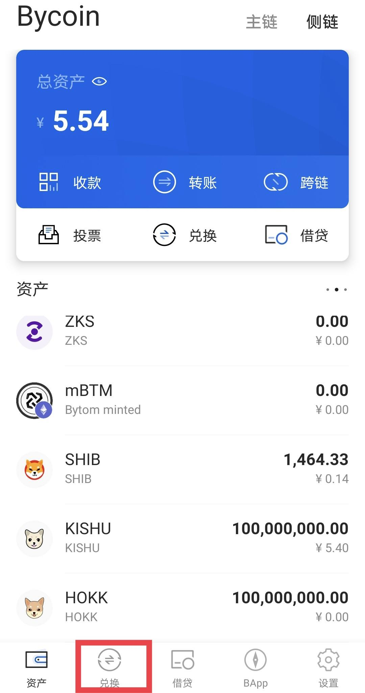

2、选择超导兑换，选择资产，输入数量，点击确定。

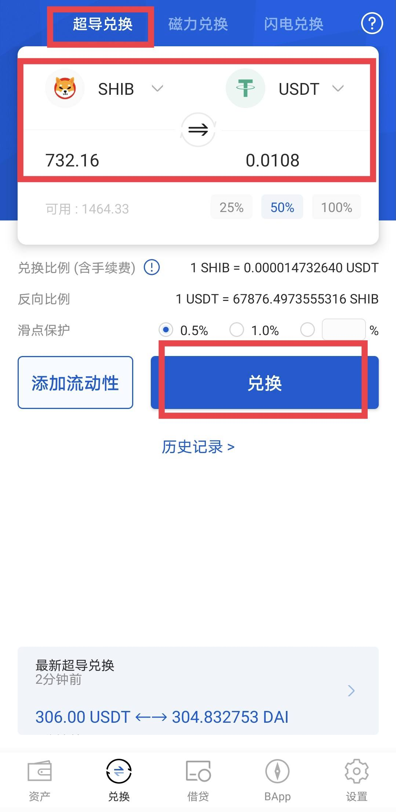

3、输入密码，等待上链完成。

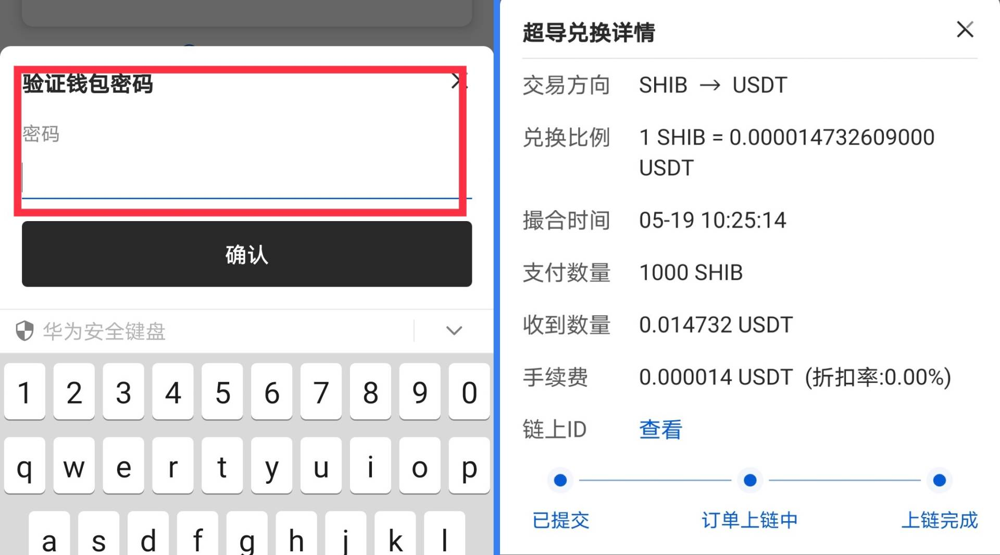

### 16、跨链、转账记录的查看方式

1、打开Bycoin，点击首页，选择需要查看的资产。

2、进入页面即可查看跨链、转账记录。

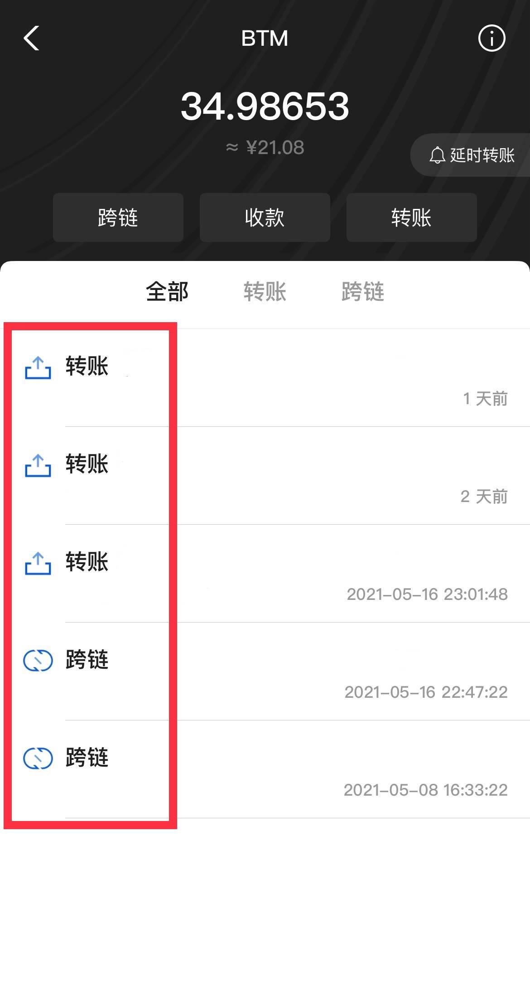

