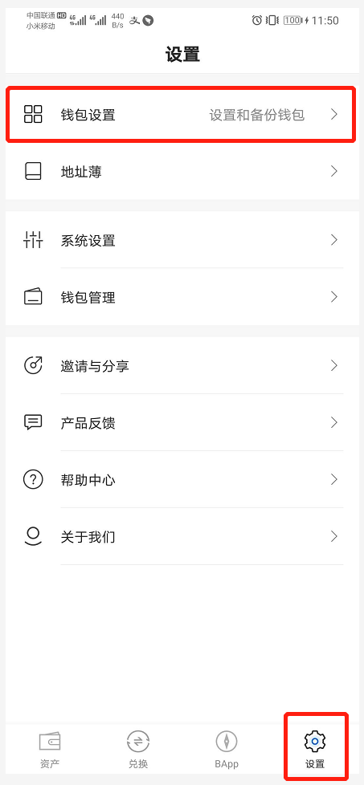
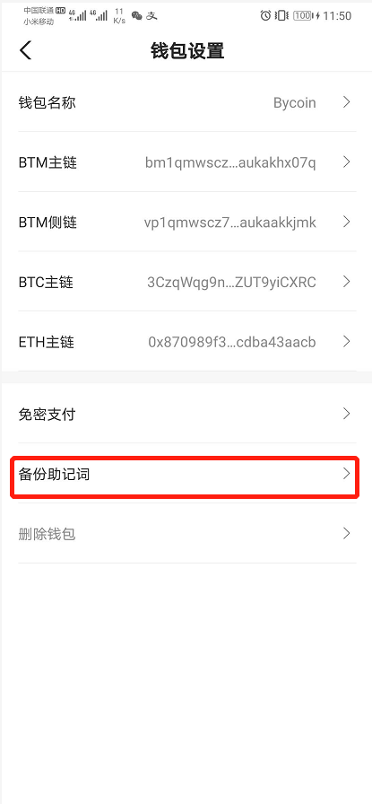
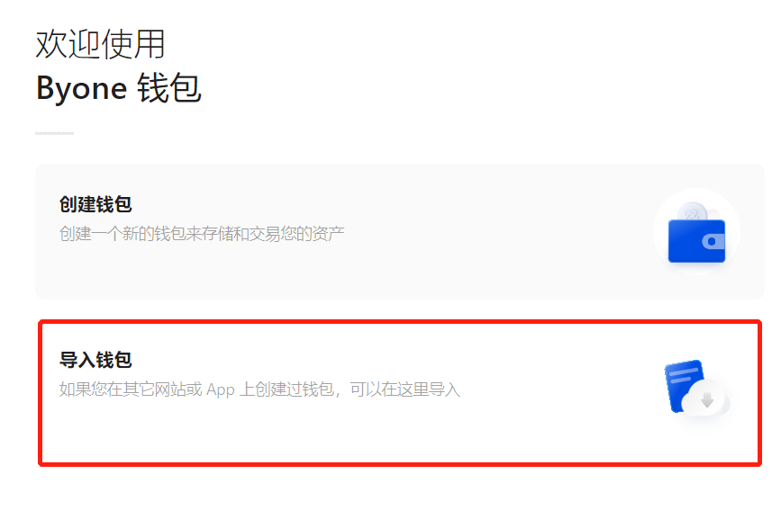
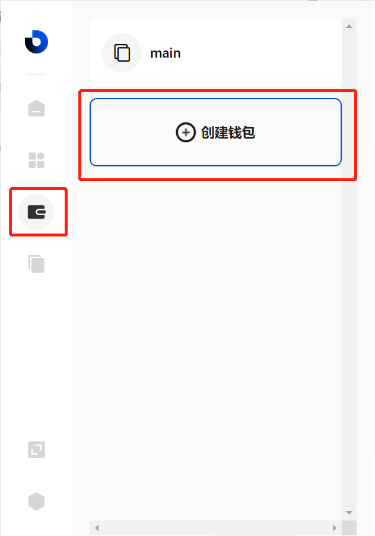
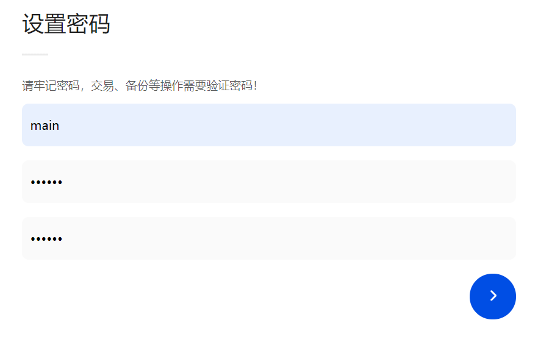
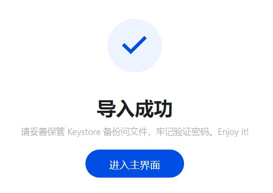

## Bycoin至Byone无缝迁移方案

MOV产品线已同时支持移动端和网页端，通过同一套助记词，即可完成账户从Bycoin至Byone的无缝迁移。

### 导出Bycoin助记词

在Bycoin右下角设置页面，依次选择钱包设置、备份助记词，输入密码后请妥善保管您的助记词。

### 将助记词导入Byone

新安装用户请直接选择导入钱包选项。

已存在Byone账户的用户请从左侧钱包栏目选择创建钱包。

助记词验证正确后，设置Byone的钱包名称和管理密码，即完成导入。

您可以去Byone主页面浏览您的所有资产，Byone和Bycoin内的资产余额和操作会实时保持同步。

