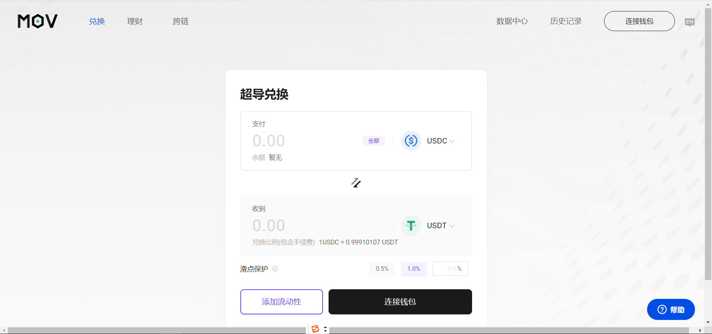
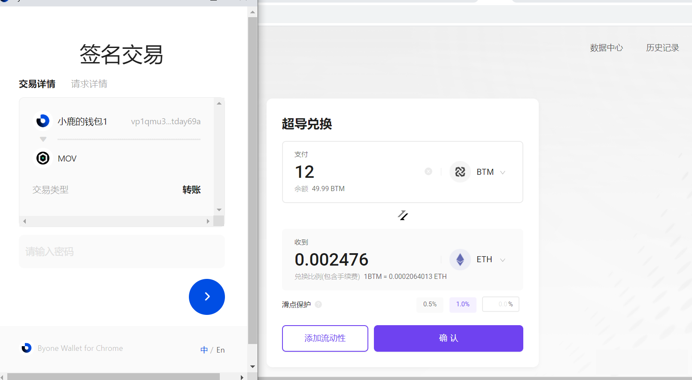

## MOV Web超导兑换

### 连接钱包

在使用超导兑换之前，请先安装Byone的谷歌插件，Byone具体如何操作，插件钱包Byone使用手册: https://weibo.com/ttarticle/p/show?id=2309404534224190570687#_0 并及时备份。

### 超导兑换

点击进入：https://supertx.bymov.io/swap#

选择需要兑换的资产。

如果是大额资产，最好确认一下滑点保护，防止较大的滑点损失

点击确认，在弹出的byone钱包中进行签名。

输入密码，确认成功，查看您的账户资产