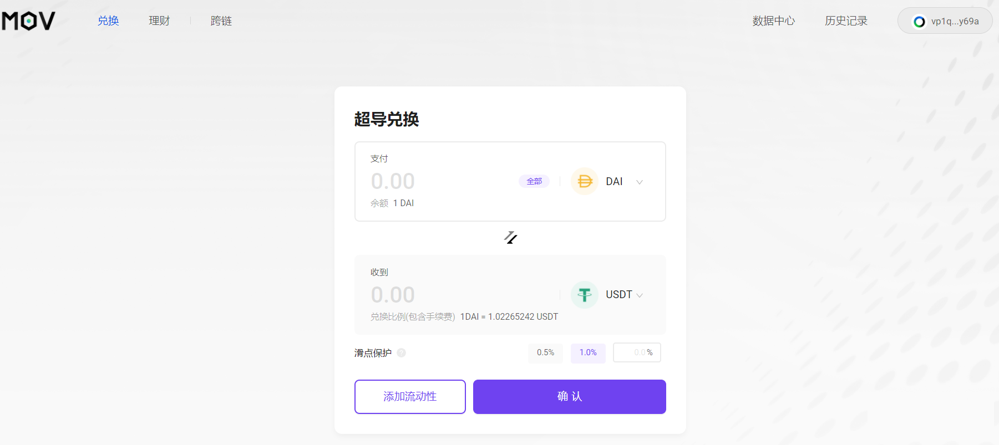

## MOV Web超导兑换

### 连接钱包

在使用超导兑换之前，请先安装Byone的谷歌插件，Byone具体如何操作，插件钱包Byone使用手册: https://weibo.com/ttarticle/p/show?id=2309404534224190570687#_0 并及时备份。

###  非稳定币兑换

非稳定币超导兑换币种包括BTM,BTC,ETH，BTM兑换其他币种最低限额12BTM，BTC兑换其他币种最低限额0.0001 BTC，ETH兑换其他币种最低限额0.001ETH.非稳定币的超导兑换手续费是千分之一，侧链交易转账几乎能实现秒到账，没有延迟。

点击进入：https://supertx.bymov.io/swap#

选择需要兑换的资产。

如果是大额资产，最好确认一下滑点保护，防止较大的滑点损失

点击确认，在弹出的byone钱包中进行签名。

输入密码，确认成功

交易几乎可以实现秒到账，可以点击Byone钱包查看自己余额，刚刚兑换的ETH和BTC已经在钱包里了。

###  稳定币兑换

目前可实现DAI/USDC/USDT三种稳定币的兑换，稳定币超导兑换的手续费低，滑点小，目前手续费是万分之五。

