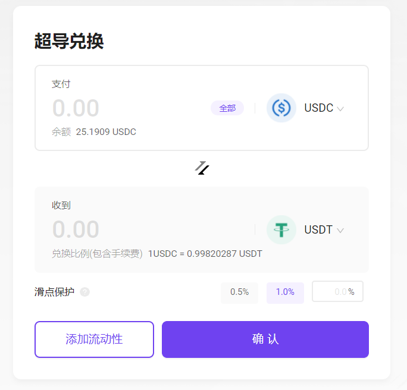
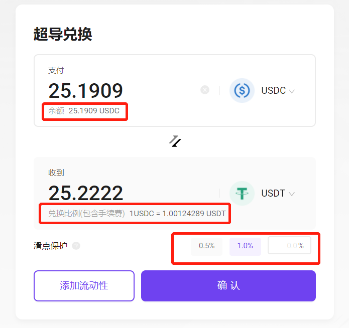
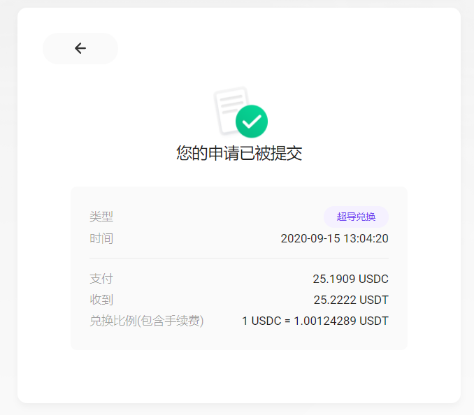

## MOV Web超导兑换

### 连接钱包

在使用超导兑换之前，请先安装Byone的谷歌插件，Byone具体如何操作，插件钱包Byone使用手册: https://weibo.com/ttarticle/p/show?id=2309404534224190570687#_0 并及时备份。

###  超导兑换

超导兑换是基于超导协议的自动做市函数，提供的去中心化兑换服务。

在您成功连接Byone插件钱包后，可以使用超导兑换功能

通过币种下拉，选择您想支付兑换的币种，已经您想要获得的币种

支付框内会标识您当前Byone内对应币种的可用余额，超过额度的兑换请求将被拒绝。

收到框内会标识当前兑换的兑换比例，兑换手续费已经包含并计算在兑换比例之中。

采用自动做市函数的兑换池，可能产生交易滑点。您可以自定义滑点保护范围，如果兑换申请时的比例变化，超过滑点保护，则兑换请求会被中止。

当您确认了兑换币种以及数量后，点击确认，将会自动唤起Byone进行签名。

请输入您的Byone管理密码并确认，兑换将自动执行。

兑换成功后，将展示相关快照信息。您也可以在网页右上角的历史记录中查看您的历史交易。

