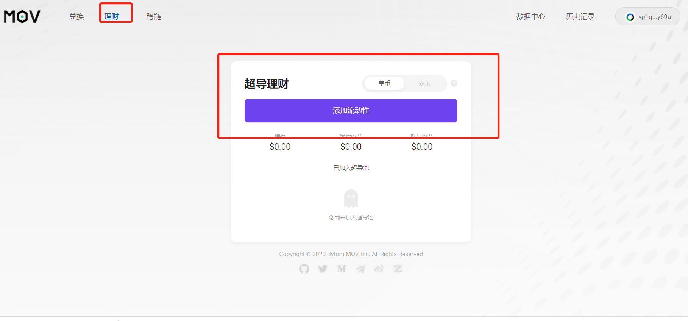
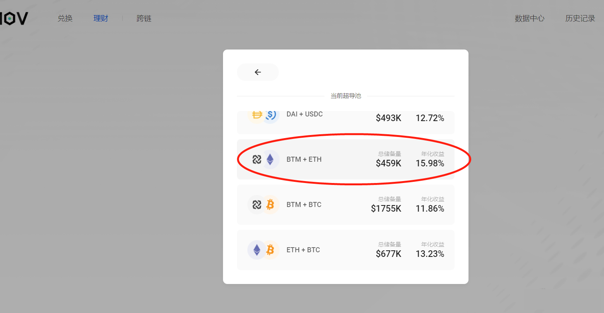
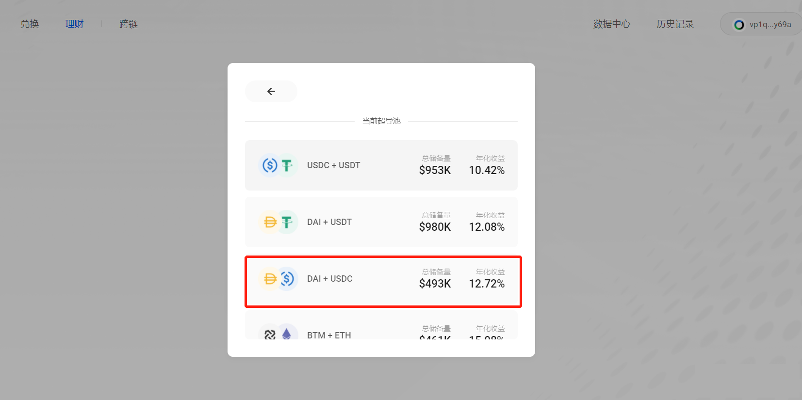

## MOV Web超导理财

### 连接钱包

在使用超导理财之前，请先安装Byone的谷歌插件，Byone具体如何操作，插件钱包Byone使用手册: https://weibo.com/ttarticle/p/show?id=2309404534224190570687#_0 并及时备份。

###  非稳定币理财

点击进入：https://supertx.bymov.io/swap#

点击“理财”——“添加流动性”

目前非稳定币超导理财不支持单币种理财，如果你想参与BTM/ETH的理财，但你又只有BTM，那么只能先将BTM兑换一半到ETH，再加入流动池参与理财。（此处要提醒的是注意无常损失：白话无常损失https://weibo.com/ttarticle/p/show?id=2309404521926180864027#_0）

投入你想投入的数量，点击“转入”，收益第二天会显示，等你取出本金的时候，利息才会打到你的地址上。

###  稳定币理财

目前稳定币理财支持单币种理财和双币种理财两种模式， USDT/USDC/DAI三种稳定币可以任选一个币种参与稳定币理财

点击“转入”——“确认”——转入成功，理财收益在你取出本金的时候才会打到地址上。

