## MOV Web超导理财

超导理财是基于超导协议的自动做市函数，对用户开放的流动性存入和取出服务，超导兑换的手续费将作为流动性提供者的奖励，分发给超导LP。

请注意：基于自动做市函数的超导池，可能会因存入币种的价格波动，而产生无偿损失，请您务必提前了解因此而可能出现的资产风险。

### 连接钱包

在使用超导理财之前，请先安装Byone的谷歌插件，Byone具体如何操作，插件钱包Byone使用手册: https://weibo.com/ttarticle/p/show?id=2309404534224190570687#_0 并及时备份。

###  超导理财

点击进入：https://supertx.bymov.io/swap#

您可以通过顶部TAB或“添加流动性”按钮，进入超导理财页面。

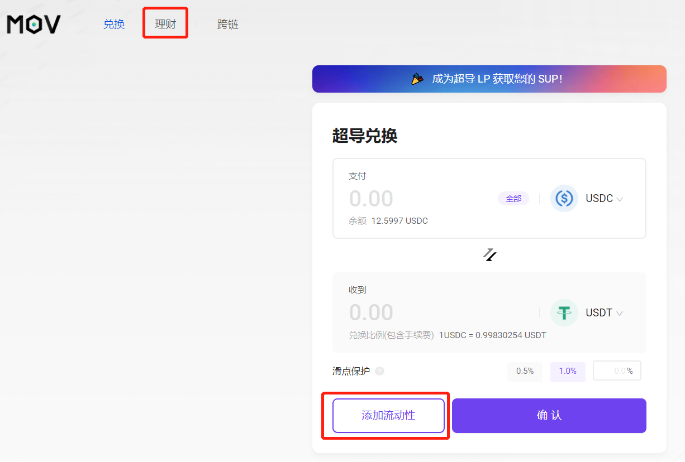

您可以通过切换单币或双币，来选择资产存入取出的模式（非稳定币暂不支持单币存取）。

通过“单币”模式操作超导池，将产生一定的手续费。您可以先通过“双币”模式尽可能多的转移资产，之后再使用“单币”模式， 从而得到最经济的方式。

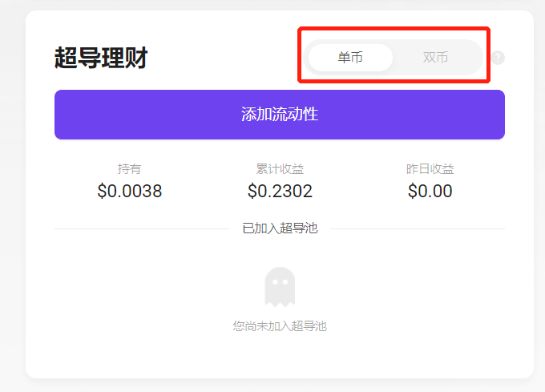

### 存入超导池

点击“添加流动性”按钮，在超导池列表中选择您想要存入的池子。
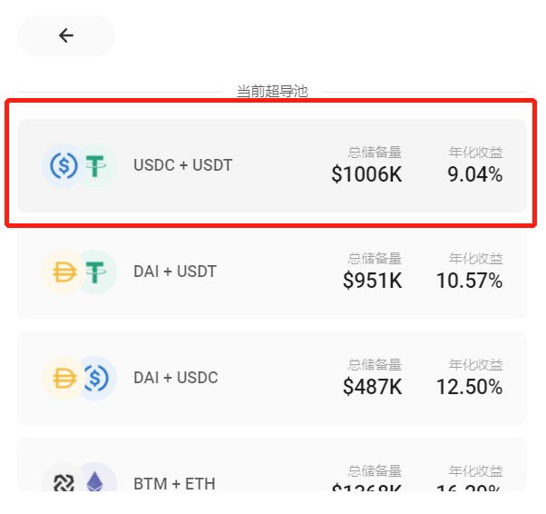

系统会自动读取您Byone中相关资产的可用余额，从输入框中键入您想要存入的资产数量。

单币模式下通过下拉可以选择存入币种，单币存取将会产生一定手续费和交易滑点。
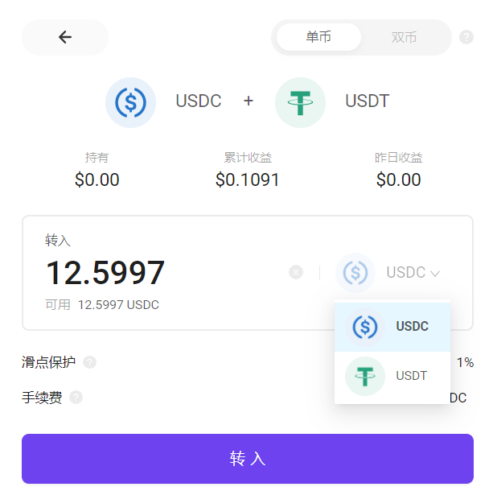

请输入您的Byone管理密码并确认，兑换将自动执行。

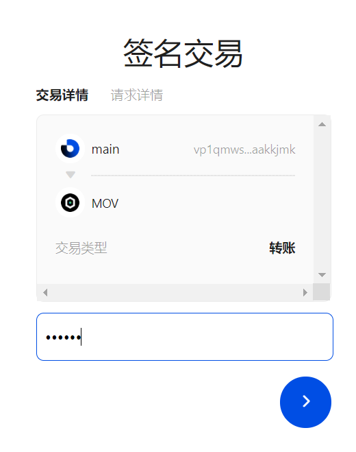
转入成功后，将展示相关快照信息。您也可以在网页右上角的历史记录中查看您的历史交易。

在超导理财首页您可以查看到您已存入的超导池，并可以继续向其中添加资产，或选择新的超导池添加。
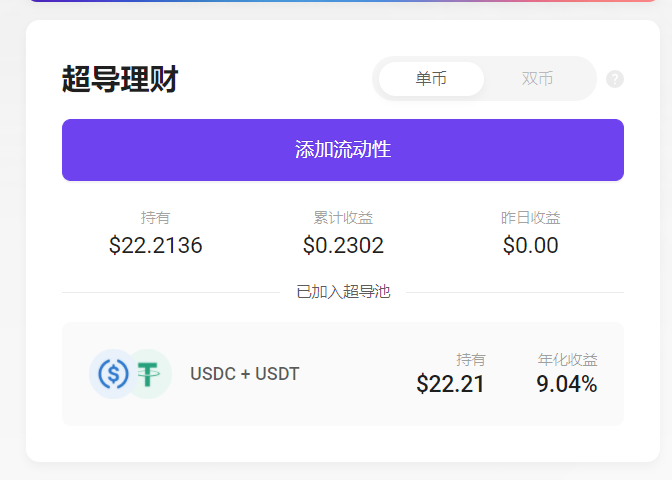

### 取出超导池

在超导理财首页，鼠标悬停至您已加入的超导池，点击“转出”，进入页面。
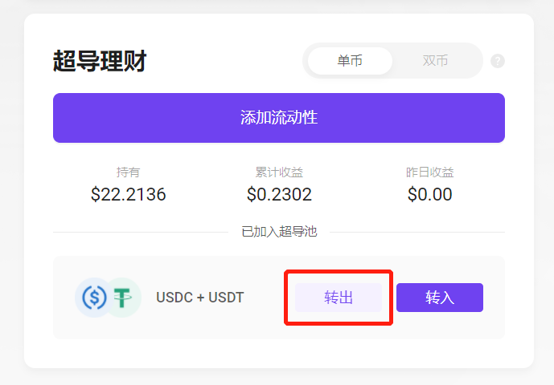
您可以通过右上角切换单币或双币转出，单币转出将消耗一定手续费并存在交易滑点。
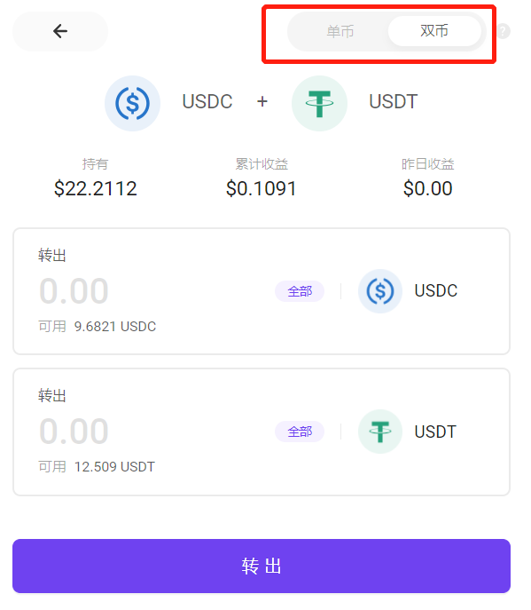
输入转出数量并确认，将会唤起Byone签名。
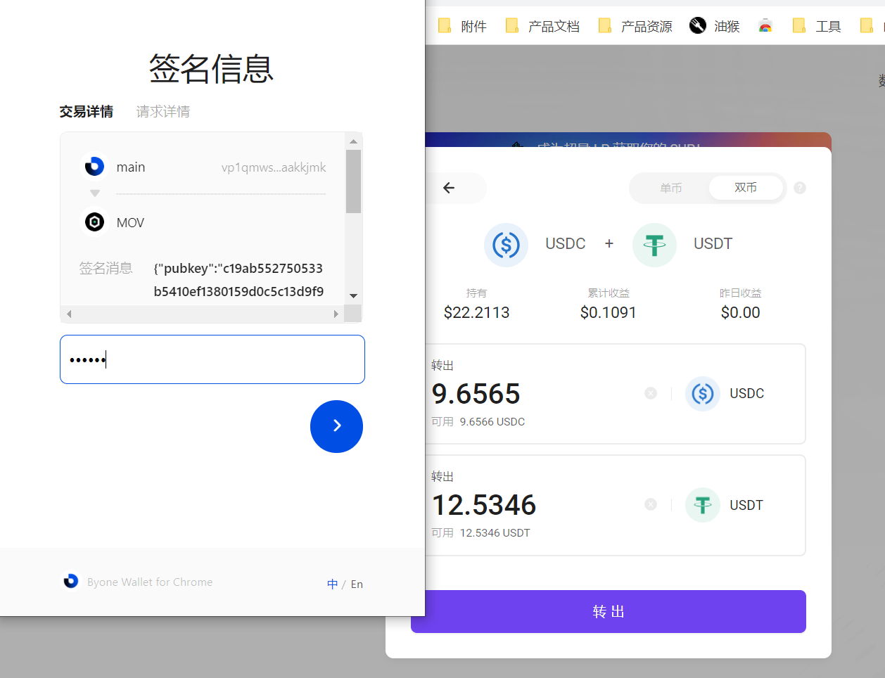
转出成功后，将展示相关快照信息。您也可以在网页右上角的历史记录中查看您的历史交易。
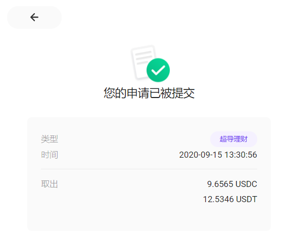
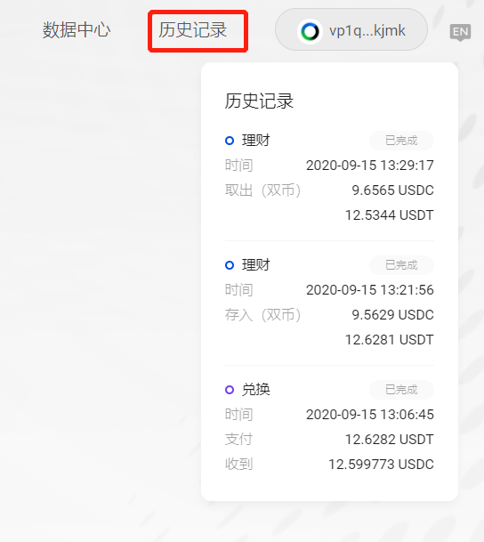