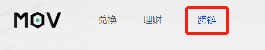
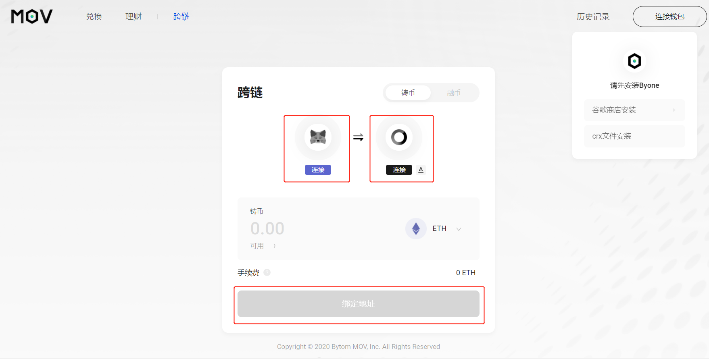
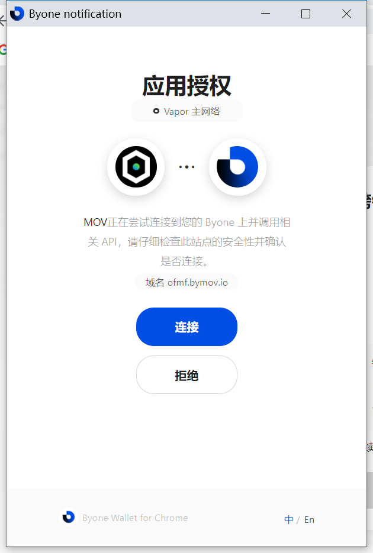
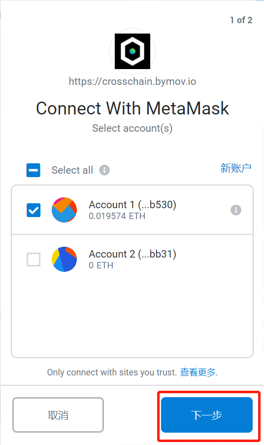
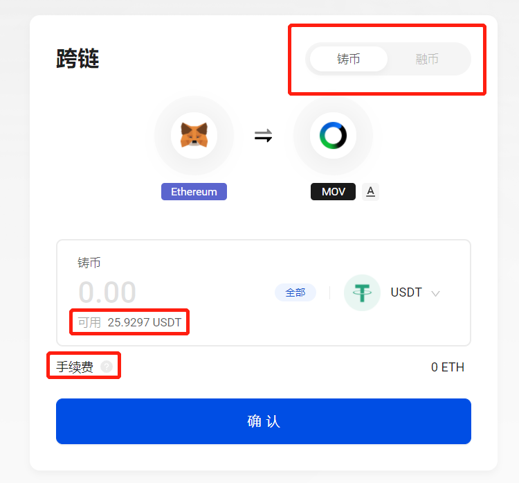
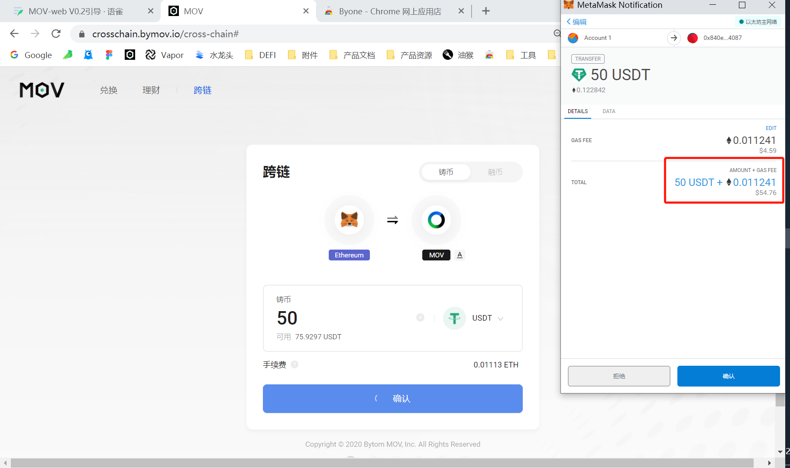

## Web跨链教程

打开链接：https://supertx.bymov.io/swap

目前MOV-web可以通过MetaMask，支持以太坊网络上ETH、USDT、USDC、DAI四个币种的跨链功能。您可通过顶部TAB访问跨链功能。

### 连接钱包

在使用跨链之前，请先安装MetaMask以及Byone的谷歌插件，并及时备份。

在跨链页面下，点击钱包icon下的连接按钮，分别唤起授权提示进行连接。

Byone授权连接：

MetaMask授权连接：

### 地址绑定

当您初次使用跨链功能时，需要先将您的ETH地址与MOV地址相关联，这将需要一定的时间，并消耗一定Gas费用运行只能合约。

绑定完成后，按钮变更为“确认”，跨链功能可以使用。

### 铸币/融币

您可以通过右上角的TAB，切换操作模式，决定用MetaMask里面的以太坊资产“铸币”至Byone。

或从Byone将MOV资产“融币”至MetaMask。

系统将自动读取您钱包内的可用资产余额，并预估手续费。

如果您有其他接收资产的地址，您也可以通过地址切换按钮，将您的资产“铸币/融币”至您手动填写的地址。

确认币种和数量后，点击确认，对应的钱包将弹窗提示您授权交易。

请留意结算页面的最终金额，实际成交金额以钱包结算为准。

确认后可以看到交易已经被提交，等待主网确认。

### 完成

当您提交请求之后，会反馈快照页面显示您申请的跨链信息。

返回主页后，您可以通过右上角历史记录，浏览您提交的跨链申请进度，以及您之前的跨链记录。

