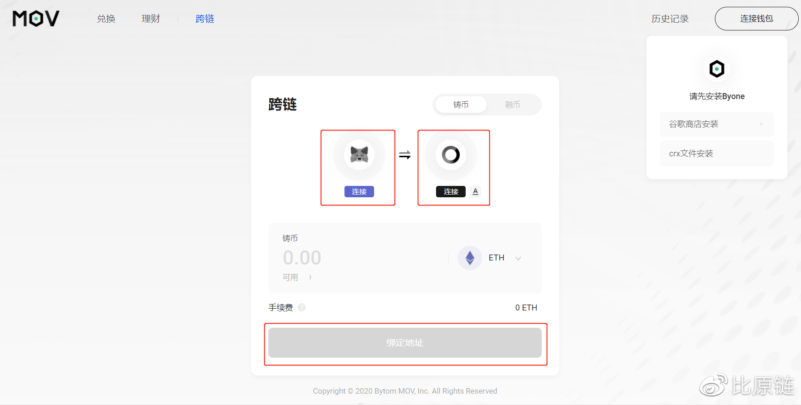
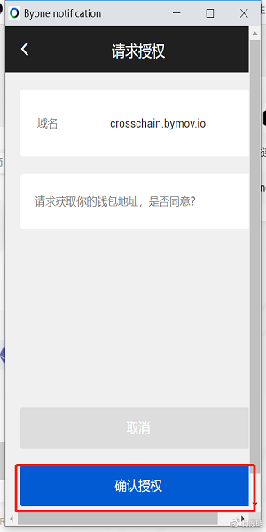
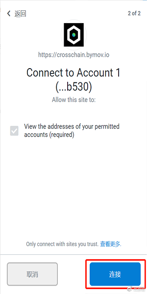
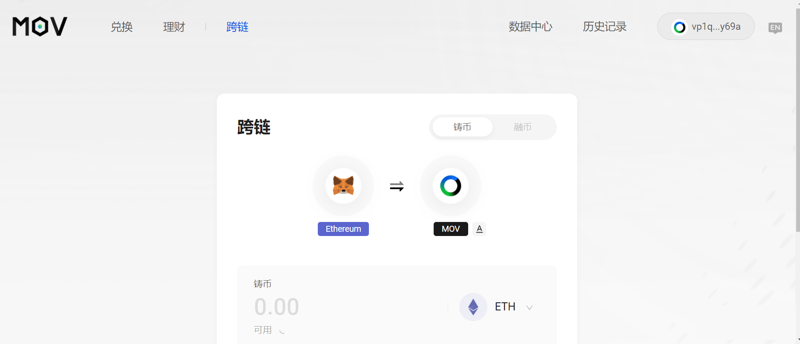
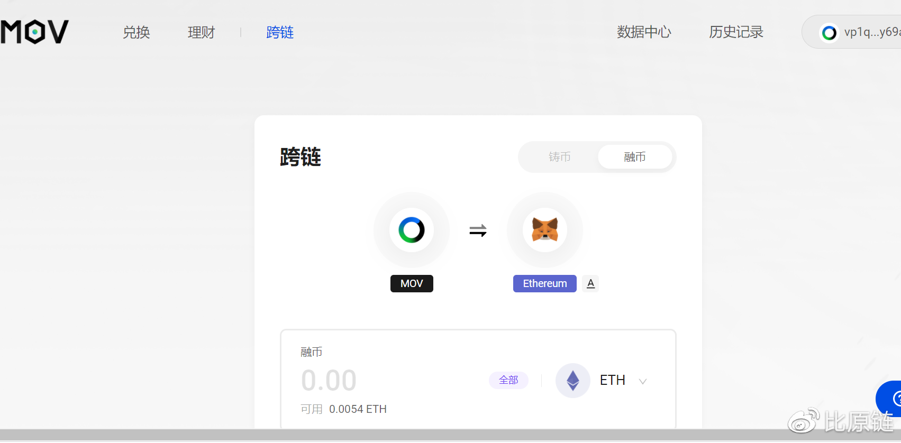

## Web跨链教程

### 连接钱包

在使用跨链之前，请先安装MetaMask以及Byone的谷歌插件，Byone具体如何操作，可看之前的文章—— [如何连接Byone钱包](https://support.bymov.io/web/web%E8%BF%9E%E6%8E%A5byone%E9%92%B1%E5%8C%85.html) 并及时备份。

在跨链页面下，点击钱包icon下的连接按钮，分别唤起授权提示进行连接。

授权Byonek连接

授权Metamask连接

### 跨入

点击“铸币”即可将主链上的币跨进MOV

### 跨出

点击“融币”即可将侧链的币跨出

