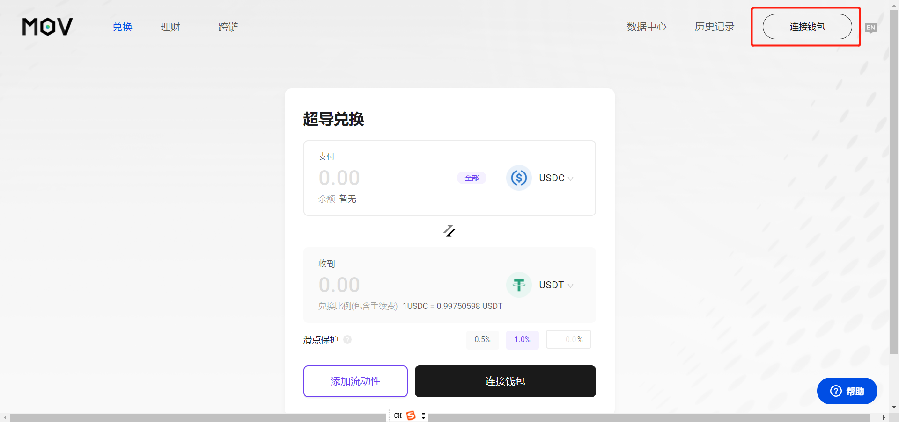
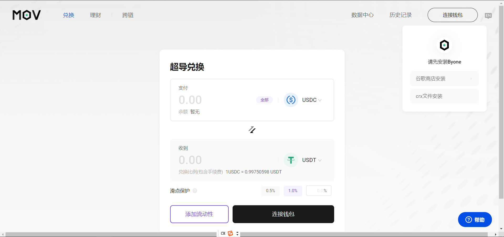
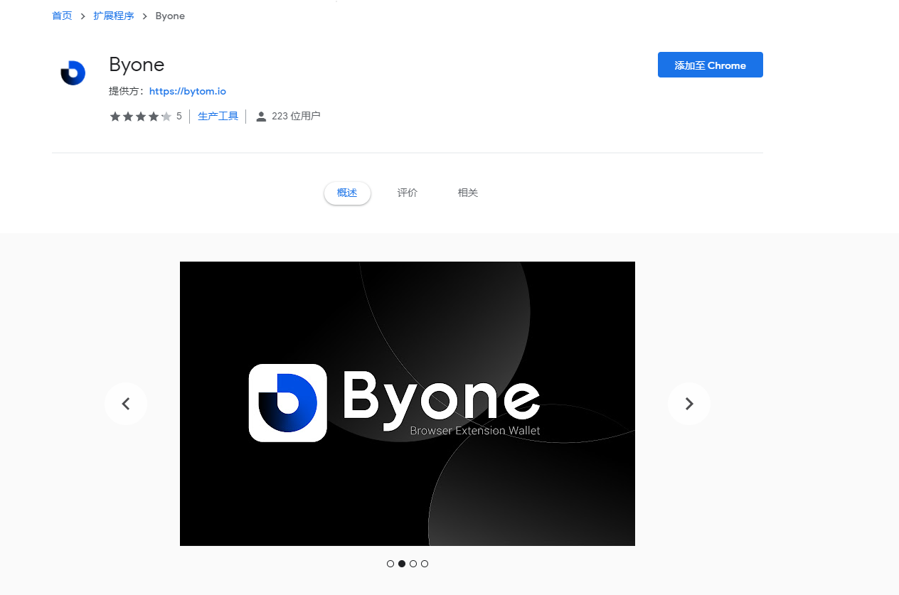
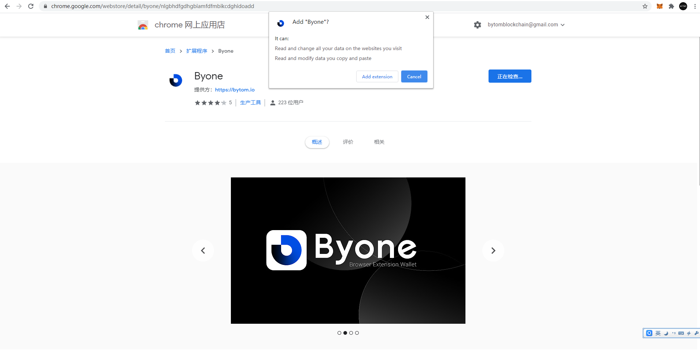
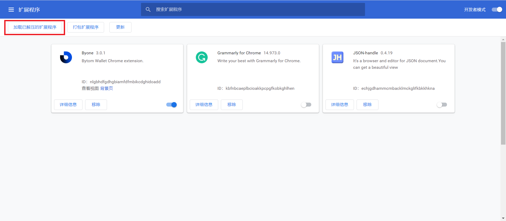

## MOV Web连接Byone钱包

### 安装钱包

点击进入网址：https://supertx.bymov.io/swap#
点击右上角“连接钱包”

分为两种安装方式：谷歌商店安装（需自备梯子） 和 crx安装

### 谷歌商店安装（自备梯子）

进入谷歌商店的Byone钱包页面

点击添加至Chrome

添加成后，会在导航栏显示一个小图标

### 下载crx

点击下载crx

下载完成后进入Chrome扩展程序页面，点击“加载已解压的扩展程序”

